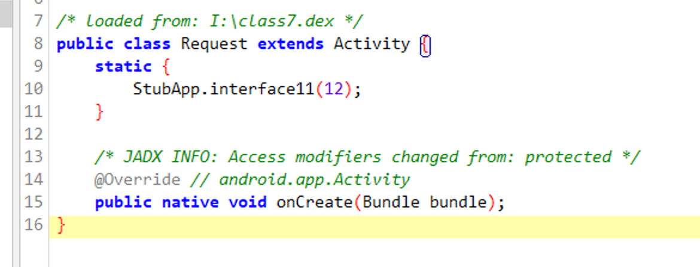

# 如何充分发挥360加固onCreate的VMP保护特性

众所周知，360加固仅对Activity的onCreate函数进行了vmp加强保护，但一般我们的核心代码都不在该函数里，这样就起不到应有的保护作用了，那怎样才能把核心代码放到onCreate里呢？

## 开始探究

首先分析，360加固识别onCreate规则，一个继承Activity的类，并且该类下实现了Activity的onCreate函数，并在AndroidManifest.xml里注册该activity

```java
public class Request extends Activity {
    protected void onCreate(Bundle savedInstanceState) {
    }
}
```

```xml
<?xml version="1.0" encoding="utf-8"?>
<manifest xmlns:android="http://schemas.android.com/apk/res/android"
    xmlns:tools="http://schemas.android.com/tools">
    <application>
        <activity android:name="xxx.xxxx.Request" />
    </application>

</manifest>
```

但是这样的实现IDE会提示，无法通过编译

```java
Overriding method should call super.onCreate
```

直接加个注解即可，让它不提示

```java
public class Request extends Activity {
    @SuppressLint("MissingSuperCall")
    protected void onCreate(Bundle savedInstanceState) {
    }
}
```

360成功加固了该onCreate函数



然后是调用，一般常规的调用就是startActivity->进入系统代码->然后由系统实例化Activity->最后调用app里实现的onCreate函数，但其实app也可以自己实例化该activity，直接`new Request()`即可，但该实例化不要放在子线程里，否则会报

```log
Can't create handler inside thread Thread[Thread-6,5,main] that has not called Looper.prepare()
```

activity对象实例化后，就可以去调onCreate函数了，这里调用onCreate函数就没有线程限制了，任意线程都可以调用

这样就实现在任意线程主动调用onCreate函数了，虽然onCreate没有返回值，但是有Bundle参数，直接把返回值放在Bundle参数里即可

## 实际效果

比如核心代码是一个网络请求

```java
public class Request extends Activity {
    @SuppressLint("MissingSuperCall")
    protected void onCreate(Bundle savedInstanceState) {
        String urlString = "https://note.shlu.fyi";
        StringBuilder result = new StringBuilder();
        HttpsURLConnection urlConnection = null;

        try {
            URL url = new URL(urlString);
            urlConnection = (HttpsURLConnection) url.openConnection();
            urlConnection.setRequestMethod("GET");
            urlConnection.setConnectTimeout(10000); // 10秒
            urlConnection.setReadTimeout(10000); // 10秒

            int responseCode = urlConnection.getResponseCode();
            if (responseCode == HttpsURLConnection.HTTP_OK) {
                InputStream in = urlConnection.getInputStream();
                BufferedReader reader = new BufferedReader(new InputStreamReader(in));
                String line;

                while ((line = reader.readLine()) != null) {
                    result.append(line);
                }

                reader.close();
                in.close();
            } else {
                result.append("响应码：").append(responseCode);
            }

        } catch (Exception e) {
            e.printStackTrace();
            result.append("异常：").append(e.getMessage());
        } finally {
            if (urlConnection != null) {
                urlConnection.disconnect();
            }
        }
        System.out.println(result);
    }

}
```

由于android系统限制，网络请求需要放在子线程里

```java
public class Main extends Activity {
    @Override
    protected void onCreate(Bundle savedInstanceState) {
        super.onCreate(savedInstanceState);
        setContentView(R.layout.main);
        Button request= findViewById(R.id.request);
        Request requestObj=new Request();//UI主线程实例化activity对象
        request.setOnClickListener(v->{
            new Thread(()->requestObj.onCreate(null)).start();//子线程里调用onCreate函数
        });
    }
}
```

这样就实现了核心代码的vmp保护