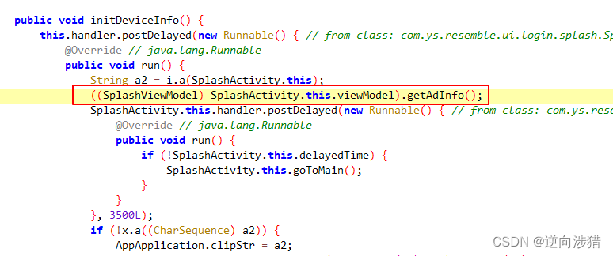
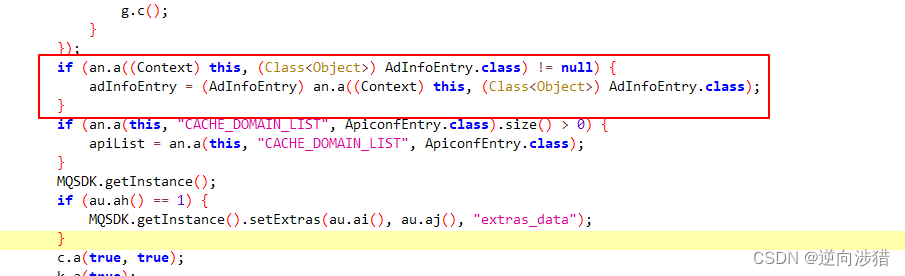
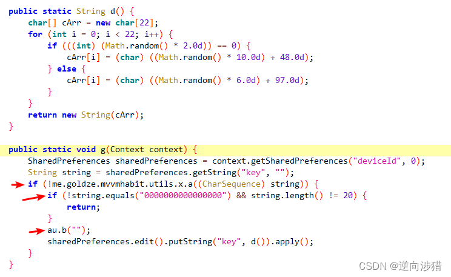
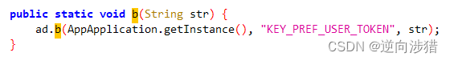
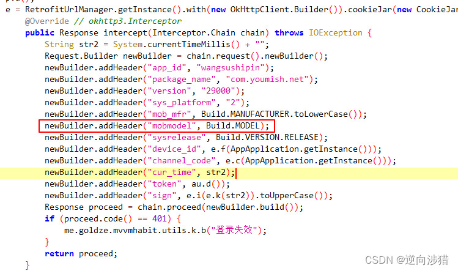
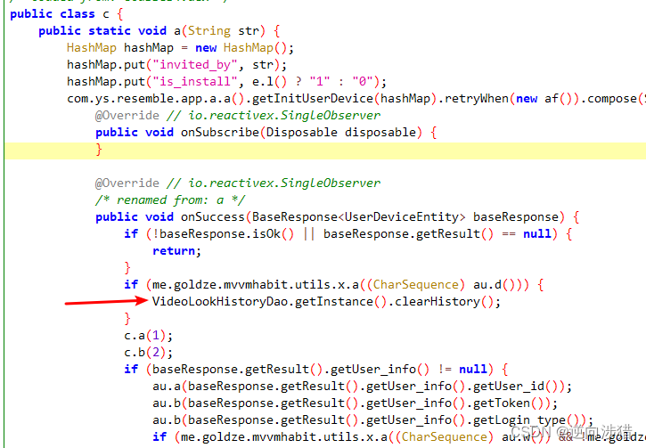
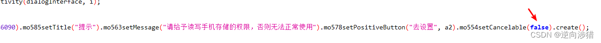

# 某免费视频软件AD机制分析

## 前言
最近发现一个不错得免费视频软件，资源很丰富，网速也很快，连奈飞都不用开了，唯一缺点，就是AD有点多，影响观看体验，今天我们就来看看它的AD机制
## 具体分析
* 该软件得核心特征是有一个`libpp_hls.so`库
* 该软件使用的视频播放库：[yjPlay](https://github.com/yangchaojiang/yjPlay)
* 先过签
MT管理器过签即可，若没有会员可以尝试NP管理器
### 第一处AD
```java
//AppApplication
GDTAdSdk.init()
```
 ### 第二处
 ```java
 //AppApplication
ZjSdk.init()
 ```
> 新版本换成了SjmSdk.init,所以为了防止以后频繁更新，需要去拦截上层函数才行
### 第三处
```java
//AppApplication
MQSDK.getInstance().initSdk();
```
### 第四处
* 获取广告信息，注释即可

* 读取广告信息，注释即可，所有的广告信息都在这个adinfoEntry里，只要不给他赋值，默认就是空对象，也就读取不到任何下发的广告信息


### 接下来是终身免AD特权
```java
MineUserInfo.getIs_vip()
```
### 去除更新
```java
UpdateEvent$UpdateData.getVersion()
```
### 默认关闭弹幕
* 其使用得开源库：[DanmakuFlameMaster](https://github.com/bilibili/DanmakuFlameMaster)
* 根据源码找到start函数对应得函数，置空函数即可
```java
master.flame.danmaku.ui.widget.DanmakuView.start()
```
* 最后发现还是不能完全去掉弹幕，需要再置空以下函数
```java
VideoPlayDetailActivity.initBarrage()
```
### 去掉推广Tab按钮
```java
MainActivity.initData(){
//arrayList.add(new TabLayout.b(2131231947, 2131820825, 2131231943, -1, ExtensionShareFragment.class, 4));
}
```
### 启动屏不再跳转第二AD屏，直接进入主界面
```java
//SplashActivity
public /* synthetic */ void lambda$initViewObservable$2$SplashActivity(AdInfoEntry adInfoEntry) {
        this.delayedTime = true;
        if (au.H() == 0) {//这里永远为true即可
            au.q(1);
            this.handler.postDelayed(new Runnable() { // from class: com.ys.resemble.ui.login.splash.SplashActivity.2
                @Override // java.lang.Runnable
                public void run() {
                    SplashActivity.this.goToMain();
                }
            }, 500L);
        } 
        //省略.....
    }
```
### 从后台打开APP后，不再跳转到AD屏
```java
public static void c(MainActivity mainActivity, AdInfoDetailEntry adInfoDetailEntry) {
        Bundle bundle = new Bundle();
        bundle.putSerializable("adInfoDetailEntry", adInfoDetailEntry);
        bundle.putBoolean("flag", true);
        //mainActivity.startActivity(SplashSecondAdActivity.class, bundle);
    }
```
### 禁止检测TV模式
```java
    public static boolean o(Context context) {//isTV
        return ((UiModeManager) context.getSystemService("uimode")).getCurrentModeType() == 4;
    }
```
```java
    public static boolean c(Context context) {//isTv
        return m(context) == 4;
    }

    private static int m(Context context) {
        UiModeManager uiModeManager = (UiModeManager) context.getSystemService("uimode");
        if (f567a || uiModeManager != null) {
            Log.d("getUiMode", uiModeManager.getCurrentModeType() + "");
            return uiModeManager.getCurrentModeType();
        }
        throw new AssertionError();
    }
```
### 盗版检测和重启提示去除
  * 检测android_id


绕过两个if判断，直接`goto`到`au.b("")`代码处，让key调用d()函数，随机生成。而`au.b("")`就是设置user_token的地方，具体代码如下：

这里直接置空，上面的g()函数是在Application的onCreate里调用的，也就是在每次启动APP后都会重置设备信息，而不会再出现盗版检测，当然把这些处理完后，依然会有盗版检测，经过排查是Build.MODEL的问题，解决方案如下：

* 检测 Build.MODEL && Build.MANUFACTURER 
这里可以换成一个随机值，当然不用我们自己写这个随机函数了，软件里有相关随机函数，上面的d()函数就是个随机函数，把它替换成上面的Build.MODEL和Build.MANUFACTURER即可。
这些修改好后，已经不会再出现盗版检测和重启提示了，但观看记录每次重启APP后，就会丢失，具体解决方案如下：
* 观看记录丢失问题

注释上面这行代码即可
### 权限请求对话框可以取消

把false换成true即可，实在嫌频繁弹框的，可以直接注释show()函数即可

### 滑动验证问题
打开视频播放界面会弹出一个滑动验证界面，经研究是频繁重置deviceId所致，但传回的视频信息除了视频链接不同，其它信息都相同，所以只能根据视频本身信息来判断，目前解决方案是获取视频的长度，若是视频太小，则被认定是出现了盗版检测视频，这时重置deviceId即可