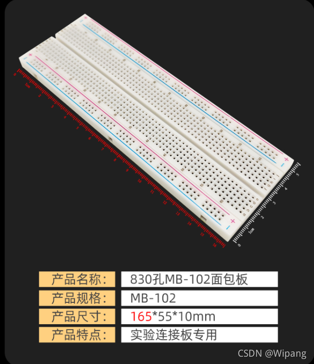
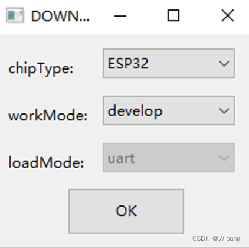
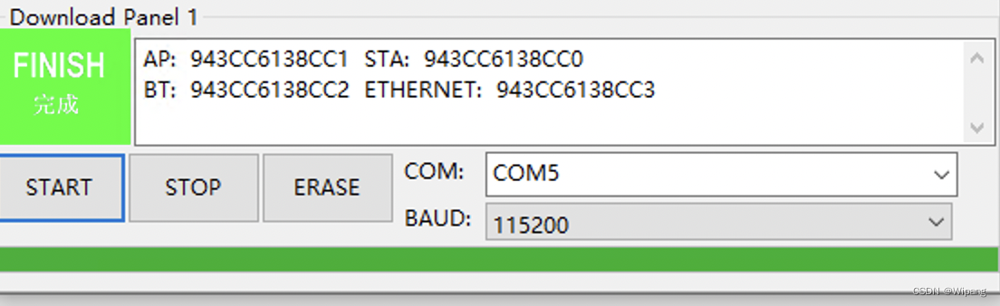
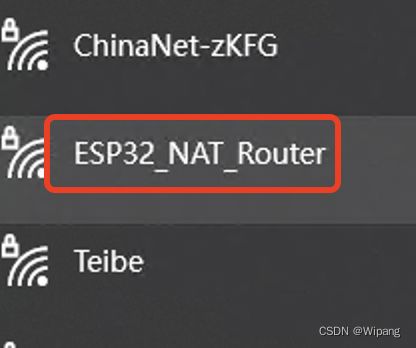
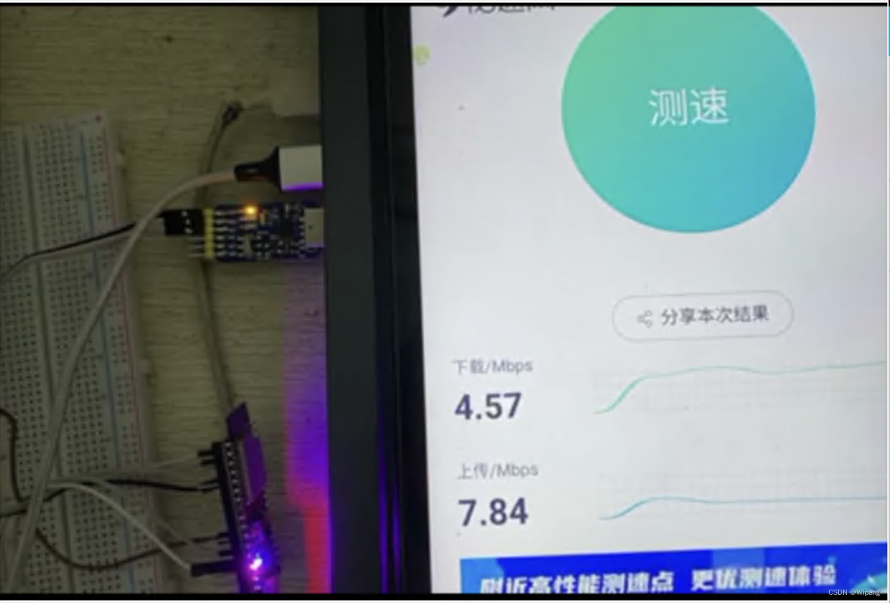

# ESP32(NodeMCU-32S)简单实现路由中继/wifi中继

#  所需资料

1esp32_nat_router源码：[ GitHub - martin-ger/esp32_nat_router: A simple NAT Router for the ESP32](https://github.com/martin-ger/esp32_nat_router)

2.NodeMCU-32S

官网[NodeMCU-32S 核心开发板 | 安信可科技](https://docs.ai-thinker.com/esp32/boards/nodemcu_32s)

本人购买链接[丢石头 NodeMCU-32S开发板 ESP32-S芯片 串口WiFi+蓝牙模块 大范围无线通信 NodeMCU-32S开发板 CH340芯片【图片 价格 品牌 报价】-京东](https://ic-item.jd.com/10023749685611.html)

3.串口模块

购买链接[丢石头 多功能串口转换模块 USB转UART USB转TTL/RS232/RS485 六合一串口模块 CP2102【图片 价格 品牌 报价】-京东](https://ic-item.jd.com/66885072587.html)

4.面包板

 购买链接[丢石头 面包板实验器件 可拼接万能板 洞洞板 电路板电子制作 830孔MB-102面包板 165×55×10【图片 价格 品牌 报价】-京东](https://ic-item.jd.com/70955459002.html)

 5.flash_download_tool_3.9.2:https://www.espressif.com/sites/default/files/tools/flash_download_tool_3.9.2.zip

6.

7.Window 电脑一台，我这里Window10系统

8.其他辅助材料:杜邦线(公对母,母对母各N条)，MicroUSB数据线

# 具体步骤

1.实物接线图，一是串口部分，另一部分是P0(失误，是P15),P2接地

2.串口部分详细连接方式，正常情况下，只要连接RX,TX,GND就可以了，只不过我这里买的串口模块是6合1的，所以需要模式切换开关，如下图1 ON,2 OFF

 

 3.连接好后，将串口模块插上电脑，并通过MicroUSB数据线给NodeMCU-32S供电，这时NodeMCU-32S会有个红灯亮起。

4.下载esp32_nat_router源码

5.下载flash_download_tool工具，选择如下选项，点击ok

 6.按如下配置即可，下图中三个bin文件路径位于esp32_nat_router源码中对应路径

 7.然后点击START按钮，绿色框里正常情况下会显示“等待上电同步”字样，这时，我们点击板子上的EN按钮一下，然后就开始烧录固件了，正常情况，下面会有绿色进度条显示。当烧录完成，会出现如下字样

8.将之前接地的P0(失误，是P15)取消接地，再次点击EN键，进入运行模式，稍等一会，在WIFI列表里就可以看到该WIFI了

9.接下来就是连接该WIFI，然后进入192.168.4.1进行软件配置了

> 可能会遇到这个问题[Header fields are too long for server to interpret · Issue #41 · martin-ger/esp32_nat_router · GitHub](https://github.com/martin-ger/esp32_nat_router/issues/41)

9.1.AP Settings就是当前ESP32的WIFI配置

9.2.STA Settings就是目标的WIFI配置

> 目前测试，好像不支持5GWIFI

10.配置完，测试速度如下

