# 【从零开始】通过Arduino+ESP32(NodeMCU-32S)实现蓝牙设备复制模拟[2021/08/30]

#  所需资料

1.Arduino IDE_1.8.15:https://downloads.arduino.cc/arduino-1.8.15-windows.zip

2.NodeMCU-32S

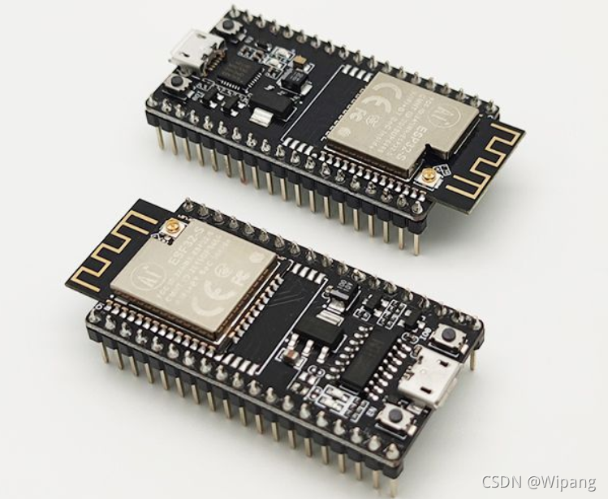编辑

官网[NodeMCU-32S 核心开发板 | 安信可科技](https://docs.ai-thinker.com/esp32/boards/nodemcu_32s)

本人购买链接[丢石头 NodeMCU-32S开发板 ESP32-S芯片 串口WiFi+蓝牙模块 大范围无线通信 NodeMCU-32S开发板 CH340芯片【图片 价格 品牌 报价】-京东](https://ic-item.jd.com/10023749685611.html)

3.串口模块

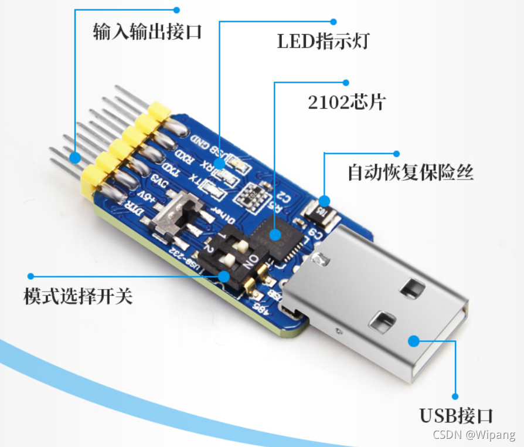编辑

购买链接[丢石头 多功能串口转换模块 USB转UART USB转TTL/RS232/RS485 六合一串口模块 CP2102【图片 价格 品牌 报价】-京东](https://ic-item.jd.com/66885072587.html)

4.面包板

编辑

 购买链接[丢石头 面包板实验器件 可拼接万能板 洞洞板 电路板电子制作 830孔MB-102面包板 165×55×10【图片 价格 品牌 报价】-京东](https://ic-item.jd.com/70955459002.html)

 5.nRF Connect apk(v4.24.3):https://github.com/NordicSemiconductor/Android-nRF-Connect

6.dingBle源码:https://github.com/zanjie1999/dingBle

7.Window 电脑一台，我这里Window10系统

8.其他辅助材料:杜邦线(公对母,母对母各N条)，MicroUSB数据线

9.安卓手机一部，我这里红米Note5 MIUI9 Android9

# 具体步骤

1.下载Arduino IDE 1.8.15压缩包，解压即可使用，免安装，点击根目录下的Arduino IDE.exe即可打开

2.打开后 点击 文件->首选项，在下面框里填入如下链接

```
https://dl.espressif.com/dl/package_esp32_index.json,http://arduino.esp8266.com/stable/package_esp8266com_index.json
```


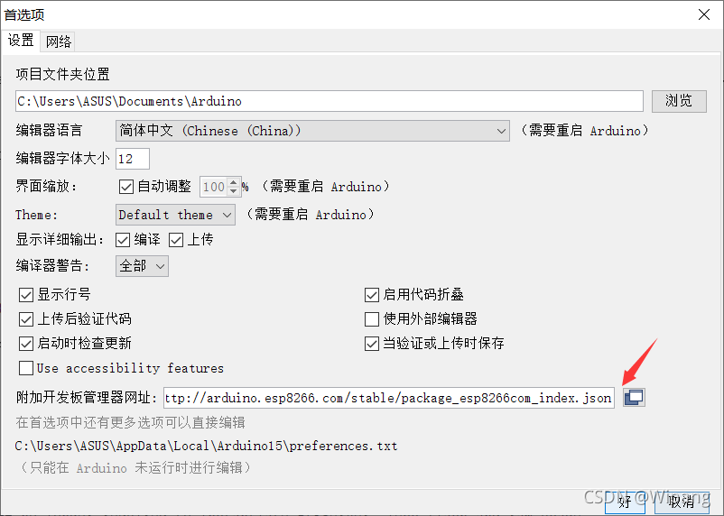编辑

 3.点击首选项->网络 设置代Li，这里需改成你们自己的代Li

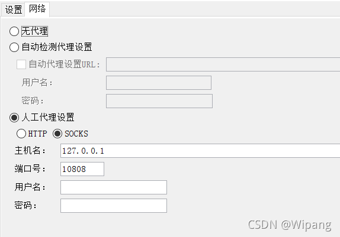编辑

 4.打开 工具-> 开发板: "xxxxxx"->开发板管理器**(不是库管理器)**，打开后等待加载完成(这一步需要代理OK)，在输入框里输入esp32，可以过滤到如下选项，点击安装即可，这里安装的是现在最新版本1.0.6，下图是已安装后的

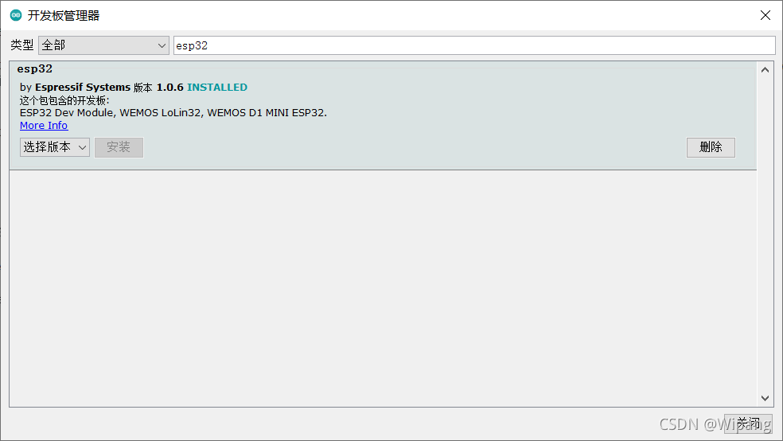编辑

 5.下载dingBle源码文件[dingBle/dingBle.ino at master · zanjie1999/dingBle · GitHub](https://github.com/zanjie1999/dingBle/blob/master/dingBle.ino)

6.用Arduino IDE打开该文件，点击对号，开始编译该文件

 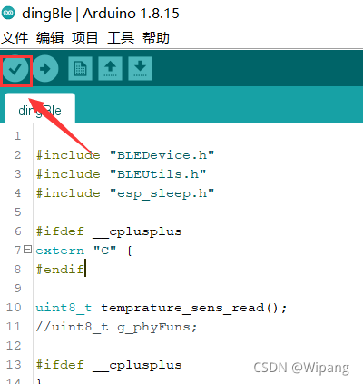编辑

 成功返回如下

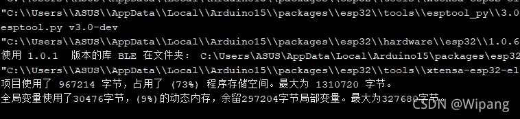编辑

7.实物接线图，一是串口部分，另一部分是P0,P2接地

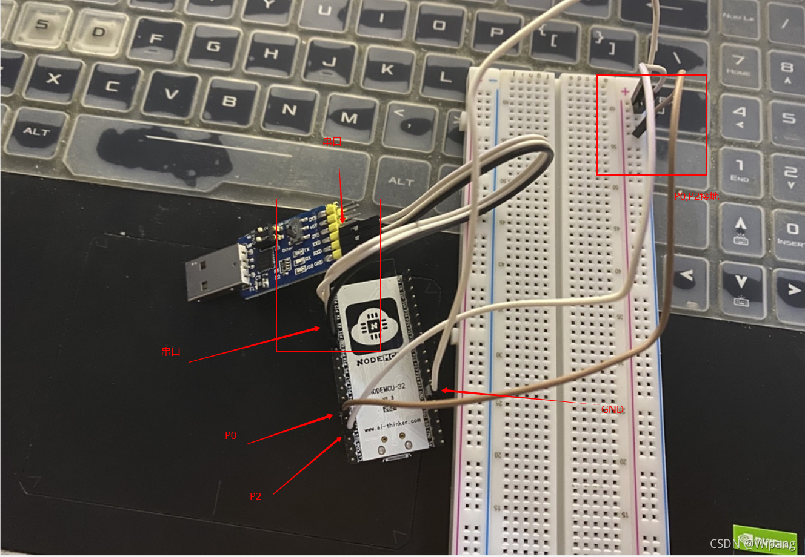编辑

8.串口部分详细连接方式，正常情况下，只要连接RX,TX,GND就可以了，只不过我这里买的串口模块是6合1的，所以需要模式切换开关，如下图1 ON,2 OFF

 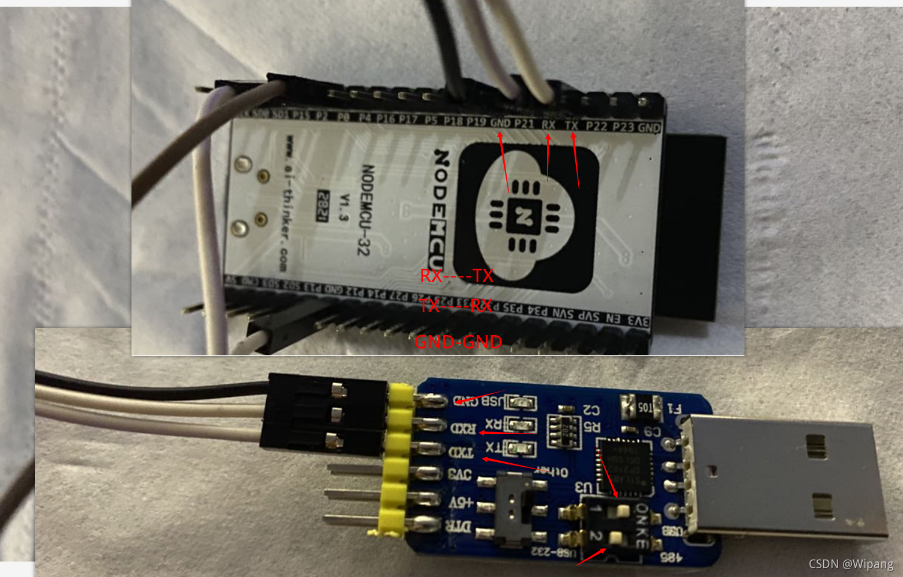编辑

 9.连接好后，将串口模块插上电脑，并通过MicroUSB数据线给NodeMCU-32S供电，这时NodeMCU-32S会有个红灯亮起。

10.打开 工具->开发板："XXXX" -> ESP32 Arduino 选择NodeMCU-32S

11. 打开 工具 -> Upload Speed:"xxxxx" 选择 115200
12. 打开 工具 -> Flash Frequency:"xxxxx" 选择 40MHz
13. 打开 工具 -> 端口 选择你的串口端口，一般情况应该只有一个

 14.点击上传按钮，开始再次编译代码

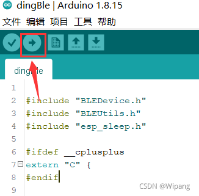编辑

 15.当代码编译完成，出现Connecting...后，点击NodeMCU-32S的EN按钮，然后就会开始烧录编译后的代码

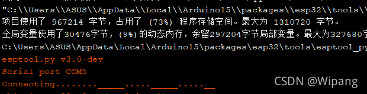编辑

 成功返回如下

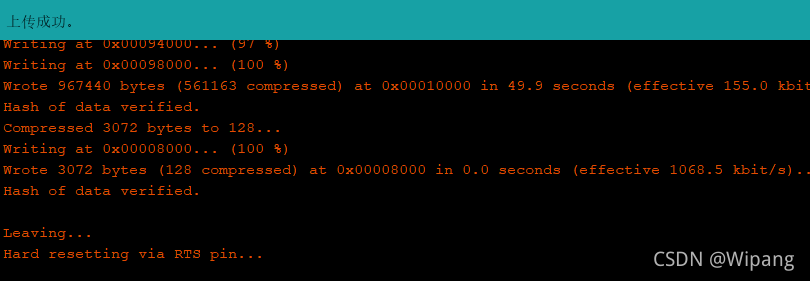编辑

16.将之前接地的P0取消接地，并打开 Arduino IDE -> 工具-> 串口监视器，其波特率调整为115200

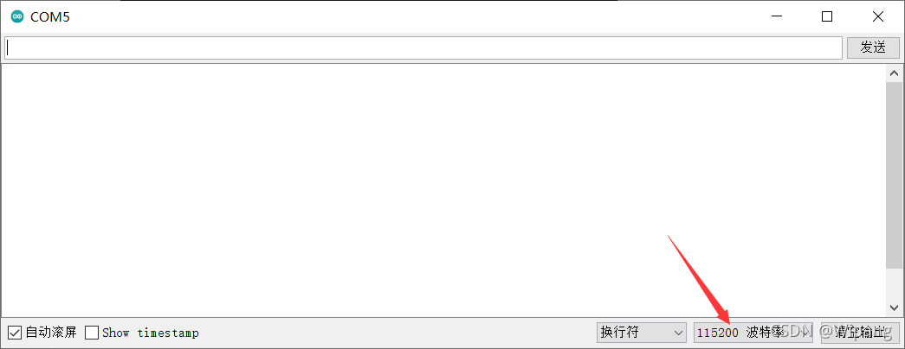编辑

17.再次点击NodeMCU-32S的EN按钮，若是循环打印出Sparkle，则表示蓝牙启动成功

 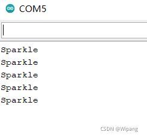编辑

 18.手机端安装nRF Connect，安装后打开，不出意外就可以看到我们的蓝牙了，mac为11:22:33:44:55:66

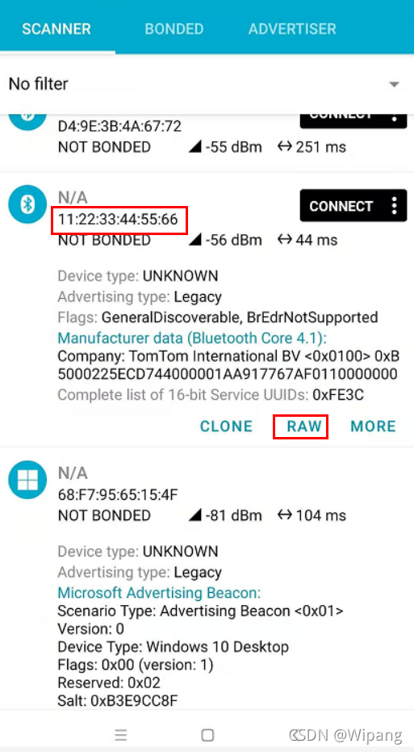编辑

 19.点击RAW，可见跟dingBle里的RAW值一样，这样就实现任意蓝牙模拟了(不过这里仅模拟的是广播数据)

 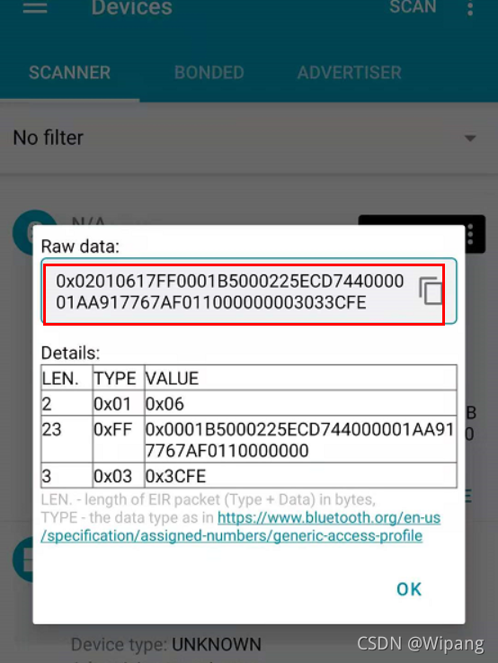编辑

20.最后最后郑重声明：本文章仅作技术研究，请勿用于违法用途。

#  参考

[Arduino IDE使用——通过板型管理器添加更多控制器-Arduino中文社区 - Powered by Discuz!](https://www.arduino.cn/thread-17884-1-1.html)

[如何为 ESP 系列模组烧录固件 | 安信可科技](https://docs.ai-thinker.com/esp_download)

[NodeMCU-32S - 丢石头百科](https://wiki.diustou.com/cn/NodeMCU-32S)

[ESP32 最新SDK发布 | 安信可科技](https://docs.ai-thinker.com/esp32/sdk)

[GitHub - marcelstoer/nodemcu-pyflasher: Self-contained NodeMCU flasher with GUI based on esptool.py and wxPython.](https://github.com/marcelstoer/nodemcu-pyflasher)

[NodeMCU-32S 核心开发板 | 安信可科技](https://docs.ai-thinker.com/esp32/boards/nodemcu_32s)

[Flashing the firmware - NodeMCU Documentation](https://nodemcu.readthedocs.io/en/latest/flash/#putting-device-into-flash-mode)