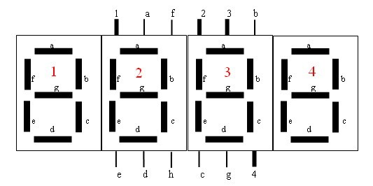

# 单片机开发之数字温度计制作

## 要求 ##
```
（一）基本功能
1.	测温范围-50℃—110℃
2.	精度误差不大于0.1℃
3.	LED数码直读显示    
（二）扩展功能
1．实现语音报数(不开发)
2．可以任意设定温度的上下限报警功能
二．计划完成时间   三周
1．第一周完成软件和硬件的整体设计，同时按要求上交设计报告一份。
2．第二周完成软件的具体设计和硬件的制作。
3．第三周完成软件和硬件的联合调试。

```
## 准备工作 ##
### 确定模块 ###
1.温度传感器模块
2.数码管模块
3.转换模块
### 元件清单 ###
1.STC89C52单片机
2.DS18B20温度传感器
### 开发工具 ###
#### 1.proteus(开发仿真图) ##
#### 2.dxp(开发原理图,设计电路板) ##
##### 安装教程 ##
1.http://www.3d66.com/softhtml/softsetup_114.html
##### 破解教程 ##
  破解文件在上文链接中

- 破解方法：AD10KeyGen

- 运行AD10KeyGen，点击“打开模板”，加载license.ini，如想修改注册名，只需修改：TransactorName=Your Name其中Your Name用你自己的名字替换，其它参数在单机版的情况下无需修改;

- 点击“生成协议”，保存生成的alf文件(文件名任意，如“jack”)，并将其放到你的安装目录下;

- 将patch.exe放到你的安装目录下，运行patch，对安装目录下的dxp.exe文件补丁，注意运行破解时软件没有运行;

- 启动DXP，运行菜单DXP->My Account，点击Add Standalone License file，加载前面生成的license(.alf)文件后即能正常使用了。
#### 3.keil(开发程序) ##
1.点击"keil3.exe"直接安装直到结束.
  不过这样只可以生产2k以下的代码，如果要生成2k以上的代码需要注册，
  请按第2部操作.

2.第一次运行请先进入"文件"->“授权管理”弹出窗口下输入注册码，
  注册码由"Keil注册.exe"生成，选择V2选项，生成后复制LIC内容到keil
  弹出窗口的“新授权ID码(LIC)”中然后点击“添加授权”,
  注意看看注册后的使用期限，如果太短可以用注册机重新生成，
  一般都可以找到30年左右:-)

  3.keil3注册失败(出现错误: ERROR R208: RENEW LICENSE ID CODE (LIC)):[解决方案]

keil3下载地址:http://www.xdowns.com/soft/38/39/2013/Soft_104885.html
注册机下载地址:   http://www.51hei.com/f/Keil_lic_v2.exe

## 设计方案 ##

```
数字温度计设计方案

电路结构

电路主要有控制模块,报警模块,显示模块,温度传感器模块以及核心模块单片机处理模块, 其系统原理框图如下图所示!

设计思路

DSl8B20作为单片机AT89C52的外部信号源，把所采集到的温度转换为数字信号，通过I／O接口传给AT89C52，AT89C52启动ROM内的控制程序驱动LED数码管，通过I／O接口和数据线(单片机和数码管的接口)把数据传送给数码管，将采集到的温度显示出来，通过控制模块控制测温的上下限，当达到限制时，则AT89C52通知报警模块，实现报警功能！
```


## 开发仿真图 ##

## 开发程序 ##
### 十六进制数值翻转代码 ##

```
int isTurn=0;
int turnAll(int a) {//切换全部
   if(isTurn)return a^0xff;
   return a;

}
int turnAfter(int a){//仅切换低位
	if(isTurn)return a^0x0f;
	return a;
```
### 全部代码 ##

```
#include<reg52.h>
#include <intrins.h>
#define  uchar  unsigned  char 
#define  uint   unsigned  int
sbit  DATA = P1^1; //DS18B20接入口
uchar code table[]={0xc0,0xf9,0xa4,0xb0,0x99,0x92,0x82,0xf8,0x80,0x90,0x88,0x83,0xc6,0xa1,0x86,0x8e};//共阳极字型码
//uchar code table[]={0x3f,0x06,0x5b,0x4f,0x66,0x6d,0x7d,0x07,0x7f,0x6f,0x77,0x7c,0x39,0x5e,0x79,0x71};//共阴极字型码
int temp;  //温度值
int ss;		//中间的一个变量
int dd;
int j;
int isTurn=0;	//切换共阴极-共阳极
uchar data b;//定时器中断次数
uchar data buf[4];//字型显示中间变量
int alarmH=320;	  //默认报警值
int alarmL=100;
//定义开关的接入口
sbit  k1=P2^5;//+
sbit  k2=P2^6;//-
sbit  k3=P2^7;//确认
sbit  k4=P2^4; //切换
sbit  bell=P1^0; //蜂鸣器
sbit  HLight=P1^2; //正温指示灯
sbit  LLight=P1^3; //负温度指示灯
sbit  warn=P1^4;  //报警指示灯
sbit  Red=P1^6;	  //温度上限设置指示灯
sbit  Green=P1^7; //温度下限设置指示灯
bit set=0;	//初始化
bit Flag=0;	//设置标志
int n,a;
//函数的声明区
void key_to1();
void key_to2();
void delay(uint); 
void key();
void Show();
int turnAll(int a) ;
int turnAfter(int a);
//函数的定义区
int turnAll(int a) {
   if(isTurn)return a^0xff;
   return a;

}
int turnAfter(int a){
	if(isTurn)return a^0x0f;
	return a;

}

/*延时子函数*/
void delay(uint num)
{
	while(num--) ;
}
  void delay2(void)        //延时函数，延时约0.6毫秒
{
   unsigned char i;
	for(i=0;i<200;i++)  
    ;//空循环 起延时作用
 }

//DS18b20温度传感器所需函数，分为初始化，读写字节，读取温度4个函数
Init_DS18B20(void)		   //传感器初始化
{
 	uchar x=0;
 	DATA = 1;    //DQ复位
 	delay(10);  //稍做延时
 	DATA = 0;    //单片机将DQ拉低
 	delay(80); //精确延时 大于 480us    //450
 	DATA = 1;    //拉高总线
 	delay(20);
 	x=DATA;      //稍做延时后 如果x=0则初始化成功 x=1则初始化失败
 	delay(30);
}
ReadOneChar(void)  //读一个字节
{
	uchar i=0;
	uchar dat = 0;
	for (i=8;i>0;i--)
 	{
  		DATA = 0; // 给脉冲信号
  		dat>>=1;
  		DATA = 1; // 给脉冲信号
  		if(DATA)
   		dat|=0x80;
  		delay(8);
 	}
 	return(dat);
}
WriteOneChar(unsigned char dat)	//写一个字节
{
 	uchar i=0;
 	for (i=8; i>0; i--)
 	{
  		DATA = 0;
  		DATA = dat&0x01;
  	delay(10);
  	DATA = 1;
  	dat>>=1;
 	}
	delay(8);
}
int ReadTemperature(void) //读取温度
{
	uchar a=0;
	uchar b=0;
	int t=0;
	float tt=0;
	Init_DS18B20();
	WriteOneChar(0xCC); // 跳过读序号列号的操作
	WriteOneChar(0x44); // 启动温度转换
	Init_DS18B20();
	WriteOneChar(0xCC); //跳过读序号列号的操作
	WriteOneChar(0xBE); //读取温度寄存器等（共可读9个寄存器） 前两个就是温度
	a=ReadOneChar();//低位
	b=ReadOneChar();//高位
	t=b;
	t<<=8;
	t=t|a;
	tt=t*0.0625;
	t= tt*10+0.5; 
	return(t);
}
void  display00()     //*********显示负值子函数
{	
    dd=-temp;
    buf[1]=dd/100;
	buf[2]=dd/100;
	buf[3]=dd%100/10;
	buf[0]=dd%10;
	//动态显示
	for(j=0;j<3;j++){
	P2=turnAfter(0xfd); //显示小数点
	P0=turnAll(0x7f); //显示小数点
	 delay2();
	 P2=turnAfter(0xfe);   //P2.0引脚输出低电平，DS0点亮
	 P0=table[buf[0]];  //数字1的段码
	 delay2();
	 P2=turnAfter(0xfd) ;  //P2.1引脚输出低电平，DS1点亮
	 P0=table[buf[3]]; //数字2的段码
	 delay2();	 
     P2=turnAfter(0xfb);   //P2.2引脚输出低电平，DS2点亮
	 P0=table[buf[2]];  //数字3的段码
	 delay2();
     P2=turnAfter(0xf7);   //P2.3引脚输出低电平，DS3点亮
	 P0=0xbf;  //数字4的段码
	 delay2();
     P2=turnAfter(0xff);
	 }	
}
//显示正值子函数
void  display()
{		
	buf[1]=temp/1000;//显示百位
	buf[2]=temp/100%10;//显示十位
	buf[3]=temp%100/10;//显示个位
	buf[0]=temp%10; //小数位
	for(j=0;j<3;j++){
	P2=turnAfter(0xfd); //显示小数点
	P0=turnAll(0x7f); //显示小数点
	 delay2();
	 P2=turnAfter(0xfe);   //P2.0引脚输出低电平，DS0点亮
	 P0=table[buf[0]];  //数字1的段码
	 delay2();
	 P2=turnAfter(0xfd) ;  //P2.1引脚输出低电平，DS1点亮
	 P0=table[buf[3]]; //数字2的段码
	 delay2();	 
     P2=turnAfter(0xfb);   //P2.2引脚输出低电平，DS2点亮
	 P0=table[buf[2]];  //数字3的段码
	 delay2();
     P2=turnAfter(0xf7);   //P2.3引脚输出低电平，DS3点亮
	 P0=table[buf[1]];  //数字4的段码
	 delay2();
     P2=turnAfter(0xff);
	 }	
}
void key()	//按键扫描子程序
{   if(k1!=1)
	{
	   delay(20);
	   if(k1!=1)
	   {
		while(k1!=1)
		  { key_to1();
		    for(n=0;n<8;n++)
		    Show();
	       }
	   }
	}
	if(k2!=1)
	{
		delay(20);
		if(k2!=1)
		{
		  while(k2!=1)
			{ key_to2(); 
			  for(n=0;n<8;n++)
		      Show();
			}
			
		}
	}	 
	if(k3!=1)
	{	TR0=1; //复位，开定时
        temp=ReadTemperature();		                                                                                                
	}
	if(k4!=1)
	{  delay(20);
	   if(k4!=1)
	   {  while(k4!=1);
	      set=!set;
		   if(set==0)
		   { Red=0;Green=1;}
		   else { Green=0;Red=1;}
		}
	 }
}
void key_to1()
{
	    TR0=0;	       //关定时器
        temp+=10;
		if(temp>=1100)
		   {temp=-550;}
        if(set==0)
		{alarmH=temp;}
		else {alarmL=temp;}	
}
void key_to2()
{
	    TR0=0;
       //关定时器
        temp-=10;
		if(temp<=-550)
		    {temp=1100;}
        if(set==0)
		{ alarmH=temp;}
		else { alarmL=temp;}
}

void alarm(void)
{
    if(temp>alarmH||temp<alarmL) 
	{   //bell=1;
	    //delay(50);
		//bell=0;
		Flag=1;
     }
	 else {Flag=0;}
}


logo()//开机的Logo  
{  

 
     P2=0xfe;   //P2.0引脚输出低电平，DS0点亮
	 P0=0xbf;  //数字1的段码
	 delay2();
	 P2=0xfd ;  //P2.1引脚输出低电平，DS1点亮
	 P0=0xbf;  //数字2的段码
	 delay2();	 
     P2=0xfb;   //P2.2引脚输出低电平，DS2点亮
	 P0=0xbf;  //数字3的段码
	 delay2();
     P2=0xf7;   //P2.3引脚输出低电平，DS3点亮
	 P0=0xbf;  //数字4的段码
	 delay2();
     P2=0xff;	   
}


void Show()  //显示函数,分别表示温度正负值
{	    if(temp>=0)
		{HLight=1;LLight=0;display();}
		if(temp<0)
		{HLight=0;LLight=1;display00();}
}
void  main()
{	
    TCON=0x01; //定时器T0工作在01模式下
    TMOD=0X01;	
	TH0=0XD8;//装入初值
	TL0=0XF0;
	EA=1;  //开总中断
	ET0=1; //开T0中断
	TR0=1; //T0开始运行计数
	EX0=1; //开外部中断0

    P0=0xff; //初始化端口
    P2=0xff;//初始化端口
	for(n=0;n<500;n++)//显示启动LOGo"- - - -"
	{bell=1;warn=1;logo();}

	 Red=0;
	while(1)
	{
	    key(); 
		ss=ReadTemperature();
        Show();
		alarm();   //报警函数
		if(Flag==1)
		{bell=!bell;
		 warn=!warn;}  //蜂鸣器滴滴响
		else {bell=1;
		      warn=1;}	
	}	 
}
 void time0(void) interrupt 1 using 1  //每隔10ms执行一次此子程序
 {	TH0=0X56;
	TL0=0XDC;	
	temp=ss;
 }
```
### 开发程序注意事项 ##
1.根据数码管是否加三极管驱动以及在反向三极管驱动的情况修改程序！

## 开发原理图 ##
## 开发PCB板 ##
## 焊接元器件 ##
### 18B20 ##
1.元件引脚识别[https://zhidao.baidu.com/question/414867948.html](https://zhidao.baidu.com/question/414867948.html)
### 四位数码管##
#### 引脚图 ##

#### 共阴极-共阳极段码表 ##

```
//uchar code table[]={0xc0,0xf9,0xa4,0xb0,0x99,0x92,0x82,0xf8,0x80,0x90,0x88,0x83,0xc6,0xa1,0x86,0x8e};//共阳极字型码
uchar code table[]={0x3f,0x06,0x5b,0x4f,0x66,0x6d,0x7d,0x07,0x7f,0x6f,0x77,0x7c,0x39,0x5e,0x79,0x71};//共阴极字型码
```

## 问题 ##
1.数码管是否加驱动问题？
http://www.360doc.com/content/16/1204/05/3813620_611692234.shtml
## 开发报告 ##

## 涉及技术 ##
1.单片机最小系统设计
2.DS18B20读取程序
3.多位数码管动态扫描显示程序
4.单片机定时器中断程序
5.如何利用延时函数修复仿真与现实的差距
## 参考文章 ##
1.[自制mini数字温度计](http://www.51hei.com/bbs/dpj-32278-1.html)
2.[51单片机电子温度计源程序+仿真+照片](http://www.51hei.com/bbs/dpj-19355-1.html)
3.[51单片机实现电子温度计(c语言)](http://www.jianshu.com/p/a84fcebfc72b)
4.[单片机数字温度计的 课程设计](http://www.51hei.com/bbs/forum.php?mod=viewthread&tid=51399)
## 总结 ##
1.在PCB上设计双排引脚的元件时一定要标明第一引脚（可把第一引脚焊盘做成方形）！
2.在使用共阳极数码管时一定要加三极管驱动！
3.一定要准确标出插槽的正负极和各个指示灯所代表的含义！