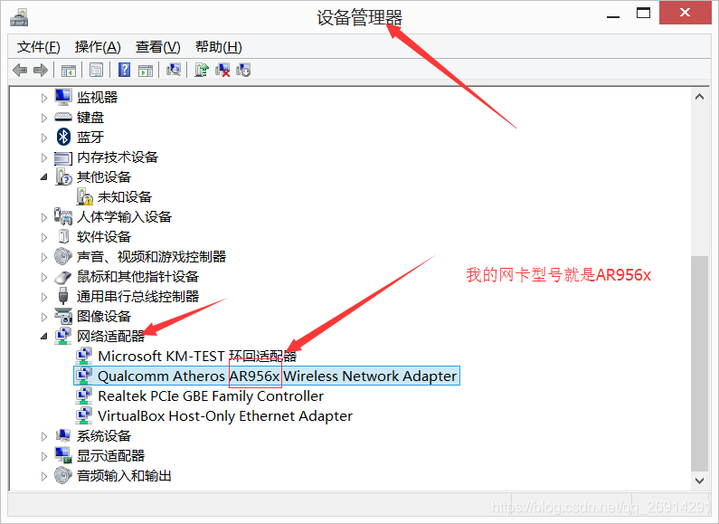
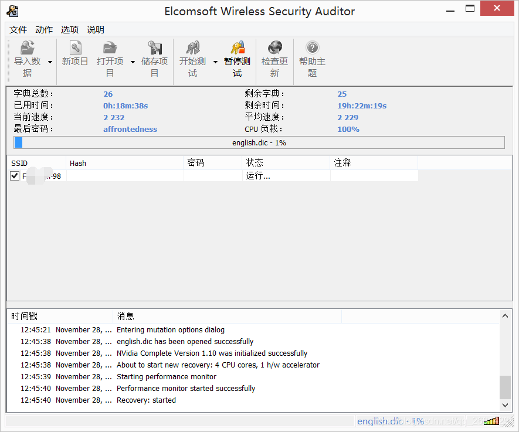

# Beini奶瓶U盘PE完整教程[2018-11-28]

##  我的环境配置
window8.1系统，华硕笔记本
## 初期直接使用奶瓶奶瓶beini-1.2.2.iso制作PE
测试了网上的Beini奶瓶PE制作教程，发现最终都不能显示beini奶瓶图标，
## 经历几次测试失败后，发现CDLinux内置beini奶瓶
####  1.初次安装CDLinux
无意间在贴吧搜到这个帖子【WPA2快速破解养成计划：http://tieba.baidu.com/p/2687170099?see_lz=1 】，发现原来CDLinux内置有beini软件，就按着他的教程按了下，不过没启动成功，启动界面只有一个光标一直在闪，
####  2.安装CDLinux填坑
又回看他的教程，发现他教程中第5楼被删除了，导致少看了一个步骤，说到底就是CDLinux的安装步骤，于是在网上搜了下，在【[CDlinux] U盘启动CDLinux进入桌面完美教程本人亲自试过：http://www.kali.org.cn/thread-14779-1-1.html 】这篇文章搜到了，然后按照他的教程，安装成功了，也成功启动了beini软件，不过无法连接到无线网，
####  3.网卡驱动问题
在网上搜了下，说是没有安装网卡驱动，我查看了下自己笔记本内置的网卡型号：Ar956x，网上搜了下，正好有个别人改过的CDLinux内置了Ar956x网卡驱动，地址：【 CDlinux-0.9.8-beta6-SSE-0802 - 42420修改版，9.18已更新 修复pixiewps：http://forum.anywlan.com/thread-373565-1-1.html 】，然后按照原来的步骤重新按了下，可以正常联网了。
####  4.开始破解
我直接参考第一个教程里说的，实测可行，不过在CDLinux跑包太慢了，可以参考教程里说的把beini获取的cap包，放到Window系统，利用EWSA来跑！
####  5.注：若教程链接失效，可在下面我整理的教程离线截图里看

##  我的笔记本内置网卡型号

##  我用ESWA跑包截图

## 参考教程中所涉及的所有文件以及教程内容备份地址
为了防止参考教程以及教程中资料以后被删除，做了个备份，备份地址：
资料备份地址：https://download.csdn.net/download/qq_26914291/10813088
CDLinux太大，分开备份：https://download.csdn.net/download/qq_26914291/10813142