# **unidbg调用sgmain的doCommandNative函数生成某酷encryptR_client参数**

> 转：https://www.52pojie.cn/thread-1680816-1-1.html

### 前置工作

1.雷电4模拟器（安装frida-server）
2.GetVideo（MD5: 72641720EC9D489FC9AB4B90BBA1D100）[GetVideo_1.3.1_20200311.apk](./assets/GetVideo_1.3.1_20200311.apk)
3.HttpCanary或者Fiddler（可以随意，非必须）
4.jadx-gui
5.IDEA（拉取unidbg项目）
6.python（安装frida相关依赖）

### app抓包

本次使用的并非官方app，而是使用的一款名为GetVideo的视频解析软件。所以里面也设置到了这个参数的生成，模拟器使用的是雷电4。关于雷电4模拟器安装frida可以参考我之前的帖子。
↓↓↓↓

[雷电模拟器安装frida-server教程](https://www.52pojie.cn/thread-1344344-1-1.html)

app安装完成后，需要点击右上角的三个点，进去设置。然后往下拉到优酷的设置中，把所有开关打开


然后打开HttpCanary，选中GetVideo进行抓包，然后在优酷的解析界面点击TV的解析


等待下方出现解析结果后，返回HttpCanary，里面路径【get.json】结尾的就是需要的包

点开这个包继续查看，里面的这个encryptR_client参数，就是本次需要生成的参数


### java层代码分析

使用jadx-gui反编译目标app，直接搜索【encryptR_client】


非常好，直接三个结果。第二个结果是定值，第一第三个是一样的，那就点第一个结果进去。


然后又是调用了staticSafeEncrypt函数，继续点进去。


这时就来到了一个抽象类，那么必须找到实现类才有真正的函数体，再看包名，是来自于【com.alibaba.wireless.security】，这个是阿里聚安全SDK（貌似三方SDK的包名是不能够被混淆的），那么这个的实现类是在【main】这个插件里面。

打开app的【lib\armeabi-v7a】目录，并把里面的【libsgmain.so】解压出来


使用jadx-gui的添加文件来添加这个so


等待重新加载后再次搜索【staticSafeEncrypt】


这次就可以搜索到较多的结果了，经过分析，实现类在【com.alibaba.wireless.security.open.staticdataencrypt】中。


调用了里面的a方法，继续跟进去


然后是调用了【doCommand】方法，继续往里面跟


这时和之前一样，又来到了一个抽象类，继续查找它的实现类，搜索【implements IRouterComponent】


很舒服，只有一个结果，直接进去看


这里接着调用了【doCommandNative】方法，继续走

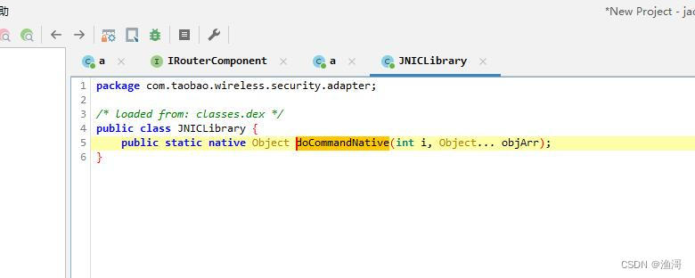
来到这里就没法继续走了，到了so层的函数了，那么使用unidbg调用的就是这个函数了。

### frida hook 加 unidbg调用

拉unidbg后简单写一个demo

```java
package com.taobao.wireless.security.adapter;

import com.github.unidbg.AndroidEmulator;
import com.github.unidbg.Module;
import com.github.unidbg.linux.android.AndroidEmulatorBuilder;
import com.github.unidbg.linux.android.AndroidResolver;
import com.github.unidbg.linux.android.dvm.*;
import com.github.unidbg.memory.Memory;
import java.io.File;
import java.io.IOException;

public class JNICLibrary_test{
    private final AndroidEmulator emulator;
    private final VM vm;
    private final Module module;
    private final DvmClass JNICLibrary;
    private final boolean logging;

    public JNICLibrary_test(boolean logging) {
        this.logging = logging;
        emulator = AndroidEmulatorBuilder.for32Bit().setRootDir(new File("root")).setProcessName("com.wuxianlin.getvideo").build();
        final Memory memory = emulator.getMemory();
        memory.setLibraryResolver(new AndroidResolver(23));
        vm = emulator.createDalvikVM(new File("unidbg-android/src/test/java/com/taobao/wireless/security/adapter/GetVideo.apk"));
        vm.setVerbose(logging);

        DalvikModule dm = vm.loadLibrary(new File("unidbg-android/src/test/java/com/taobao/wireless/security/adapter/libsgmainso-6.4.170.so"), true);
        dm.callJNI_OnLoad(emulator);
        module = dm.getModule();

        JNICLibrary = vm.resolveClass("com/taobao/wireless/security/adapter/JNICLibrary");
    }

    public void destroy() throws IOException {
        emulator.close();
        if (logging) {
            System.out.println("destroy");
        }
    }

    public static void main(String[] args) throws Exception {
        JNICLibrary_test CLibrary = new JNICLibrary_test(true);
        CLibrary.encrypt();
        CLibrary.destroy();
    }

    public void encrypt() {

    }

}

这里加载的就不是我们从apk拉出来的【libsgmain.so】，而是名字类似的【libsgmainso-6.4.170.so】，
```


不出意外，会出现补环境相关的问题，这里自行补全。


完成初始化后就尝试调用目标函数，那么调用的参数是什么呢？这时就需要用frida帮助我们了。

根据前面的内容，我们知道目标函数是第一个整数是10601的函数，使用frida可以hook到下面内容

```javascript
↓↓↓↓↓↓↓↓↓↓↓↓↓↓↓↓↓↓↓↓↓↓↓↓
java.lang.Exception
    at com.taobao.wireless.security.adapter.JNICLibrary.doCommandNative(Native Method)
    at com.alibaba.wireless.security.mainplugin.a.doCommand(Unknown Source)
    at com.alibaba.wireless.security.open.staticdataencrypt.a.a(Unknown Source)
    at com.alibaba.wireless.security.open.staticdataencrypt.a.staticSafeEncrypt(Unknown Source)
    at d.h.a.e.m.a()
    at d.h.a.e.l.d(:2)
    at com.wuxianlin.getvideo.ui.YoukuFragment$d$a.run(:2)
    at java.lang.Thread.run(Thread.java:761)

传入参数：a
10601
传入参数：b
['<instance: java.lang.Object, $className: java.lang.Integer>', '<instance: java.lang.Object, $className: java.lang.Integer>', '<instance: java.lang.Object, $className: java.lang.Integer>', '<instance: java.lang.Object, $className: java.lang.String>', '<instance: java.lang.Object, $className: [B>', '<instance: java.lang.Object, $className: java.lang.String>']
<instance: java.lang.Object, $className: java.lang.Integer>
<instance: java.lang.Object, $className: java.lang.Integer>
<instance: java.lang.Object, $className: java.lang.Integer>
<instance: java.lang.Object, $className: java.lang.String>
<instance: java.lang.Object, $className: [B>
<instance: java.lang.Object, $className: java.lang.String>
1
16
1
23570660
长  度：6
字节集：[49, 50, 51, 52, 53, 54]
字符串：b'123456'
Base64：MTIzNDU2
HEX   ：313233343536

结果：
<instance: java.lang.Object, $className: [B>
长  度：24
字节集：[68, 78, 89, 76, 47, 78, 66, 47, 120, 56, 103, 112, 122, 74, 102, 75, 121, 83, 66, 52, 56, 81, 61, 61]
字符串：b'DNYL/NB/x8gpzJfKySB48Q=='
Base64：RE5ZTC9OQi94OGdwekpmS3lTQjQ4UT09
HEX   ：444e594c2f4e422f783867707a4a664b7953423438513d3d
↑↑↑↑↑↑↑↑↑↑↑↑↑↑↑↑↑↑↑↑↑↑↑↑
```

可以看到入参的类型和结果，尝试使用unidbg运行，在自己写的encrypt函数内增加下面内容

```java
DvmObject<?> dvmObject = JNICLibrary.callStaticJniMethodObject(
                emulator,
                "doCommandNative(I[Ljava/lang/Object;)Ljava/lang/Object;",
                10601,
                vm.addLocalObject(new ArrayObject(
                        DvmInteger.valueOf(vm, 1),
                        DvmInteger.valueOf(vm, 16),
                        DvmInteger.valueOf(vm, 1),
                        new StringObject(vm, "23570660"),
                        new ByteArray(vm, "123456".getBytes()),
                        new StringObject(vm, "")
                ))
        );
        System.out.println("staticSafeEncrypt: " + dvmObject.getValue());
```

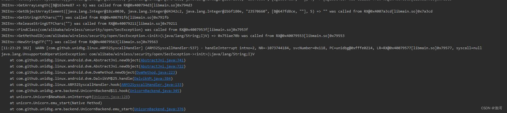
这里出现报错了，虽然这是一个补jni环境，但是这是在java层抛出一个异常。但是参数是没有错的，怎么会这样呢。

在这里就要考虑是不是有一些初始化的东西没有做了，但是so这里就只有一个函数，没有init名字相关的函数，那这时就要考虑初始化函数是不是自己本身，那么就要hook从so加载一直到调用目标函数的所有调用

```javascript
↓↓↓↓↓↓↓↓↓↓↓↓↓↓↓↓↓↓↓↓↓↓↓↓
java.lang.Exception
    at com.taobao.wireless.security.adapter.JNICLibrary.doCommandNative(Native Method)
    at com.alibaba.wireless.security.mainplugin.a.doCommand(Unknown Source)
    at com.alibaba.wireless.security.mainplugin.SecurityGuardMainPlugin.onPluginLoaded(Unknown Source)
    at com.alibaba.wireless.security.framework.d.a()
    at com.alibaba.wireless.security.framework.d.d()
    at com.alibaba.wireless.security.framework.d.getPluginInfo()
    at com.alibaba.wireless.security.open.initialize.b.a()
    at com.alibaba.wireless.security.open.initialize.a.loadLibrarySync()
    at com.alibaba.wireless.security.open.initialize.a.loadLibrarySync()
    at com.alibaba.wireless.security.open.initialize.a.initialize()
    at com.alibaba.wireless.security.open.SecurityGuardManager.getInstance()
    at com.alibaba.wireless.security.open.SecurityGuardManager.getInstance()
    at d.h.a.e.l.d(:1)
    at com.wuxianlin.getvideo.ui.YoukuFragment$d$a.run(:2)
    at java.lang.Thread.run(Thread.java:761)

传入参数：a
10101
传入参数：b
['<instance: java.lang.Object, $className: com.wuxianlin.getvideo.MainApplication>', '<instance: java.lang.Object, $className: java.lang.Integer>', '<instance: java.lang.Object, $className: java.lang.String>', '<instance: java.lang.Object, $className: java.lang.String>', '<instance: java.lang.Object, $className: java.lang.String>']
<instance: java.lang.Object, $className: com.wuxianlin.getvideo.MainApplication>
<instance: java.lang.Object, $className: java.lang.Integer>
<instance: java.lang.Object, $className: java.lang.String>
<instance: java.lang.Object, $className: java.lang.String>
<instance: java.lang.Object, $className: java.lang.String>
3

/data/user/0/com.wuxianlin.getvideo/app_SGLib

结果：
<instance: java.lang.Object, $className: java.lang.Integer>
↑↑↑↑↑↑↑↑↑↑↑↑↑↑↑↑↑↑↑↑↑↑↑↑
↓↓↓↓↓↓↓↓↓↓↓↓↓↓↓↓↓↓↓↓↓↓↓↓
java.lang.Exception
    at com.taobao.wireless.security.adapter.JNICLibrary.doCommandNative(Native Method)
    at com.alibaba.wireless.security.mainplugin.a.doCommand(Unknown Source)
    at com.alibaba.wireless.security.framework.d.a()
    at com.alibaba.wireless.security.framework.d.d()
    at com.alibaba.wireless.security.framework.d.getPluginInfo()
    at com.alibaba.wireless.security.open.initialize.b.a()
    at com.alibaba.wireless.security.open.initialize.a.loadLibrarySync()
    at com.alibaba.wireless.security.open.initialize.a.loadLibrarySync()
    at com.alibaba.wireless.security.open.initialize.a.initialize()
    at com.alibaba.wireless.security.open.SecurityGuardManager.getInstance()
    at com.alibaba.wireless.security.open.SecurityGuardManager.getInstance()
    at d.h.a.e.l.d(:1)
    at com.wuxianlin.getvideo.ui.YoukuFragment$d$a.run(:2)
    at java.lang.Thread.run(Thread.java:761)

传入参数：a
10102
传入参数：b
['<instance: java.lang.Object, $className: java.lang.String>', '<instance: java.lang.Object, $className: java.lang.String>', '<instance: java.lang.Object, $className: java.lang.String>']
<instance: java.lang.Object, $className: java.lang.String>
<instance: java.lang.Object, $className: java.lang.String>
<instance: java.lang.Object, $className: java.lang.String>
main
6.4.170
/data/app/com.wuxianlin.getvideo-1/lib/arm/libsgmainso-6.4.170.so
结果：
<instance: java.lang.Object, $className: java.lang.Integer>
↑↑↑↑↑↑↑↑↑↑↑↑↑↑↑↑↑↑↑↑↑↑↑↑
↓↓↓↓↓↓↓↓↓↓↓↓↓↓↓↓↓↓↓↓↓↓↓↓
java.lang.Exception
    at com.taobao.wireless.security.adapter.JNICLibrary.doCommandNative(Native Method)
    at com.alibaba.wireless.security.mainplugin.a.doCommand(Unknown Source)
    at com.alibaba.wireless.security.framework.d.a()
    at com.alibaba.wireless.security.framework.d.d()
    at com.alibaba.wireless.security.framework.d.a()
    at com.alibaba.wireless.security.framework.d.a()
    at com.alibaba.wireless.security.framework.d.d()
    at com.alibaba.wireless.security.framework.d.getPluginInfo()
    at com.alibaba.wireless.security.framework.d.getInterface()
    at com.alibaba.wireless.security.open.SecurityGuardManager.getInterface()
    at d.h.a.e.l.d(:1)
    at com.wuxianlin.getvideo.ui.YoukuFragment$d$a.run(:2)
    at java.lang.Thread.run(Thread.java:761)

传入参数：a
10102
传入参数：b
['<instance: java.lang.Object, $className: java.lang.String>', '<instance: java.lang.Object, $className: java.lang.String>', '<instance: java.lang.Object, $className: java.lang.String>']
<instance: java.lang.Object, $className: java.lang.String>
<instance: java.lang.Object, $className: java.lang.String>
<instance: java.lang.Object, $className: java.lang.String>
securitybody
6.4.99
/data/app/com.wuxianlin.getvideo-1/lib/arm/libsgsecuritybodyso-6.4.99.so
结果：
<instance: java.lang.Object, $className: java.lang.Integer>
↑↑↑↑↑↑↑↑↑↑↑↑↑↑↑↑↑↑↑↑↑↑↑↑
↓↓↓↓↓↓↓↓↓↓↓↓↓↓↓↓↓↓↓↓↓↓↓↓
java.lang.Exception
    at com.taobao.wireless.security.adapter.JNICLibrary.doCommandNative(Native Method)
    at com.alibaba.wireless.security.mainplugin.a.doCommand(Unknown Source)
    at com.alibaba.wireless.security.framework.d.a()
    at com.alibaba.wireless.security.framework.d.d()
    at com.alibaba.wireless.security.framework.d.getPluginInfo()
    at com.alibaba.wireless.security.framework.d.getInterface()
    at com.alibaba.wireless.security.open.SecurityGuardManager.getInterface()
    at d.h.a.e.l.d(:1)
    at com.wuxianlin.getvideo.ui.YoukuFragment$d$a.run(:2)
    at java.lang.Thread.run(Thread.java:761)

传入参数：a
10102
传入参数：b
['<instance: java.lang.Object, $className: java.lang.String>', '<instance: java.lang.Object, $className: java.lang.String>', '<instance: java.lang.Object, $className: java.lang.String>']
<instance: java.lang.Object, $className: java.lang.String>
<instance: java.lang.Object, $className: java.lang.String>
<instance: java.lang.Object, $className: java.lang.String>
avmp
6.4.36
/data/app/com.wuxianlin.getvideo-1/lib/arm/libsgavmpso-6.4.36.so
结果：
<instance: java.lang.Object, $className: java.lang.Integer>
↑↑↑↑↑↑↑↑↑↑↑↑↑↑↑↑↑↑↑↑↑↑↑↑
↓↓↓↓↓↓↓↓↓↓↓↓↓↓↓↓↓↓↓↓↓↓↓↓
java.lang.Exception
    at com.taobao.wireless.security.adapter.JNICLibrary.doCommandNative(Native Method)
    at com.alibaba.wireless.security.mainplugin.a.doCommand(Unknown Source)
    at com.alibaba.wireless.security.avmpplugin.a.a$a.a(Unknown Source)
    at com.alibaba.wireless.security.avmpplugin.a.a.createAVMPInstance(Unknown Source)
    at d.h.a.e.l.d(:1)
    at com.wuxianlin.getvideo.ui.YoukuFragment$d$a.run(:2)
    at java.lang.Thread.run(Thread.java:761)

传入参数：a
60901
传入参数：b
['<instance: java.lang.Object, $className: java.lang.String>', '<instance: java.lang.Object, $className: java.lang.String>']
<instance: java.lang.Object, $className: java.lang.String>
<instance: java.lang.Object, $className: java.lang.String>
mwua_uuid
sgcipher
结果：
<instance: java.lang.Object, $className: java.lang.Long>
↑↑↑↑↑↑↑↑↑↑↑↑↑↑↑↑↑↑↑↑↑↑↑↑
↓↓↓↓↓↓↓↓↓↓↓↓↓↓↓↓↓↓↓↓↓↓↓↓
java.lang.Exception
    at com.taobao.wireless.security.adapter.JNICLibrary.doCommandNative(Native Method)
    at com.alibaba.wireless.security.mainplugin.a.doCommand(Unknown Source)
    at com.alibaba.wireless.security.avmpplugin.a.a$a.invokeAVMP(Unknown Source)
    at d.h.a.e.l.d(:1)
    at com.wuxianlin.getvideo.ui.YoukuFragment$d$a.run(:2)
    at java.lang.Thread.run(Thread.java:761)

传入参数：a
60902
传入参数：b
['<instance: java.lang.Object, $className: java.lang.Long>', '<instance: java.lang.Object, $className: java.lang.String>', '<instance: java.lang.Object, $className: java.lang.Class>', '<instance: java.lang.Object, $className: [Ljava.lang.Object;>']
<instance: java.lang.Object, $className: java.lang.Long>
<instance: java.lang.Object, $className: java.lang.String>
<instance: java.lang.Object, $className: java.lang.Class>
<instance: java.lang.Object, $className: [Ljava.lang.Object;>
2955493818
sign
class [B
<instance: java.lang.Object, $className: [Ljava.lang.Object;>
[2,[99,99,111,100,101,61,48,49,48,51,48,49,48,49,48,50,38,99,108,105,101,110,116,95,105,112,61,49,57,50,46,49,54,56,46,49,46,49,38,99,108,105,101,110,116,95,116,115,61,49,54,54,49,53,55,48,51,51,51,38,117,116,105,100,61,89,119,109,78,72,82,66,65,113,74,119,68,65,78,99,117,53,84,86,117,49,118,55,75,38,118,105,100,61,88,77,106,107,52,79,68,65,121,77,122,73,121,79,65,61,61],111,"",[0,0,0,0],0]
结果：
<instance: java.lang.Object, $className: [B>
↑↑↑↑↑↑↑↑↑↑↑↑↑↑↑↑↑↑↑↑↑↑↑↑
↓↓↓↓↓↓↓↓↓↓↓↓↓↓↓↓↓↓↓↓↓↓↓↓
java.lang.Exception
    at com.taobao.wireless.security.adapter.JNICLibrary.doCommandNative(Native Method)
    at com.alibaba.wireless.security.mainplugin.a.doCommand(Unknown Source)
    at com.alibaba.wireless.security.open.staticdataencrypt.a.a(Unknown Source)
    at com.alibaba.wireless.security.open.staticdataencrypt.a.staticSafeEncrypt(Unknown Source)
    at d.h.a.e.m.a()
    at d.h.a.e.l.d(:2)
    at com.wuxianlin.getvideo.ui.YoukuFragment$d$a.run(:2)
    at java.lang.Thread.run(Thread.java:761)

传入参数：a
10601
传入参数：b
['<instance: java.lang.Object, $className: java.lang.Integer>', '<instance: java.lang.Object, $className: java.lang.Integer>', '<instance: java.lang.Object, $className: java.lang.Integer>', '<instance: java.lang.Object, $className: java.lang.String>', '<instance: java.lang.Object, $className: [B>', '<instance: java.lang.Object, $className: java.lang.String>']
<instance: java.lang.Object, $className: java.lang.Integer>
<instance: java.lang.Object, $className: java.lang.Integer>
<instance: java.lang.Object, $className: java.lang.Integer>
<instance: java.lang.Object, $className: java.lang.String>
<instance: java.lang.Object, $className: [B>
<instance: java.lang.Object, $className: java.lang.String>
1
16
1
23570660
长  度：6
字节集：[49, 50, 51, 52, 53, 54]
字符串：b'123456'
Base64：MTIzNDU2
HEX   ：313233343536

结果：
<instance: java.lang.Object, $className: [B>
长  度：24
字节集：[68, 78, 89, 76, 47, 78, 66, 47, 120, 56, 103, 112, 122, 74, 102, 75, 121, 83, 66, 52, 56, 81, 61, 61]
字符串：b'DNYL/NB/x8gpzJfKySB48Q=='
Base64：RE5ZTC9OQi94OGdwekpmS3lTQjQ4UT09
HEX   ：444e594c2f4e422f783867707a4a664b7953423438513d3d
↑↑↑↑↑↑↑↑↑↑↑↑↑↑↑↑↑↑↑↑↑↑↑↑
```

调用的次数不少，整理一下就是如下图

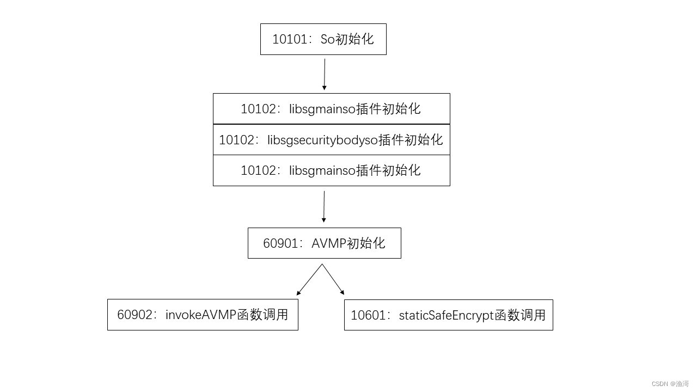
按照上面的逻辑顺序去调用doCommandNative函数

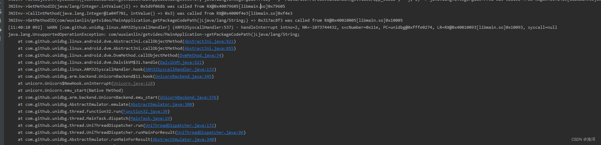
出现一些补环境的问题，这里就跳过了

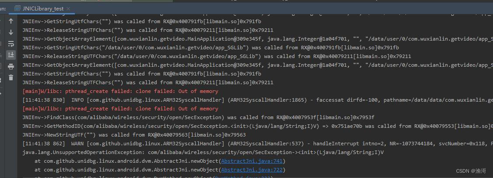
接着会出现libc的pthread_create failed，那这里就要开启多线程

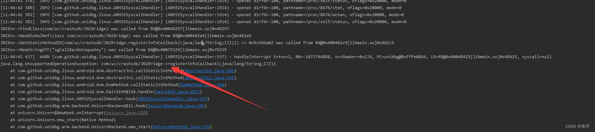
接着会出现一个【com/uc/crashsdk/JNIBridge】的类，但是我在java层并没有找到这个类，也就是说这个类很有可能是不存在的，但是unidbg没有办法知道java层是否真的有这个类，默认都是找到类的，那么应该怎么处理呢

在全局搜索【FindClass】，跳转到DalvikVM这个类里面

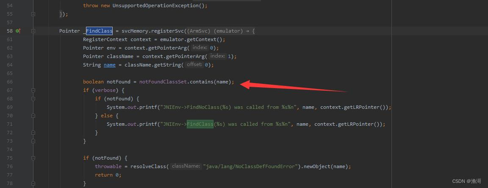

可以看到上面还有一个【notFoundClassSet】的处理，点击跳转进去，来到BaseVM

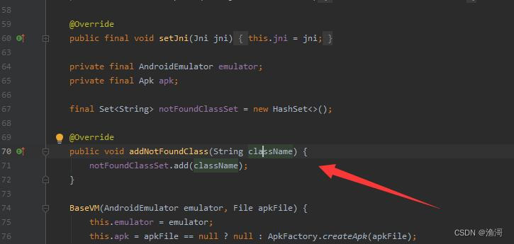
可以看到有一个addNotFoundClass的函数给我们进行调用，那么就可以在生成vm后进行下面调用

```java
vm.addNotFoundClass("com/uc/crashsdk/JNIBridge");
```

此时再运行，就不会出现这个补环境，并且从jni日志看到下面内容

```java
JNIEnv->FindNoClass(com/uc/crashsdk/JNIBridge) was called from RX@0x40048297[libmain.so]0x48297
```


so的初始化就完成，接着处理插件的初始化

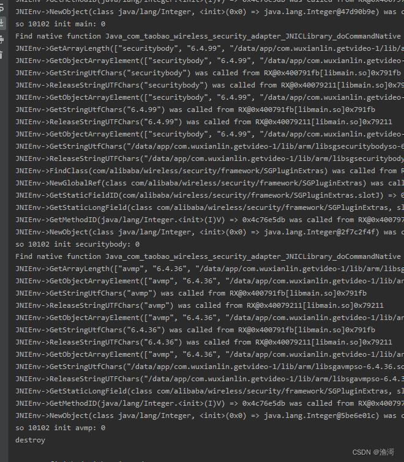
下一步就是生成vmp的函数

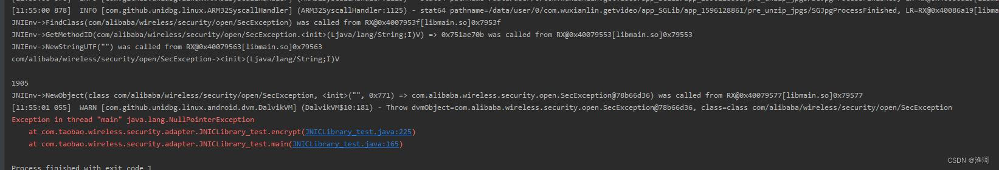
这里出现一个1905的报错，在app中查看这个报错的原因

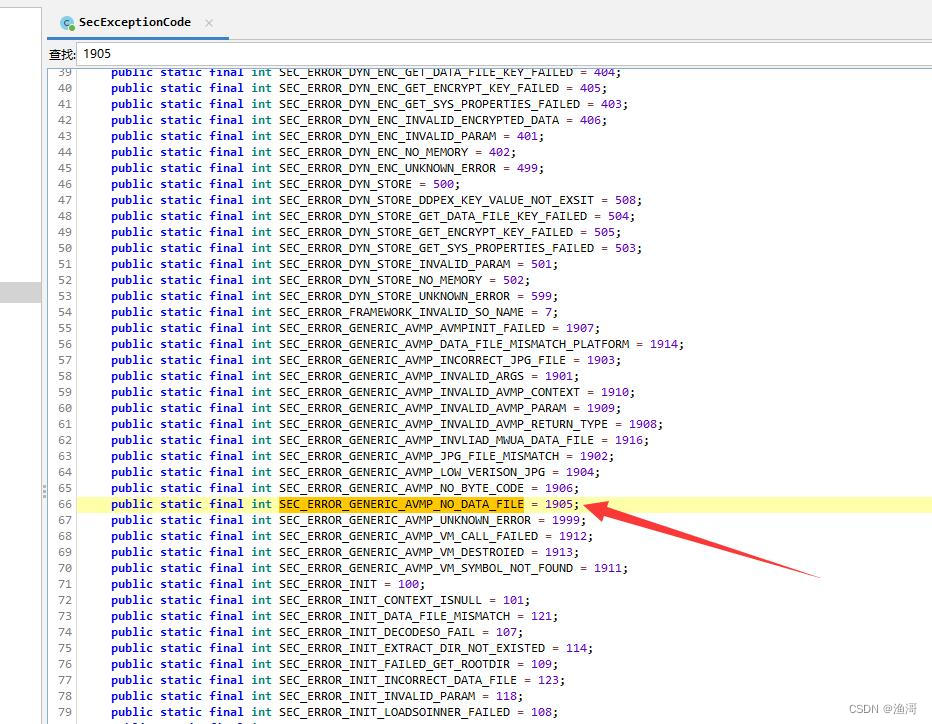
这里说了是一个找不到文件的错误，也就是说我们需要处理文件io

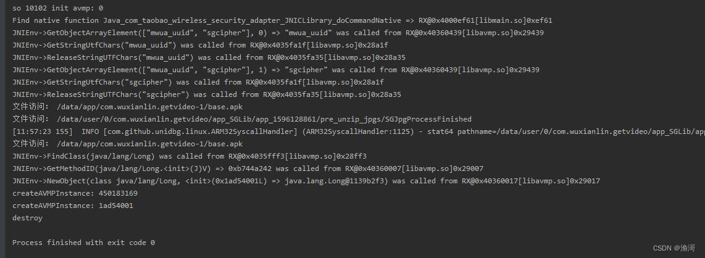
处理好文件访问后，就可以调用成功了，跟着调用invokeAVMP函数

```java
long createAVMPInstance = (Long) dvmObject.getValue();
        System.out.println("createAVMPInstance: " + createAVMPInstance);
        System.out.println("createAVMPInstance: " + Long.toHexString(createAVMPInstance));
        String ccode = "ccode=0103010102&client_ip=192.168.1.1&client_ts=" + (System.currentTimeMillis() / 1000) + "&utid=YwUOJY66/6oDANcu5TV0KQWW&vid=XMjk4ODAyMzIyOA==";
        dvmObject = JNICLibrary.callStaticJniMethodObject(
                emulator,
                "doCommandNative(I[Ljava/lang/Object;)Ljava/lang/Object;",
                60902,
                vm.addLocalObject(new ArrayObject(
                        DvmLong.valueOf(vm, createAVMPInstance),
                        new StringObject(vm, "sign"),
                        vm.resolveClass("[B"),
                        new ArrayObject(
                                DvmInteger.valueOf(vm, 2),
                                new ByteArray(vm, ccode.getBytes()),
                                DvmInteger.valueOf(vm, ccode.length()),
                                new StringObject(vm, ""),
                                new ByteArray(vm, new byte[4]),
                                DvmInteger.valueOf(vm, 0)
                        )
                ))
        );
```

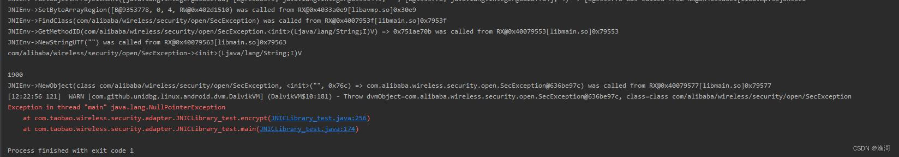
这次出现的是1900的错误

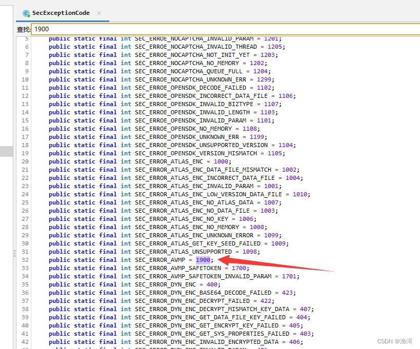
这里只说了是VMP错误，但是没有详细信息。我也不知道怎么搞了，但是经过分析发现，这个并非是目标函数的前置函数，也就是说这个函数可以不调用。

如果哪位大佬知道这里报错1900的源码，麻烦评论区回复一下，先感谢了

那么接下来直接调用目标函数

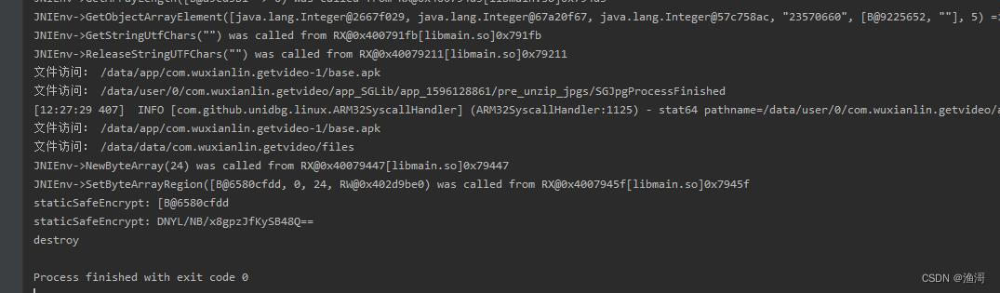
这次终于调用成功了，并且结果与hook的是一致的，说明调用没有错误。完美，散花！！！

------

**补充 By shlu：**

