# 白盒AES算法详解(一)

> 转：https://bbs.kanxue.com/thread-280335.htm

在白盒攻击环境中，密钥变得无所遁形，因此诞生了一系列的魔改算法，其中应用最广、效果最好的莫过于白盒算法，该算法在白盒攻击环境下被提出，能够保证密钥在内存分析、动态调试过程中不被发现。所以我们将会用系列文章来说明标准AES存在的问题，以及白盒化如何实现，白盒算法又面临什么样的挑战。该文章是第一篇，主要详解AES算法的实现、密钥问题以及故障分析等。内容比较干燥，主要为后续文章做铺垫，读者可选择性阅读感兴趣的章节。

## 一、AES算法简述

首先简单讨论AES算法本身，对AES真正熟悉的读者可以跳过这部分。工作模式以及填充方式并非AES独有的内容，这里不做讨论。AES-128接收16字节的明文输入，16字节的密钥，输出16字节的密文结果。

我们key设置为**2b7e151628aed2a6abf7158809cf4f3c**，明文设置为**00112233445566778899aabbccddeeff**。

```py
input_bytes = 0x00112233445566778899aabbccddeeff
key = 0x2b7e151628aed2a6abf7158809cf4f3c
```

接下来进入AES的世界,下方是整体流程图:

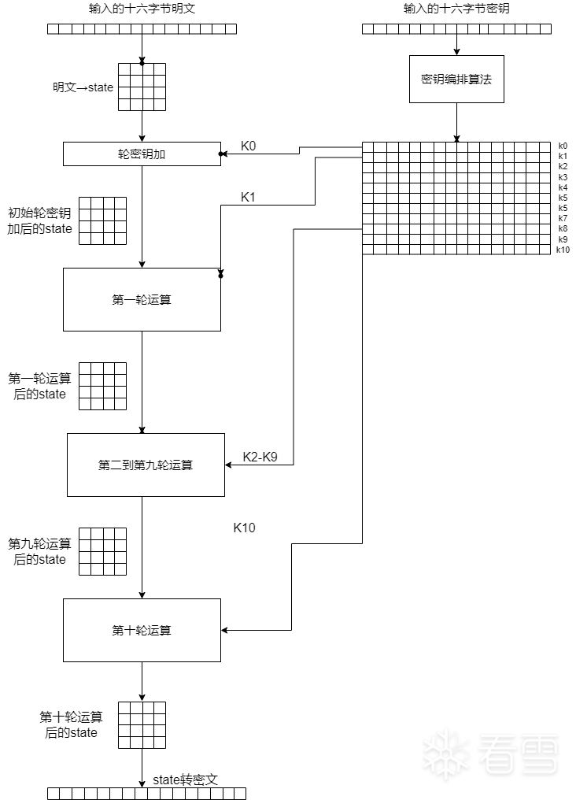

首先看整体的流程图，我们发现，AES的整体图景可以分成左右两块，即明文的处理和密钥的编排。明文的处理主体是一个初始化轮密钥加和十轮运算，在初始化轮密钥加十轮运算中都需要使用密钥编排的结果。密钥编排将16个字节经过运算推演出11组轮密钥，每一组16个字节，称之为,....*K*0,*K*1....*K*10

## 二、密钥编排

下面我们看一下密钥扩展是如何算出来的，假设密钥Key为： **2b7e151628aed2a6abf7158809cf4f3c**。为了区分密钥和密钥编排后的轮密钥，我们将此时的密钥叫主密钥。

在AES-128中，密钥扩展后得16*11共176字节，使用时**逐十六个字节**划分成,,...*K*0,*K*1,...*K*10使用，但是在生成时，它是**逐四个字**节生成的，即44*4。我们不妨用数组来描述它，即一个包含了44个元素的数组,叫W*W*。

这四十四个元素的生成规则有三种，如下图所示

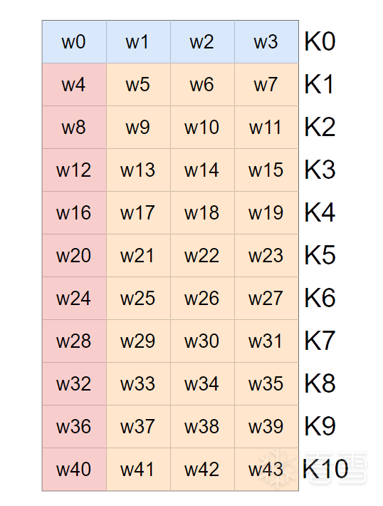

不同颜色代表了不同规则。最上方的,,,*W*0,*W*1,*W*2,*W*3 就是主密钥本身切成四段。

Key=beaedaabfcffc=be=aeda=abf=cffc*Key*=2*b*7*e*151628*a**e**d*2*a*6*ab**f*7158809*c**f*4*f*3*c**W*0=2*b*7*e*1516*W*1=28*a**e**d*2*a*6*W*2=*ab**f*71588*W*3=09*c**f*4*f*3*c*

#### 2.1 红色区域

左侧的红色部分，,,,....*W*4,*W*8,*W*12,....*W*40的生成复杂一点。

=g()xor*W**n*=*g*(*W**n*−1)*x**or**W**n*−4

xor 是异或运算，比如 =g()xor*W*4=*g*(*W*3)*x**or**W*0。g(当前元素前面那个元素) 异或 当前元素头顶上那个元素。

那么关键点就是这个 g*g* 函数了， g*g* 函数一共三个步骤——行移位、S盒替换、字节异或。我们以W*W*4运算中所需的*W*3为例。

=cffc*W*3=09*c**f*4*f*3*c*

首先是行移位，也就是循环左移，规则固定——将最左边的一个字节挪到右边即可

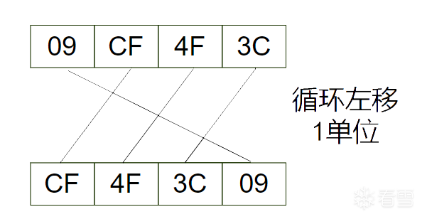

第二步是S盒替换，S盒是固定的,S盒替换听着很高级，但操作上很简单——将数值本身作为索引取出S数组中对用的值。

```
SBox ``=` `[``0x63``, ``0x7C``, ``0x77``, ``0x7B``, ``0xF2``, ``0x6B``, ``0x6F``, ``0xC5``, ``0x30``, ``0x01``, ``0x67``, ``0x2B``, ``0xFE``, ``0xD7``, ``0xAB``, ``0x76``,``0xCA``, ``0x82``, ``0xC9``, ``0x7D``, ``0xFA``, ``0x59``, ``0x47``, ``0xF0``, ``0xAD``, ``0xD4``, ``0xA2``, ``0xAF``, ``0x9C``, ``0xA4``, ``0x72``, ``0xC0``,``0xB7``, ``0xFD``, ``0x93``, ``0x26``, ``0x36``, ``0x3F``, ``0xF7``, ``0xCC``, ``0x34``, ``0xA5``, ``0xE5``, ``0xF1``, ``0x71``, ``0xD8``, ``0x31``, ``0x15``,``0x04``, ``0xC7``, ``0x23``, ``0xC3``, ``0x18``, ``0x96``, ``0x05``, ``0x9A``, ``0x07``, ``0x12``, ``0x80``, ``0xE2``, ``0xEB``, ``0x27``, ``0xB2``, ``0x75``,``0x09``, ``0x83``, ``0x2C``, ``0x1A``, ``0x1B``, ``0x6E``, ``0x5A``, ``0xA0``, ``0x52``, ``0x3B``, ``0xD6``, ``0xB3``, ``0x29``, ``0xE3``, ``0x2F``, ``0x84``,``0x53``, ``0xD1``, ``0x00``, ``0xED``, ``0x20``, ``0xFC``, ``0xB1``, ``0x5B``, ``0x6A``, ``0xCB``, ``0xBE``, ``0x39``, ``0x4A``, ``0x4C``, ``0x58``, ``0xCF``,``0xD0``, ``0xEF``, ``0xAA``, ``0xFB``, ``0x43``, ``0x4D``, ``0x33``, ``0x85``, ``0x45``, ``0xF9``, ``0x02``, ``0x7F``, ``0x50``, ``0x3C``, ``0x9F``, ``0xA8``,``0x51``, ``0xA3``, ``0x40``, ``0x8F``, ``0x92``, ``0x9D``, ``0x38``, ``0xF5``, ``0xBC``, ``0xB6``, ``0xDA``, ``0x21``, ``0x10``, ``0xFF``, ``0xF3``, ``0xD2``,``0xCD``, ``0x0C``, ``0x13``, ``0xEC``, ``0x5F``, ``0x97``, ``0x44``, ``0x17``, ``0xC4``, ``0xA7``, ``0x7E``, ``0x3D``, ``0x64``, ``0x5D``, ``0x19``, ``0x73``,``0x60``, ``0x81``, ``0x4F``, ``0xDC``, ``0x22``, ``0x2A``, ``0x90``, ``0x88``, ``0x46``, ``0xEE``, ``0xB8``, ``0x14``, ``0xDE``, ``0x5E``, ``0x0B``, ``0xDB``,``0xE0``, ``0x32``, ``0x3A``, ``0x0A``, ``0x49``, ``0x06``, ``0x24``, ``0x5C``, ``0xC2``, ``0xD3``, ``0xAC``, ``0x62``, ``0x91``, ``0x95``, ``0xE4``, ``0x79``,``0xE7``, ``0xC8``, ``0x37``, ``0x6D``, ``0x8D``, ``0xD5``, ``0x4E``, ``0xA9``, ``0x6C``, ``0x56``, ``0xF4``, ``0xEA``, ``0x65``, ``0x7A``, ``0xAE``, ``0x08``,``0xBA``, ``0x78``, ``0x25``, ``0x2E``, ``0x1C``, ``0xA6``, ``0xB4``, ``0xC6``, ``0xE8``, ``0xDD``, ``0x74``, ``0x1F``, ``0x4B``, ``0xBD``, ``0x8B``, ``0x8A``,``0x70``, ``0x3E``, ``0xB5``, ``0x66``, ``0x48``, ``0x03``, ``0xF6``, ``0x0E``, ``0x61``, ``0x35``, ``0x57``, ``0xB9``, ``0x86``, ``0xC1``, ``0x1D``, ``0x9E``,``0xE1``, ``0xF8``, ``0x98``, ``0x11``, ``0x69``, ``0xD9``, ``0x8E``, ``0x94``, ``0x9B``, ``0x1E``, ``0x87``, ``0xE9``, ``0xCE``, ``0x55``, ``0x28``, ``0xDF``,``0x8C``, ``0xA1``, ``0x89``, ``0x0D``, ``0xBF``, ``0xE6``, ``0x42``, ``0x68``, ``0x41``, ``0x99``, ``0x2D``, ``0x0F``, ``0xB0``, ``0x54``, ``0xBB``, ``0x16``]` `num ``=` `0x13``result ``=` `SBox[num]``### 7d
```

S盒的背后有十分复杂的知识，据说S盒的设计上留有后门，所以我们会推出国密算法等，但好在我们并不需要去了解。

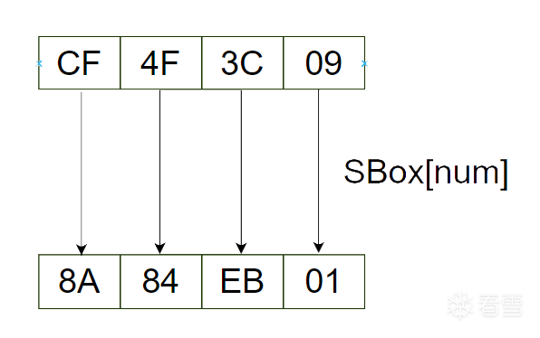

最后一个步骤更简单，将上一步结果中的最高字节和一个固定常量异或。W4的生成是第一个，用如下rcon表的第一个元素0x1。W40即第十次，用最后一个元素0x36.

```
rcon ``=` `[``0x01``, ``0x02``, ``0x04``, ``0x08``, ``0x10``, ``0x20``, ``0x40``, ``0x80``, ``0x1B``, ``0x36``]
```

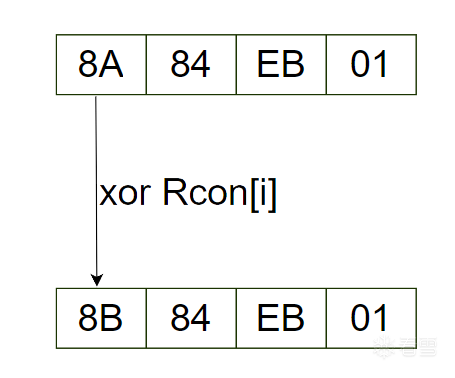

=g()xor=g(cffc)xorbe=bebxorbe=afafe*W*4=*g*(*W*3)*x**or**W*1=*g*(09*c**f*4*f*3*c*)*x**or*2*b*7*e*1516=8*b*84*e**b*01*x**or*2*b*7*e*1516=*a*0*f**a**f**e*17

最后一步的异或我用Python算的

```
print``(``hex``(``0x8b84eb01` `^ ``0x2b7e1516``))
```

#### 2.2 橙色区域

上图中蓝色和红色的部分我们都讲完了，那么橙色部分呢？相当的简单，和红色部分类似，去掉g函数即可

=xor*W**n*=*W**n*−1*x**or**W**n*−4

打个比方，*W*5 = *W*4 ^ *W*1 = 0xa0fafe17 ^ 0x28aed2a6 = 0x88542cb1。

至此，密钥编排的整体过程就结束了。

## 三、明文运算

现在开始分析明文运算的过程。首先，调整明文的格式，在AES中，数据以state*s**t**a**t**e*的形式计算、中间存储和传输，中文名即**状态**。

从明文转到state形式很简单，以我们的明文**00112233445566778899aabbccddeeff**为例。从上到下，从左到右。千万不要颠倒顺序，第一行不是“00 11 22 33”。除此之外，**state中的数，我们一般用十六进制表示，且不加0x前缀，这样看着比较舒服。除非特意强调是十进制，否则下文均为十六进制。**

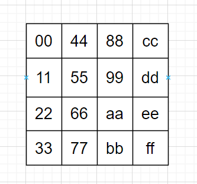

#### 3.1 轮密钥加

首先是轮密钥加步骤，因为是第一次轮密钥加步骤，所以也叫初始轮密钥加。具体步骤很简单，只需要将对应的轮密钥和 state*s**t**a**t**e* 一样从上到下，从左到右排列。两个矩阵逐字节异或，这就是轮密钥加步骤。

初始的轮密钥加使用 *K*0 ，2b7e151628aed2a6abf7158809cf4f3c。

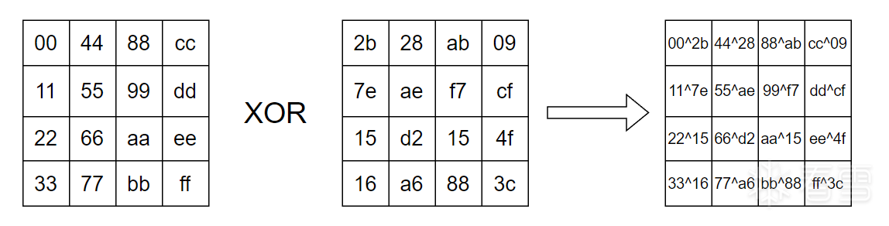

接下来就是十轮主运算，看如下的伪代码，我们可以清楚看到一轮运算中有什么，以及第十轮和前九轮有什么区别。

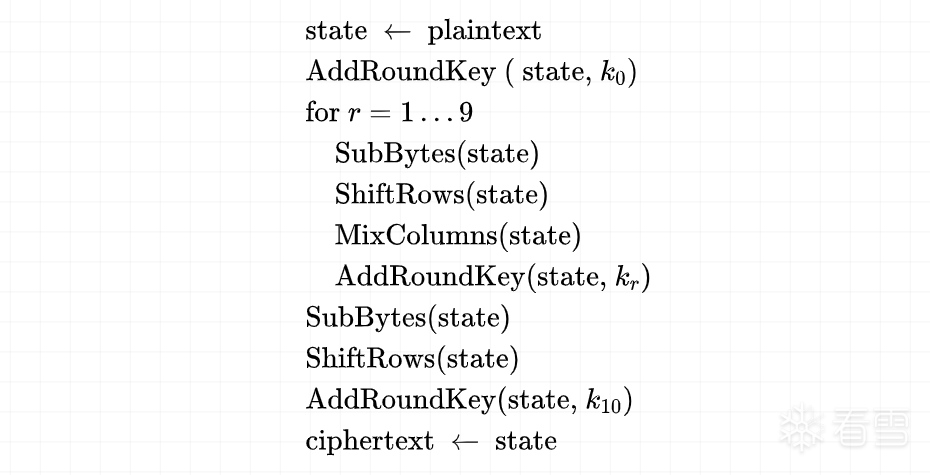

初始的明文转 state*s**t**a**t**e* 和最后的 state*s**t**a**t**e* 转明文自不必说，然后是初始轮密钥，使用 *K*0 。

前九轮运算中，包含四个步骤：字节替换，行移位，列混淆，轮密钥加。

第十轮中，包含三个步骤：字节替换，行移位，轮密钥加。相比前九轮缺一个列混淆，其余相同。

十轮运算中的轮密钥加，和初始轮密钥加相比，除了使用的轮密钥不同外，并无不同，分别为.....*K*1.....*K*10。

#### 3.2 字节替换

SubBytes*S**u**b**B**y**t**es* 字节替换步骤，和密钥编排中的S盒替换完全一致，在此不再赘述。

#### 3.3 行移位

ShiftRows*S**hi**f**tR**o**w**s* 循环左移，和密钥编排中的循环左移类似，但有差异。密钥编排中， g*g* 函数中也需循环左移，但其中待处理的数据仅有一行，而明文编排中 state*s**t**a**t**e* 是四行。其循环左移规则如下：第一行不循环左移，第二行循环左移1字节，第三行循环左移2字节，第四行循环左移3字节。

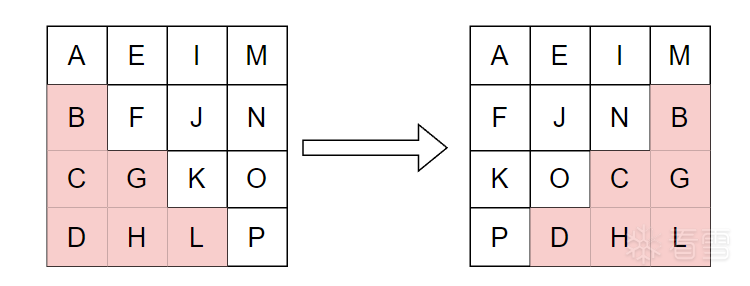

#### 3.4 列混淆

相对复杂的是列混淆步骤，列混淆步骤涉及两块知识，1是矩阵乘法，2是伽罗瓦域的加法和乘法。

先看第一块——矩阵乘法。首先演示简单的矩阵相乘，

{}∗{}={}{1425}∗{7246}={*a**c**b**d*}

左边准备相乘的两个矩阵，我们称它俩为矩阵A和矩阵B，如何求结果矩阵中的abcd*ab**c**d* ？规则如下：第m行第n列的值等于**矩阵**A的第m行的元素与**矩阵**B的第n列对应元素乘积之和。

a是第一行第一列，那么就是A的第一行和B的第一列元素**乘积之和**

a=∗+∗=*a*=1∗7+2∗2=11

同理可得

b=∗+∗=c=∗+∗=d=∗+∗=*b*=1∗4+2∗6=16*c*=4∗7+5∗2=38*d*=4∗4+5∗6=46

即

{}∗{}={}{1425}∗{7246}={11381646}

所谓乘积之和，指乘法和加法。

再来看AES列混淆中的矩阵乘法，我们的 state*s**t**a**t**e* ，左边乘如下所示固定矩阵

{}∗{}⎩⎨⎧2113321113211132⎭⎬⎫∗⎩⎨⎧*A**B**C**D**E**F**G**H**I**J**K**L**M**N**O**P*⎭⎬⎫

看起来有些复杂，小例子中是2*2的矩阵要算4个值，这里是4*4的矩阵要算16个值。我们这里只管第一列，其他列的计算类似。

{}⎩⎨⎧2*A*+3*B*+*C*+*D**A*+2*B*+3*C*+*D**A*+*B*+2*C*+3*D*3*A*+*B*+*C*+2*D*....................................⎭⎬⎫

列混淆中的的加法和乘法并不是小例子或日常中的那样，其中的加法指**异或运算**。2A + 3B + C + D 即 2A ^ 3B ^ C ^ D，这也是AddRoundKeys*A**dd**R**o**u**n**d**Keys* 叫轮密钥加而不是轮密钥异或的原因——加法就是异或。那么其中的乘法呢？乘法复杂一些，想真正理解的读者可以搜索**伽罗瓦域内乘法**。我们这里仅考虑如下三种情况，因为AES-128加密中，列混淆的乘法中，仅涉及这三个数。

x∗=?x∗=?x∗=?*x*∗1=?*x*∗2=?*x*∗3=?

结合Python代码可以更清晰，函数名中 mul 是multiply（乘）的缩写。

**x \* 1，结果为x本身**

```
def` `mul_by_01(num):``  ``return` `num
```

**x \* 2，首先切换到二进制形式，最高位为0时，比特串左移1比特，最右边补0即可。如果最高位为1，比特串左移1比特，最右边补0，最后再异或上 0x1B**

```
def` `mul_by_02(num):``  ``if` `num < ``0x80``:``    ``res ``=` `(num << ``1``)``  ``else``:``    ``res ``=` `(num << ``1``) ^ ``0x1b` `  ``return` `res ``%` `0x100
```

**x \* 3 = (x \* 02) + x，注意”加“是异或**。

```
def` `mul_by_03(num):``  ``return` `(mul_by_02(num) ^ num)
```

## 四、密钥相关问题

接下来我们讨论关于密钥编排更深的一些问题。通过这些问题来挖掘出白盒算法面临的问题。我们将密钥本身叫主密钥，编排后的轮密钥。我们主要讨论一个问题：**可以从轮密钥逆推主密钥吗？**

首先讨论AES-128：

```
K00:``2b7e151628aed2a6abf7158809cf4f3c``K01:a0fafe1788542cb123a339392a6c7605``K02:f2c295f27a96b9435935807a7359f67f``K03:``3d80477d4716fe3e1e237e446d7a883b``K04:ef44a541a8525b7fb671253bdb0bad00``K05:d4d1c6f87c839d87caf2b8bc11f915bc``K06:``6d88a37a110b3efddbf98641ca0093fd``K07:``4e54f70e5f5fc9f384a64fb24ea6dc4f``K08:ead27321b58dbad2312bf5607f8d292f``K09:ac7766f319fadc2128d12941575c006e``K10:d014f9a8c9ee2589e13f0cc8b6630ca6
```

假如获取到的是*K*0，自不必说。如果获取的是*K*10呢？

#### 4.1 K10分析

**d014f9a8c9ee2589e13f0cc8b6630ca6**，首先我们会到W*W*数组的视图，看*K*10密钥怎么编排出来的。

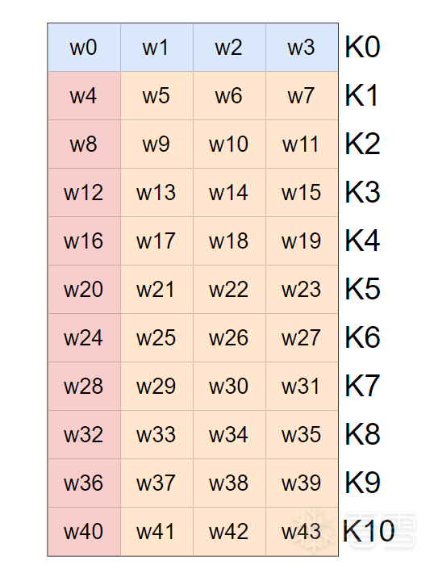

K10是,,,*W*40,*W*41,*W*42,*W*43拼起来的，我们已知*K*10，即已知,,,*W*40,*W*41,*W*42,*W*43。有没有办法求*K*9？如果可以，那么同理可以逆推到*K*0，即求得了主密钥。

=g()xor=xor=xor=xor*W*40=*g*(*W*39)*x**or**W*36*W*41=*W*40*x**or**W*37*W*42=*W*41*x**or**W*38*W*43=*W*42*x**or**W*39

根据异或的基本性质，**异或作用与比特位上，对应的比特位相同则为0，相异则为1**。

xor=xor=xor=xor=0*x**or*0=01*x**or*0=10*x**or*1=11*x**or*1=0

因为相同为0，相异为1，那么一个数和自身异或时，因为每个比特位都相同，所以结果为0。

X+X=*X*+*X*=0

而当某个数和0异或时，自身为0的比特0^0得0，自身为1的比特位1^0得1，这就导致结果和没异或前一样。

X+=X*X*+0=*X*

除此之外，异或并不看谁先谁后，A ^ B 与 B ^ A 显然无区别，即具有交换律。

X+Y=Y+X*X*+*Y*=*Y*+*X*

矩阵乘法不具有交换律，矩阵结果的第m行第n列的值等于**矩阵**A的第m行的元素与**矩阵**B的第n列对应元素乘积之和。谁在前谁在后影响了用行还是用列。

下面做变换，左右和*W*42异或

=xorxor=xorxorxor=xor=xor*W*43=*W*42*x**or**W*39*W*42*x**or**W*43=*W*42*x**or**W*42*x**or**W*39*W*42*x**or**W*43=0*x**or**W*39*W*39=*W*42*x**or**W*43

*K*10中涉及到的四个式子均可以做变化

=g()xor=xor=xor=xor*W*36=*g*(*W*39)*x**or**W*40*W*37=*W*40*x**or**W*41*W*38=*W*41*x**or**W*42*W*39=*W*42*x**or**W*43

*K*10 = **d014f9a8c9ee2589e13f0cc8b6630ca6**，切成四块

=dfa=cee=efcc=bca*W*40=*d*014*f*9*a*8*W*41=*c*9*ee*2589*W*42=*e*13*f*0*cc*8*W*43=*b*6630*c**a*6

```
>>> ``hex``(``0xd014f9a8``^``0xc9ee2589``)``'0x19fadc21'``>>> ``hex``(``0xc9ee2589``^``0xe13f0cc8``)``'0x28d12941'``>>> ``hex``(``0xe13f0cc8``^``0xb6630ca6``)``'0x575c006e'
```

求出了*W*37、*W*38、*W*39，即 *K*9 的后大半部分，和真实情况比对后发现一致。

#### 4.2 K09分析

K09:ac7766f3**19fadc2128d12941575c006e**

那么*W*36呢？再复看一下 g*g* 函数吧

首先循环左移一字节，575c006e 变成 5c006e57

然后逐字节S盒替换，得4a639f5b

```
>>> Sbox ``=` `(``...   ``0x63``, ``0x7C``, ``0x77``, ``0x7B``, ``0xF2``, ``0x6B``, ``0x6F``, ``0xC5``, ``0x30``, ``0x01``, ``0x67``, ``0x2B``, ``0xFE``, ``0xD7``, ``0xAB``, ``0x76``,``...   ``0xCA``, ``0x82``, ``0xC9``, ``0x7D``, ``0xFA``, ``0x59``, ``0x47``, ``0xF0``, ``0xAD``, ``0xD4``, ``0xA2``, ``0xAF``, ``0x9C``, ``0xA4``, ``0x72``, ``0xC0``,``...   ``0xB7``, ``0xFD``, ``0x93``, ``0x26``, ``0x36``, ``0x3F``, ``0xF7``, ``0xCC``, ``0x34``, ``0xA5``, ``0xE5``, ``0xF1``, ``0x71``, ``0xD8``, ``0x31``, ``0x15``,``...   ``0x04``, ``0xC7``, ``0x23``, ``0xC3``, ``0x18``, ``0x96``, ``0x05``, ``0x9A``, ``0x07``, ``0x12``, ``0x80``, ``0xE2``, ``0xEB``, ``0x27``, ``0xB2``, ``0x75``,``...   ``0x09``, ``0x83``, ``0x2C``, ``0x1A``, ``0x1B``, ``0x6E``, ``0x5A``, ``0xA0``, ``0x52``, ``0x3B``, ``0xD6``, ``0xB3``, ``0x29``, ``0xE3``, ``0x2F``, ``0x84``,``...   ``0x53``, ``0xD1``, ``0x00``, ``0xED``, ``0x20``, ``0xFC``, ``0xB1``, ``0x5B``, ``0x6A``, ``0xCB``, ``0xBE``, ``0x39``, ``0x4A``, ``0x4C``, ``0x58``, ``0xCF``,``...   ``0xD0``, ``0xEF``, ``0xAA``, ``0xFB``, ``0x43``, ``0x4D``, ``0x33``, ``0x85``, ``0x45``, ``0xF9``, ``0x02``, ``0x7F``, ``0x50``, ``0x3C``, ``0x9F``, ``0xA8``,``...   ``0x51``, ``0xA3``, ``0x40``, ``0x8F``, ``0x92``, ``0x9D``, ``0x38``, ``0xF5``, ``0xBC``, ``0xB6``, ``0xDA``, ``0x21``, ``0x10``, ``0xFF``, ``0xF3``, ``0xD2``,``...   ``0xCD``, ``0x0C``, ``0x13``, ``0xEC``, ``0x5F``, ``0x97``, ``0x44``, ``0x17``, ``0xC4``, ``0xA7``, ``0x7E``, ``0x3D``, ``0x64``, ``0x5D``, ``0x19``, ``0x73``,``...   ``0x60``, ``0x81``, ``0x4F``, ``0xDC``, ``0x22``, ``0x2A``, ``0x90``, ``0x88``, ``0x46``, ``0xEE``, ``0xB8``, ``0x14``, ``0xDE``, ``0x5E``, ``0x0B``, ``0xDB``,``...   ``0xE0``, ``0x32``, ``0x3A``, ``0x0A``, ``0x49``, ``0x06``, ``0x24``, ``0x5C``, ``0xC2``, ``0xD3``, ``0xAC``, ``0x62``, ``0x91``, ``0x95``, ``0xE4``, ``0x79``,``...   ``0xE7``, ``0xC8``, ``0x37``, ``0x6D``, ``0x8D``, ``0xD5``, ``0x4E``, ``0xA9``, ``0x6C``, ``0x56``, ``0xF4``, ``0xEA``, ``0x65``, ``0x7A``, ``0xAE``, ``0x08``,``...   ``0xBA``, ``0x78``, ``0x25``, ``0x2E``, ``0x1C``, ``0xA6``, ``0xB4``, ``0xC6``, ``0xE8``, ``0xDD``, ``0x74``, ``0x1F``, ``0x4B``, ``0xBD``, ``0x8B``, ``0x8A``,``...   ``0x70``, ``0x3E``, ``0xB5``, ``0x66``, ``0x48``, ``0x03``, ``0xF6``, ``0x0E``, ``0x61``, ``0x35``, ``0x57``, ``0xB9``, ``0x86``, ``0xC1``, ``0x1D``, ``0x9E``,``...   ``0xE1``, ``0xF8``, ``0x98``, ``0x11``, ``0x69``, ``0xD9``, ``0x8E``, ``0x94``, ``0x9B``, ``0x1E``, ``0x87``, ``0xE9``, ``0xCE``, ``0x55``, ``0x28``, ``0xDF``,``...   ``0x8C``, ``0xA1``, ``0x89``, ``0x0D``, ``0xBF``, ``0xE6``, ``0x42``, ``0x68``, ``0x41``, ``0x99``, ``0x2D``, ``0x0F``, ``0xB0``, ``0x54``, ``0xBB``, ``0x16``,``... )``>>> ``hex``(Sbox[``0x5c``])``'0x4a'``>>> ``hex``(Sbox[``0x00``])``'0x63'``>>> ``hex``(Sbox[``0x6e``])``'0x9f'``>>> ``hex``(Sbox[``0x57``])``'0x5b'
```

最后是首字节和Rcon中的一个字节异或，这是最后一次变换，即用0x36

```
Rcon ``=` `(``0x00``, ``0x01``, ``0x02``, ``0x04``, ``0x08``, ``0x10``, ``0x20``, ``0x40``, ``0x80``, ``0x1B``, ``0x36``)
>>> ``hex``(``0x4a``^``0x36``)``'0x7c'
```

g函数的结果即7c639f5b

```
>>> ``hex``(``0x7c639f5b` `^ ``0xd014f9a8``)``'0xac7766f3'
```

完整的K9: **ac7766f319fadc2128d12941575c006e**，就被我们分析出来了。

根据这套流程，我们可以继续往上推出K0，获得主密钥。即AES可以依靠轮密钥逆推出主密钥。严肃的说，AES-128可以通过一轮轮密钥逆推出主密钥，AES-192需要一轮半，AES-256需要两轮轮密钥。感兴趣的读者可以去处理一下AES-192/256。

## 五、故障对密文的影响

经过上面的了解，我们知道获取轮密钥即可逆推出主密钥，那如何获取轮密钥呢？

在AES中，数据以 state*s**t**a**t**e* 的形式计算、中间存储和传输。考虑一个问题，如果在**某个时机**，state*s**t**a**t**e* 中的一个字节发生了错误，变成了另一个字节，这会对密文造成什么影响？

我们可以通过DBI工具（比如Frida），Debuggger（比如IDA），修改二进制文件本身（SO patch）来实现对 state*s**t**a**t**e* 中一个字节的更改，这可以称为引导、诱发一个错误。

因此差分故障攻击或差分错误攻击都是DFA合适的名字，如图是修改 state*s**t**a**t**e* 中第一个字节的值。

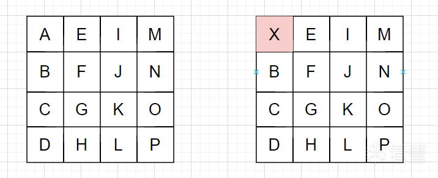

**先解释一下图示，我们将未修改 state\*s\**t\**a\**t\**e\* 的执行流叫正常情况，修改了state中一字节的执行流叫故障情况，我们观察正常和故障两种情况下，state\*s\**t\**a\**t\**e\* 中产生差异的字节，即图中的粉色格子。**

#### 5.1 起始处发生故障对密文的影响

首先是初始轮密钥加，错误限于这一个字节

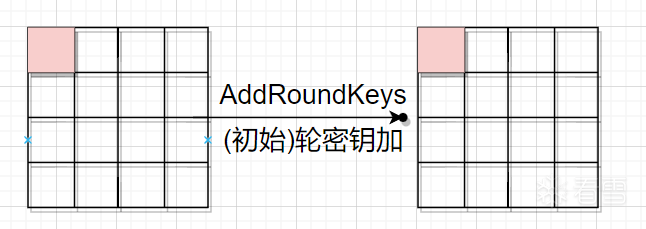

然后是第一轮的字节替换，错误限于这一个字节

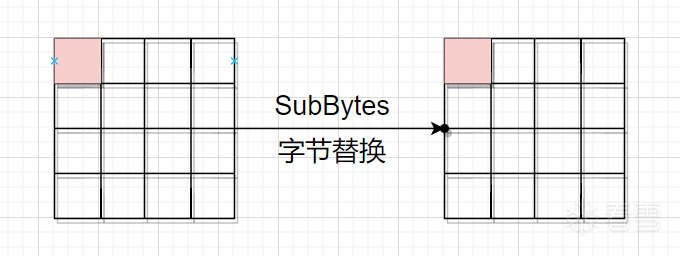

然后是第一轮的循环左移，因为是第一行，所以没动。

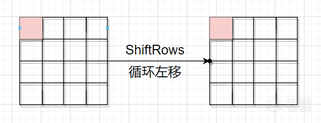

然后是第一轮的列混淆步骤，再次复习矩阵乘法，结果的第m行第n列的值等于**矩阵**A的第m行的元素与**矩阵**B的第n列对应元素乘积之和，因此结果中第一列的每一个元素都受到矩阵B（即下图左边）第一列中每个元素的影响。因而，一个字节的错误被扩散到了一整列。或者说，正常情况和故障情况在第一轮列混淆结束后，有四个字节的值不同。

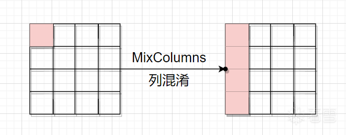

然后是第一轮的轮密钥加，它只作用用当前字节，不会将差异扩散出去。

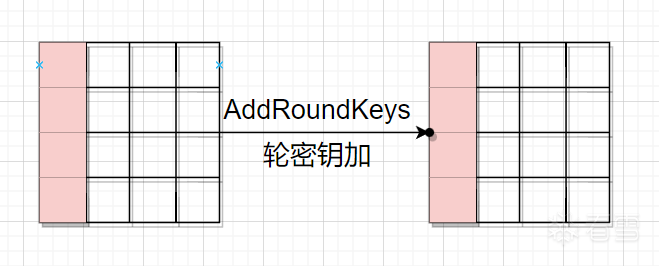

可以看到，在一轮循环后，一个字节的故障，被扩散到了四个字节上。我们继续第二轮。

第二轮的字节替换


第二轮的循环左移，需要注意到，虽然差异还是四个字节，但被扩散到不同的四列去了。

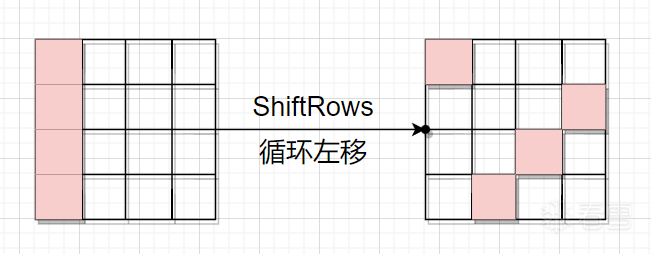

第二轮的列混淆，每列存在的差异扩散到整列，这导致state的全部字节都与原先有差异。
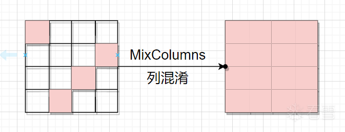

我们发现，AES运算中，仅在第二轮 MixColumns*M**i**x**C**o**l**u**mn**s* 结束后，一个字节的差异就已经扩散到所有字节上了。

我们可以更仔细的观察到，如果没有 MixColumns*M**i**x**C**o**l**u**mn**s* ，那么 state*s**t**a**t**e* 中一个字节的差异，不论循环多少轮，也只会带来一个字节的差异。反过来说，每一次 MixColumns*M**i**x**C**o**l**u**mn**s* ，都会让一个字节的差异变成四个字节的差异。

如果没有 ShiftRows*S**hi**f**tR**o**w**s* ，一列中的变化不会影响其余列。那么state中一个字节的差异，只会带来一列中四个字节的差异。

列混淆和循环左移这两个步骤，提供了 **扩散** 的效果。

#### 5.2 倒数两个列混淆之间发生故障对密文的影响

如果，故障并非发生在开头，而且发生在加密的其他位置呢？

我们关注于倒数两个 MixColumns*M**i**x**C**o**l**u**mn**s* 中间，即下图这四个时机点中任意一个。

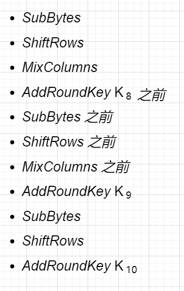

故障的效果是随机修改state中某一个字节，那么我们应当意识到，图中四个时机点，效果是等价的，这在6.1里就验证过了，只要没经过列混淆，那么错误就只影响一个字节。那么“倒数两个列混淆之间发生故障对密文的影响”只需要看最后一个列混淆前发生故障对密文的影响即可。

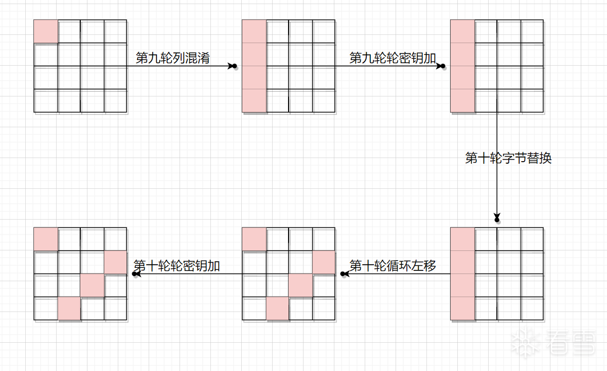

因为后面这五步骤里，只有一次列混淆，所以会导致结果中四个字节改变。这是很好推断的，我们再仔细瞧瞧，有没有别的规律。

如果故障字节位于第一列，那么其最终一定会改变第一、第八、第十一、第十四这四个字节。

如果故障字节在第二列呢

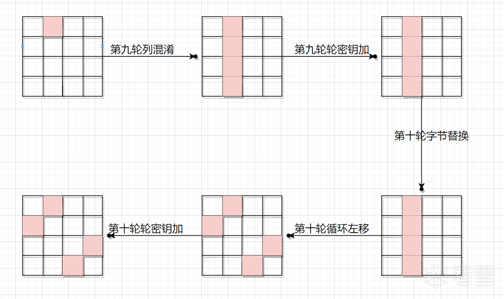

最终会改变第二、第五、第十二、第十五这四个字节。

第三列

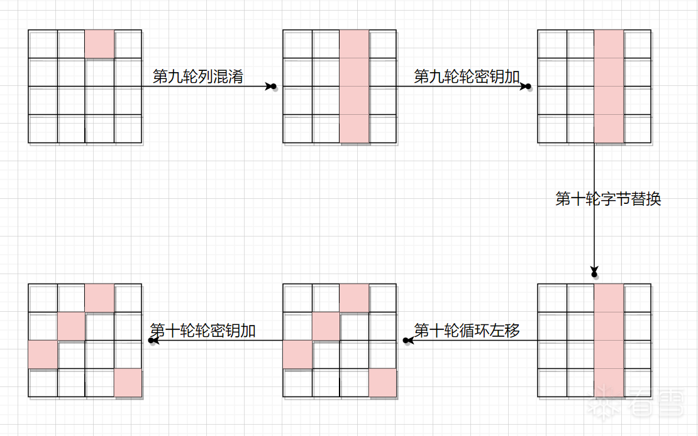
最终会改变第三、第六、第九、第十六这四个字节

第四列

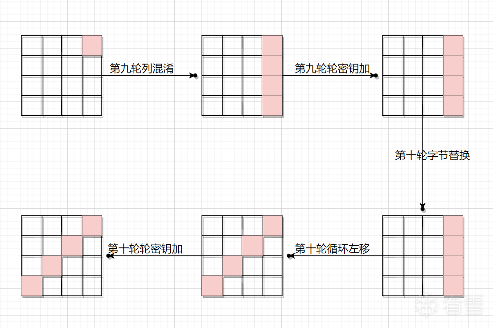

最终改变第四、第七、第十、第十三这四个字节

我们发现，结果中发生改变的四个字节有其规律，只有四种变法。

- 如果故障早于倒数第二个列混淆，那么会影响结果中的十六个字节
- 如果故障发生在倒数两个列混淆之间，那么会影响结果中的四个字节，且依照故障所发生的列，仅存在四种“模式”。
- 如果故障晚于最后一个列混淆，那么会影响结果中的一个字节

#### 5.3 由密文状况反推故障发生地点

基于上面的规律，我们意识到，可以根据密文的状况，反推故障发生的地点。差分故障攻击中，要求故障发生在5.2中的时机，如果是白盒场景下，我们可以分析二进制代码，在合适的位置Hook实现。

## 六、差分故障分析

在上一节中，我们通过图和方块来表示值的变化，是一种定性的分析，这一节中，我们要从数理的角度定量分析。

#### 6.1 数理分析

假设最后一次MixColumns前state状态如下，我们修改第一个字节，A变X


首先是列混淆步骤，请复习第二节中所讲的知识。

{}and{}⎩⎨⎧2*A*+3*B*+*C*+*D**A*+2*B*+3*C*+*D**A*+*B*+2*C*+3*D*3*A*+*B*+*C*+2*D*....................................⎭⎬⎫*an**d*⎩⎨⎧2*X*+3*B*+*C*+*D**X*+2*B*+3*C*+*D**X*+*B*+2*C*+3*D*3*X*+*B*+*C*+2*D*....................................⎭⎬⎫

接下来是轮密钥加步骤，有些读者可能困惑过，第九轮轮密钥使用*K*9。

{}and{}⎩⎨⎧2*A*+3*B*+*C*+*D*+*K*9,0*A*+2*B*+3*C*+*D*+*K*9,1*A*+*B*+2*C*+3*D*+*K*9,23*A*+*B*+*C*+2*D*+*K*9,3....................................⎭⎬⎫*an**d*⎩⎨⎧2*X*+3*B*+*C*+*D*+*K*9,0*X*+2*B*+3*C*+*D*+*K*9,1*X*+*B*+2*C*+3*D*+*K*9,23*X*+*B*+*C*+2*D*+*K*9,3....................................⎭⎬⎫

接下来是字节替换，这个步骤我们用S函数表示。

{}and{}⎩⎨⎧*S*(2*A*+3*B*+*C*+*D*+*K*9,0)*S*(*A*+2*B*+3*C*+*D*+*K*9,1)*S*(*A*+*B*+2*C*+3*D*+*K*9,2)*S*(3*A*+*B*+*C*+2*D*+*K*9,3)....................................⎭⎬⎫*an**d*⎩⎨⎧*S*(2*X*+3*B*+*C*+*D*+*K*9,0)*S*(*X*+2*B*+3*C*+*D*+*K*9,1)*S*(*X*+*B*+2*C*+3*D*+*K*9,2)*S*(3*X*+*B*+*C*+2*D*+*K*9,3)....................................⎭⎬⎫

然后是循环左移

正常 state*s**t**a**t**e*


故障 state*s**t**a**t**e*

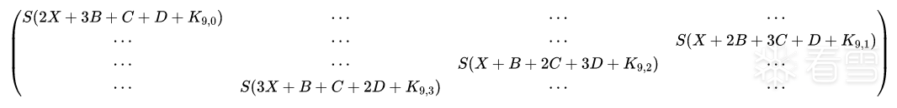

最后是末轮的轮密钥加，*K*10

正常 state*s**t**a**t**e*

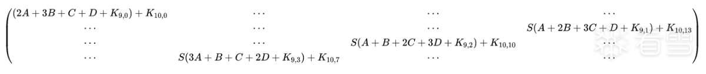

故障 state*s**t**a**t**e*
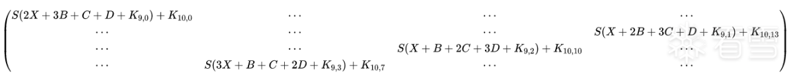
我们将正常结果称为C*C*，故障结果称为C′*C*′，十六个字节用下标表示。

C′C′C′C′C′C′C′C′C′C′′C′C′C′C′*C*0*C*1*C*2*C*3*C*4*C*5*C*6*C*7*C*8*C*9*C*10*C*11*C*12*C*13*C*14*C*15*C*0′*C*1′*C*2′*C*3′*C*4′*C*5′*C*6′*C*7′*C*8′*C*9′*C*10′*C*11′*C*12′*C*13′*C*14′*C*15’

#### 6.2 差异点

接下来讨论正常和故障密文的差异。

=S(A+B+C+D+)+C′=S(X+B+C+D+)+=S(A+B+C+D+)+C′=S(X+B+C+D+)+=S(A+B+C+D+)+=S(X+B+C+D+)+=S(A+B+C+D+)+=S(X+B+C+D+)+*C*0=*S*(2*A*+3*B*+*C*+*D*+*K*9,0)+*K*10,0*C*0′=*S*(2*X*+3*B*+*C*+*D*+*K*9,0)+*K*10,0*C*7=*S*(3*A*+*B*+*C*+2*D*+*K*9,3)+*K*10,7*C*7′=*S*(3*X*+*B*+*C*+2*D*+*K*9,3)+*K*10,7*C*10=*S*(*A*+*B*+2*C*+3*D*+*K*9,2)+*K*10,10*C*10’=*S*(*X*+*B*+2*C*+3*D*+*K*9,2)+*K*10,10*C*13=*S*(*A*+2*B*+3*C*+*D*+*K*9,1)+*K*10,13*C*13’=*S*(*X*+2*B*+3*C*+*D*+*K*9,1)+*K*10,13

我们先看第一个字节

=S(A+B+C+D+)+()C′=S(X+B+C+D+)+()*C*0=*S*(2*A*+3*B*+*C*+*D*+*K*9,0)+*K*10,0(1)*C*0′=*S*(2*X*+3*B*+*C*+*D*+*K*9,0)+*K*10,0(2)

左右部分上下相加（再次强调，这里的“加”是异或运算）

+C′=(S(A+B+C+D+)+)+(S(X+B+C+D+)+)*C*0+*C*0′=(*S*(2*A*+3*B*+*C*+*D*+*K*9,0)+*K*10,0)+(*S*(2*X*+3*B*+*C*+*D*+*K*9,0)+*K*10,0)

右式展开

+C′=S(A+B+C+D+)+S(X+B+C+D+)++*C*0+*C*0′=*S*(2*A*+3*B*+*C*+*D*+*K*9,0)+*S*(2*X*+3*B*+*C*+*D*+*K*9,0)+*K*10,0+*K*10,0①

化简

+C′=S(A+B+C+D+)+S(X+B+C+D+)++=S(A+B+C+D+)+S(X+B+C+D+)+=S(A+B+C+D+)+S(X+B+C+D+)*C*0+*C*0′=*S*(2*A*+3*B*+*C*+*D*+*K*9,0)+*S*(2*X*+3*B*+*C*+*D*+*K*9,0)+*K*10,0+*K*10,0=*S*(2*A*+3*B*+*C*+*D*+*K*9,0)+*S*(2*X*+3*B*+*C*+*D*+*K*9,0)+0=*S*(2*A*+3*B*+*C*+*D*+*K*9,0)+*S*(2*X*+3*B*+*C*+*D*+*K*9,0)

两次异或同样的数，等于异或0，再等于没做异或。下面反其道而行之：

S(A+B+C+D+)+S(X+B+C+D+)=S(A+B+C+D+)+S(X+B+C+D++)=S(A+B+C+D+)+S(X+B+C+D++(A+A))=S(A+B+C+D+)+S(A+B+C+D++A+X)*S*(2*A*+3*B*+*C*+*D*+*K*9,0)+*S*(2*X*+3*B*+*C*+*D*+*K*9,0)=*S*(2*A*+3*B*+*C*+*D*+*K*9,0)+*S*(2*X*+3*B*+*C*+*D*+*K*9,0+0)=*S*(2*A*+3*B*+*C*+*D*+*K*9,0)+*S*(2*X*+3*B*+*C*+*D*+*K*9,0+(2*A*+2*A*))=*S*(2*A*+3*B*+*C*+*D*+*K*9,0)+*S*(2*A*+3*B*+*C*+*D*+*K*9,0+2*A*+2*X*)

令=A+B+C+D+*Y*0=2*A*+3*B*+*C*+*D*+*K*9,0 ，Z=A+X*Z*=*A*+*X*。

+C′=S()+S(+Z)()*C*0+*C*0′=*S*(*Y*0)+*S*(*Y*0+2*Z*)(3)

#### 6.3 引入差分

这里我们要引入差分的概念，A*A* 是正确的输入值，X*X* 是故障带来的输入值，A*A* 与 X*X* 异或的结果我们叫它输入差分。同理，*C**o* 是正确的密文，C′*C*0′是故障带来的密文，*C*0与C′*C*0′异或的结果叫它输出差分。

不必对这些概念感到恐慌，我们只是为了更好的指代+C′*C*0+*C*0′ 以及 A+X*A*+*X*，它们在后面要被多次使用。

考虑(3)式中的已知量与未知量，在灰盒攻击模型中，我们能观测加密的结果，但观察不到state的中间量或故障导致的变化。因此正确密文和故障密文都可知，正确输入和故障输入都未知。进而，输入差分未知，输出差分已知。式子左边已知，而右边的*Y*0以及输出差分Z*Z* 未知。

关键点来了，*Y*0和 Z*Z* 都是单个字节，即0-255之间的数。可是，是否任意的Z*Z*都可以带来左边的结果？

假设差分是0x10，Python代码验证如下

```
SBox ``=` `[``  ``0x63``, ``0x7C``, ``0x77``, ``0x7B``, ``0xF2``, ``0x6B``, ``0x6F``, ``0xC5``, ``0x30``, ``0x01``, ``0x67``, ``0x2B``, ``0xFE``, ``0xD7``, ``0xAB``, ``0x76``,``  ``0xCA``, ``0x82``, ``0xC9``, ``0x7D``, ``0xFA``, ``0x59``, ``0x47``, ``0xF0``, ``0xAD``, ``0xD4``, ``0xA2``, ``0xAF``, ``0x9C``, ``0xA4``, ``0x72``, ``0xC0``,``  ``0xB7``, ``0xFD``, ``0x93``, ``0x26``, ``0x36``, ``0x3F``, ``0xF7``, ``0xCC``, ``0x34``, ``0xA5``, ``0xE5``, ``0xF1``, ``0x71``, ``0xD8``, ``0x31``, ``0x15``,``  ``0x04``, ``0xC7``, ``0x23``, ``0xC3``, ``0x18``, ``0x96``, ``0x05``, ``0x9A``, ``0x07``, ``0x12``, ``0x80``, ``0xE2``, ``0xEB``, ``0x27``, ``0xB2``, ``0x75``,``  ``0x09``, ``0x83``, ``0x2C``, ``0x1A``, ``0x1B``, ``0x6E``, ``0x5A``, ``0xA0``, ``0x52``, ``0x3B``, ``0xD6``, ``0xB3``, ``0x29``, ``0xE3``, ``0x2F``, ``0x84``,``  ``0x53``, ``0xD1``, ``0x00``, ``0xED``, ``0x20``, ``0xFC``, ``0xB1``, ``0x5B``, ``0x6A``, ``0xCB``, ``0xBE``, ``0x39``, ``0x4A``, ``0x4C``, ``0x58``, ``0xCF``,``  ``0xD0``, ``0xEF``, ``0xAA``, ``0xFB``, ``0x43``, ``0x4D``, ``0x33``, ``0x85``, ``0x45``, ``0xF9``, ``0x02``, ``0x7F``, ``0x50``, ``0x3C``, ``0x9F``, ``0xA8``,``  ``0x51``, ``0xA3``, ``0x40``, ``0x8F``, ``0x92``, ``0x9D``, ``0x38``, ``0xF5``, ``0xBC``, ``0xB6``, ``0xDA``, ``0x21``, ``0x10``, ``0xFF``, ``0xF3``, ``0xD2``,``  ``0xCD``, ``0x0C``, ``0x13``, ``0xEC``, ``0x5F``, ``0x97``, ``0x44``, ``0x17``, ``0xC4``, ``0xA7``, ``0x7E``, ``0x3D``, ``0x64``, ``0x5D``, ``0x19``, ``0x73``,``  ``0x60``, ``0x81``, ``0x4F``, ``0xDC``, ``0x22``, ``0x2A``, ``0x90``, ``0x88``, ``0x46``, ``0xEE``, ``0xB8``, ``0x14``, ``0xDE``, ``0x5E``, ``0x0B``, ``0xDB``,``  ``0xE0``, ``0x32``, ``0x3A``, ``0x0A``, ``0x49``, ``0x06``, ``0x24``, ``0x5C``, ``0xC2``, ``0xD3``, ``0xAC``, ``0x62``, ``0x91``, ``0x95``, ``0xE4``, ``0x79``,``  ``0xE7``, ``0xC8``, ``0x37``, ``0x6D``, ``0x8D``, ``0xD5``, ``0x4E``, ``0xA9``, ``0x6C``, ``0x56``, ``0xF4``, ``0xEA``, ``0x65``, ``0x7A``, ``0xAE``, ``0x08``,``  ``0xBA``, ``0x78``, ``0x25``, ``0x2E``, ``0x1C``, ``0xA6``, ``0xB4``, ``0xC6``, ``0xE8``, ``0xDD``, ``0x74``, ``0x1F``, ``0x4B``, ``0xBD``, ``0x8B``, ``0x8A``,``  ``0x70``, ``0x3E``, ``0xB5``, ``0x66``, ``0x48``, ``0x03``, ``0xF6``, ``0x0E``, ``0x61``, ``0x35``, ``0x57``, ``0xB9``, ``0x86``, ``0xC1``, ``0x1D``, ``0x9E``,``  ``0xE1``, ``0xF8``, ``0x98``, ``0x11``, ``0x69``, ``0xD9``, ``0x8E``, ``0x94``, ``0x9B``, ``0x1E``, ``0x87``, ``0xE9``, ``0xCE``, ``0x55``, ``0x28``, ``0xDF``,``  ``0x8C``, ``0xA1``, ``0x89``, ``0x0D``, ``0xBF``, ``0xE6``, ``0x42``, ``0x68``, ``0x41``, ``0x99``, ``0x2D``, ``0x0F``, ``0xB0``, ``0x54``, ``0xBB``, ``0x16``]` `# 传入两个数，计算S(x) ^ S(y)``def` `getSDiff(x, y):``  ``return` `SBox[x] ^ SBox[y]` `# 乘2，前面讲过的乘法规则``def` `mul_by_02(num):``  ``if` `num < ``0x80``:``    ``res ``=` `(num << ``1``)``  ``else``:``    ``res ``=` `(num << ``1``) ^ ``0x1b` `  ``return` `res ``%` `0x100` `diff ``=` `0x10``# 使用集合去重``zlist ``=` `set``({})``# 遍历z``for` `z ``in` `range``(``0x100``):``  ``# 遍历y0``  ``for` `y0 ``in` `range``(``0x100``):``    ``tmp ``=` `getSDiff(y0, mul_by_02(z) ^ y0)``    ``if` `tmp ``=``=` `diff:``      ``zlist.add(z)` `print``(``len``(zlist))` `# run result:127
```

可以发现，输出差分为0x10的约束下，Z的取值空间并非0-255Z范围内全部数字，仅有127个值符合条件。

有没有办法进一步约束 Z*Z* 的范围？别忘了我们才用了一个约束，还有三个输出差分可以用。

=S(A+B+C+D+)+C′=S(X+B+C+D+)+=S(A+B+C+D+)+C′=S(X+B+C+D+)+=S(A+B+C+D+)+=S(X+B+C+D+)+=S(A+B+C+D+)+=S(X+B+C+D+)+*C*0=*S*(2*A*+3*B*+*C*+*D*+*K*9,0)+*K*10,0*C*0′=*S*(2*X*+3*B*+*C*+*D*+*K*9,0)+*K*10,0*C*7=*S*(3*A*+*B*+*C*+2*D*+*K*9,3)+*K*10,7*C*7′=*S*(3*X*+*B*+*C*+2*D*+*K*9,3)+*K*10,7*C*10=*S*(*A*+*B*+2*C*+3*D*+*K*9,2)+*K*10,10*C*10’=*S*(*X*+*B*+2*C*+3*D*+*K*9,2)+*K*10,10*C*13=*S*(*A*+2*B*+3*C*+*D*+*K*9,1)+*K*10,13*C*13’=*S*(*X*+2*B*+3*C*+*D*+*K*9,1)+*K*10,13

对后面三条做同样的操作

Y=A+B+C+D++C′=S()+S(+Z)=A+B+C+D++C′=S()+S(+Z)=A+B+C+D++=S()+S(+Z)令*Y*1=3*A*+*B*+*C*+2*D*+*K*9,3*C*7+*C*7′=*S*(*Y*1)+*S*(*Y*1+3*Z*)令*Y*2=*A*+*B*+2*C*+3*D*+*K*9,2*C*10+*C*10′=*S*(*Y*2)+*S*(*Y*2+*Z*)令*Y*3=*A*+2*B*+3*C*+*D*+*K*9,1*C*13+*C*13’=*S*(*Y*3)+*S*(*Y*3+*Z*)

+C′*C*7+*C*7′，+C′*C*10+*C*10′，+C′*C*13+*C*13′都是已知的，那么和+C′*C*0+*C*0′类似，也可以对输入差分Z*Z* 起到约束作用。

*Y*1，*Y*2， *Y*3 都在0-255之间，如法炮制。

接下来用第二节中的AES Python代码，对第一个字节做故障注入

正常密文

```
8d` `f4 e9 aa c5 c7 ``57` `3a` `27` `d8 d0 ``55` `d6 e4 d6 ``4b
def` `encrypt(input_bytes, kList):``  ``'''` `  ``:param input_bytes: 输入的明文``  ``:param kList: K0-K10``  ``:return:``  ``'''``  ``plainState ``=` `text2matrix(input_bytes)``  ``# 初始轮密钥加``  ``state ``=` `AddRoundKeys(plainState, kList[``0``:``4``])``  ``for` `i ``in` `range``(``1``, ``10``):``    ``state ``=` `SubBytes(state)``    ``state ``=` `ShiftRows(state)``    ``# 第九轮列混淆前将state第一个字节改为0``    ``if``(i``=``=``9``):``      ``state[``0``][``0``] ``=` `0``    ``state ``=` `MixColumns(state)``    ``state ``=` `AddRoundKeys(state, kList[``4` `*` `i:``4` `*` `(i ``+` `1``)])` `  ``state ``=` `SubBytes(state)``  ``state ``=` `ShiftRows(state)``  ``state ``=` `AddRoundKeys(state, kList[``40``:``44``])``  ``return` `state
```

注入故障后的密文

```
3c` `f4 e9 aa c5 c7 ``57` `a5 ``27` `d8 ``2e` `55` `d6 ``36` `d6 ``4b
```

结果的第一个字节是0x8d，变成了0x3c

结果的第八个字节是0x3a，变成了0xa5

结果的第十一个字节是0xd0，变成了0x2e

结果的第十四个字节是0xe4，变成了0x36

```
SBox ``=` `[``  ``0x63``, ``0x7C``, ``0x77``, ``0x7B``, ``0xF2``, ``0x6B``, ``0x6F``, ``0xC5``, ``0x30``, ``0x01``, ``0x67``, ``0x2B``, ``0xFE``, ``0xD7``, ``0xAB``, ``0x76``,``  ``0xCA``, ``0x82``, ``0xC9``, ``0x7D``, ``0xFA``, ``0x59``, ``0x47``, ``0xF0``, ``0xAD``, ``0xD4``, ``0xA2``, ``0xAF``, ``0x9C``, ``0xA4``, ``0x72``, ``0xC0``,``  ``0xB7``, ``0xFD``, ``0x93``, ``0x26``, ``0x36``, ``0x3F``, ``0xF7``, ``0xCC``, ``0x34``, ``0xA5``, ``0xE5``, ``0xF1``, ``0x71``, ``0xD8``, ``0x31``, ``0x15``,``  ``0x04``, ``0xC7``, ``0x23``, ``0xC3``, ``0x18``, ``0x96``, ``0x05``, ``0x9A``, ``0x07``, ``0x12``, ``0x80``, ``0xE2``, ``0xEB``, ``0x27``, ``0xB2``, ``0x75``,``  ``0x09``, ``0x83``, ``0x2C``, ``0x1A``, ``0x1B``, ``0x6E``, ``0x5A``, ``0xA0``, ``0x52``, ``0x3B``, ``0xD6``, ``0xB3``, ``0x29``, ``0xE3``, ``0x2F``, ``0x84``,``  ``0x53``, ``0xD1``, ``0x00``, ``0xED``, ``0x20``, ``0xFC``, ``0xB1``, ``0x5B``, ``0x6A``, ``0xCB``, ``0xBE``, ``0x39``, ``0x4A``, ``0x4C``, ``0x58``, ``0xCF``,``  ``0xD0``, ``0xEF``, ``0xAA``, ``0xFB``, ``0x43``, ``0x4D``, ``0x33``, ``0x85``, ``0x45``, ``0xF9``, ``0x02``, ``0x7F``, ``0x50``, ``0x3C``, ``0x9F``, ``0xA8``,``  ``0x51``, ``0xA3``, ``0x40``, ``0x8F``, ``0x92``, ``0x9D``, ``0x38``, ``0xF5``, ``0xBC``, ``0xB6``, ``0xDA``, ``0x21``, ``0x10``, ``0xFF``, ``0xF3``, ``0xD2``,``  ``0xCD``, ``0x0C``, ``0x13``, ``0xEC``, ``0x5F``, ``0x97``, ``0x44``, ``0x17``, ``0xC4``, ``0xA7``, ``0x7E``, ``0x3D``, ``0x64``, ``0x5D``, ``0x19``, ``0x73``,``  ``0x60``, ``0x81``, ``0x4F``, ``0xDC``, ``0x22``, ``0x2A``, ``0x90``, ``0x88``, ``0x46``, ``0xEE``, ``0xB8``, ``0x14``, ``0xDE``, ``0x5E``, ``0x0B``, ``0xDB``,``  ``0xE0``, ``0x32``, ``0x3A``, ``0x0A``, ``0x49``, ``0x06``, ``0x24``, ``0x5C``, ``0xC2``, ``0xD3``, ``0xAC``, ``0x62``, ``0x91``, ``0x95``, ``0xE4``, ``0x79``,``  ``0xE7``, ``0xC8``, ``0x37``, ``0x6D``, ``0x8D``, ``0xD5``, ``0x4E``, ``0xA9``, ``0x6C``, ``0x56``, ``0xF4``, ``0xEA``, ``0x65``, ``0x7A``, ``0xAE``, ``0x08``,``  ``0xBA``, ``0x78``, ``0x25``, ``0x2E``, ``0x1C``, ``0xA6``, ``0xB4``, ``0xC6``, ``0xE8``, ``0xDD``, ``0x74``, ``0x1F``, ``0x4B``, ``0xBD``, ``0x8B``, ``0x8A``,``  ``0x70``, ``0x3E``, ``0xB5``, ``0x66``, ``0x48``, ``0x03``, ``0xF6``, ``0x0E``, ``0x61``, ``0x35``, ``0x57``, ``0xB9``, ``0x86``, ``0xC1``, ``0x1D``, ``0x9E``,``  ``0xE1``, ``0xF8``, ``0x98``, ``0x11``, ``0x69``, ``0xD9``, ``0x8E``, ``0x94``, ``0x9B``, ``0x1E``, ``0x87``, ``0xE9``, ``0xCE``, ``0x55``, ``0x28``, ``0xDF``,``  ``0x8C``, ``0xA1``, ``0x89``, ``0x0D``, ``0xBF``, ``0xE6``, ``0x42``, ``0x68``, ``0x41``, ``0x99``, ``0x2D``, ``0x0F``, ``0xB0``, ``0x54``, ``0xBB``, ``0x16``]` `# 传入两个数，计算S(x) ^ S(y)``def` `getSDiff(x, y):``  ``return` `SBox[x] ^ SBox[y]` `def` `mul_by_01(num):``  ``return` `num` `def` `mul_by_02(num):``  ``if` `num < ``0x80``:``    ``res ``=` `(num << ``1``)``  ``else``:``    ``res ``=` `(num << ``1``) ^ ``0x1b` `  ``return` `res ``%` `0x100` `def` `mul_by_03(num):``  ``return` `(mul_by_02(num) ^ num)`  `z1list ``=` `set``({})``z2list ``=` `set``({})``z3list ``=` `set``({})``z4list ``=` `set``({})``zlist ``=` `set``({})``for` `z ``in` `range``(``0x100``):``  ``for` `y0 ``in` `range``(``0x100``):``    ``tmp ``=` `getSDiff(y0, mul_by_02(z) ^ y0)``    ``if` `tmp ``=``=` `(``0x8d``^``0x3c``):``      ``z1list.add(z)` `  ``for` `y1 ``in` `range``(``0x100``):``    ``tmp ``=` `getSDiff(y1, mul_by_03(z) ^ y1)``    ``if` `tmp ``=``=` `(``0x3a` `^ ``0xa5``):``      ``z2list.add(z)` `  ``for` `y3 ``in` `range``(``0x100``):``    ``tmp ``=` `getSDiff(y3, z ^ y3)``    ``if` `tmp ``=``=` `(``0xd0` `^ ``0x2e``):``      ``z3list.add(z)` `  ``for` `y4 ``in` `range``(``0x100``):``    ``tmp ``=` `getSDiff(y4, z ^ y4)``    ``if` `tmp ``=``=` `(``0xe4` `^ ``0x36``):``      ``z4list.add(z)` `print``(``len``(z1list))``print``(``len``(z2list))``print``(``len``(z3list))``print``(``len``(z4list))` `# run result``# 127``# 127``# 127``# 127
```

z1list 到 z4list是**分别**满足1式到4式的 Z*Z* 的集合，可以发现分别有127个元素满足要求。需要意识到，尽管输入差分未知，但都是 A*A* 变 X*X* 这个故障带来的，即每个式子中的输入差分Z是同一个Z，Z必须同时满足这四个式子，即Z*Z*的范围是这四个集合的交集。Python提供了非常方便的API。

```
zlist ``=` `set``.intersection(z1list, z2list, z3list, z4list)``print``(``len``(zlist))``print``(zlist)``# result``# 15``# {193, 132, 68, 134, 7, 197, 105, 205, 109, 145, 82, 55, 59, 156, 61}
```

我们惊喜的发现，Z*Z* 的范围被缩小到了15个值，或者说十五个候选 Z*Z*。

#### 6.4 进一步探索

大家可能会有两个困惑

- 为什么要去缩小Z*Z*的范围，甚至是求Z*Z*具体的值？
- 如何进一步缩小Z*Z*的值。

##### 为什么要去缩小、确认Z*Z*的范围？

先看第一个问题，如下式子大家应该不陌生，它是用来约束Z*Z*取值范围的四个式子之一。

+C′=S()+S(+Z)()*C*0+*C*0′=*S*(*Y*0)+*S*(*Y*0+2*Z*)(3)

那么，当Z*Z*范围缩小，甚至固定时，是不是同理可以约束*Y*0的取值范围呢？即左边的输出差分已知且固定，Z*Z*有取值限制，那么0-255范围内的*Y*0是不是都能构建等式呢？我想可以验证一下

*Z*0现在只有15个可选项，遍历寻找符合条件的*Y*0

```
y0list ``=` `set``({})``for` `z ``in` `zlist:``  ``for` `y0 ``in` `range``(``0x100``):``    ``tmp ``=` `getSDiff(y0, mul_by_02(z) ^ y0)``    ``if` `tmp ``=``=` `(``0x8d``^``0x3c``):``      ``y0list.add(y0)` `print``(``len``(y0list))``print``(y0list)``# 30``# {128, 1, 3, 131, 8, 137, 140, 141, 16, 145, 154, 178, 181, 186, 60, 64, 70, 71, 78, 215, 220, 223, 227, 104, 238, 244, 246, 249, 126, 255}
```

我们惊喜的发现，*Y*0的取值范围被约束到30个潜在值里了。别忘了还有下面这个式子

=S(A+B+C+D+)+*C*0=*S*(2*A*+3*B*+*C*+*D*+*K*9,0)+*K*10,0

即

=S()+*C*0=*S*(*Y*0)+*K*10,0

那么我们可以将*K*10,0也限制在30个值之中。在上面密钥的相关问题讨论中，我们已经验证，AES-128可以依靠一轮的轮密钥逆推出主密钥。因此问题就变成了——如果能尽可能约束Z*Z*的取值范围，或许能让*K*10,0唯一，同理对其余15个K做同样的事，恢复轮密钥，最终逆推主密钥。

##### 如何进一步约束Z*Z*？

首先我们发现，对Z*Z*具有约束条件的四个式子都被我们“用完”了。能不能另外再来一些式子呢？比如重新再注入一个故障，不是又有四组等式了吗？这是行不通的，不要忘了，重新注入故障的话，输入差分Z*Z*已经变了，新的等式不能再对原来的Z*Z*取值范围产生约束。

那么不妨换个思路，Z*Z*是变化的，无法通过多次重新注入来缩小范围，但是*K*10,*n*不会变化！因为密钥始终是那个密钥。所以可以通过多次注入来缩小*K*10,*n*的范围。

在刚才的故障注入中，我们将*K*10,0的候选人缩小到30个值之中。那么考虑一下，如果再注入故障，新的*K*10,0可以如法炮制出一个取值范围，真正的*K*10,0是哪个？我们不知道。但它必定在第一次那30个候选人里，也一定在第二个那30个候选人里面。换言之，它在两个范围的交集里。

首先由 *Y*0 计算出对应的*K*10,0

=S()+S()+=S()+S()+S()+=*C*0=*S*(*Y*0)+*K*10,0*S*(*Y*0)+*C*0=*S*(*Y*0)+*S*(*Y*0)+*K*10,0*S*(*Y*0)+*C*0=*K*10,0

```
k ``=` `set``({})``for` `y0 ``in` `list``(y0list):``  ``k.add(SBox[y0] ^ ``0x8d``)` `print``(k)``# {131, 132, 11, 12, 19, 20, 155, 156, 162, 165, 42, 45, 50, 53, 186, 189, 64, 71, 200, 207, 208, 215, 88, 97, 102, 233, 241, 246, 121, 126}
```

完整代码如下

```
SBox ``=` `[``  ``0x63``, ``0x7C``, ``0x77``, ``0x7B``, ``0xF2``, ``0x6B``, ``0x6F``, ``0xC5``, ``0x30``, ``0x01``, ``0x67``, ``0x2B``, ``0xFE``, ``0xD7``, ``0xAB``, ``0x76``,``  ``0xCA``, ``0x82``, ``0xC9``, ``0x7D``, ``0xFA``, ``0x59``, ``0x47``, ``0xF0``, ``0xAD``, ``0xD4``, ``0xA2``, ``0xAF``, ``0x9C``, ``0xA4``, ``0x72``, ``0xC0``,``  ``0xB7``, ``0xFD``, ``0x93``, ``0x26``, ``0x36``, ``0x3F``, ``0xF7``, ``0xCC``, ``0x34``, ``0xA5``, ``0xE5``, ``0xF1``, ``0x71``, ``0xD8``, ``0x31``, ``0x15``,``  ``0x04``, ``0xC7``, ``0x23``, ``0xC3``, ``0x18``, ``0x96``, ``0x05``, ``0x9A``, ``0x07``, ``0x12``, ``0x80``, ``0xE2``, ``0xEB``, ``0x27``, ``0xB2``, ``0x75``,``  ``0x09``, ``0x83``, ``0x2C``, ``0x1A``, ``0x1B``, ``0x6E``, ``0x5A``, ``0xA0``, ``0x52``, ``0x3B``, ``0xD6``, ``0xB3``, ``0x29``, ``0xE3``, ``0x2F``, ``0x84``,``  ``0x53``, ``0xD1``, ``0x00``, ``0xED``, ``0x20``, ``0xFC``, ``0xB1``, ``0x5B``, ``0x6A``, ``0xCB``, ``0xBE``, ``0x39``, ``0x4A``, ``0x4C``, ``0x58``, ``0xCF``,``  ``0xD0``, ``0xEF``, ``0xAA``, ``0xFB``, ``0x43``, ``0x4D``, ``0x33``, ``0x85``, ``0x45``, ``0xF9``, ``0x02``, ``0x7F``, ``0x50``, ``0x3C``, ``0x9F``, ``0xA8``,``  ``0x51``, ``0xA3``, ``0x40``, ``0x8F``, ``0x92``, ``0x9D``, ``0x38``, ``0xF5``, ``0xBC``, ``0xB6``, ``0xDA``, ``0x21``, ``0x10``, ``0xFF``, ``0xF3``, ``0xD2``,``  ``0xCD``, ``0x0C``, ``0x13``, ``0xEC``, ``0x5F``, ``0x97``, ``0x44``, ``0x17``, ``0xC4``, ``0xA7``, ``0x7E``, ``0x3D``, ``0x64``, ``0x5D``, ``0x19``, ``0x73``,``  ``0x60``, ``0x81``, ``0x4F``, ``0xDC``, ``0x22``, ``0x2A``, ``0x90``, ``0x88``, ``0x46``, ``0xEE``, ``0xB8``, ``0x14``, ``0xDE``, ``0x5E``, ``0x0B``, ``0xDB``,``  ``0xE0``, ``0x32``, ``0x3A``, ``0x0A``, ``0x49``, ``0x06``, ``0x24``, ``0x5C``, ``0xC2``, ``0xD3``, ``0xAC``, ``0x62``, ``0x91``, ``0x95``, ``0xE4``, ``0x79``,``  ``0xE7``, ``0xC8``, ``0x37``, ``0x6D``, ``0x8D``, ``0xD5``, ``0x4E``, ``0xA9``, ``0x6C``, ``0x56``, ``0xF4``, ``0xEA``, ``0x65``, ``0x7A``, ``0xAE``, ``0x08``,``  ``0xBA``, ``0x78``, ``0x25``, ``0x2E``, ``0x1C``, ``0xA6``, ``0xB4``, ``0xC6``, ``0xE8``, ``0xDD``, ``0x74``, ``0x1F``, ``0x4B``, ``0xBD``, ``0x8B``, ``0x8A``,``  ``0x70``, ``0x3E``, ``0xB5``, ``0x66``, ``0x48``, ``0x03``, ``0xF6``, ``0x0E``, ``0x61``, ``0x35``, ``0x57``, ``0xB9``, ``0x86``, ``0xC1``, ``0x1D``, ``0x9E``,``  ``0xE1``, ``0xF8``, ``0x98``, ``0x11``, ``0x69``, ``0xD9``, ``0x8E``, ``0x94``, ``0x9B``, ``0x1E``, ``0x87``, ``0xE9``, ``0xCE``, ``0x55``, ``0x28``, ``0xDF``,``  ``0x8C``, ``0xA1``, ``0x89``, ``0x0D``, ``0xBF``, ``0xE6``, ``0x42``, ``0x68``, ``0x41``, ``0x99``, ``0x2D``, ``0x0F``, ``0xB0``, ``0x54``, ``0xBB``, ``0x16``]` `# 传入两个数，计算S(x) ^ S(y)``def` `getSDiff(x, y):``  ``return` `SBox[x] ^ SBox[y]` `def` `mul_by_01(num):``  ``return` `num` `def` `mul_by_02(num):``  ``if` `num < ``0x80``:``    ``res ``=` `(num << ``1``)``  ``else``:``    ``res ``=` `(num << ``1``) ^ ``0x1b` `  ``return` `res ``%` `0x100` `def` `mul_by_03(num):``  ``return` `(mul_by_02(num) ^ num)`  `z1list ``=` `set``({})``z2list ``=` `set``({})``z3list ``=` `set``({})``z4list ``=` `set``({})``zlist ``=` `set``({})``for` `z ``in` `range``(``0x100``):``  ``for` `y0 ``in` `range``(``0x100``):``    ``tmp ``=` `getSDiff(y0, mul_by_02(z) ^ y0)``    ``if` `tmp ``=``=` `(``0x8d``^``0x3c``):``      ``z1list.add(z)` `  ``for` `y1 ``in` `range``(``0x100``):``    ``tmp ``=` `getSDiff(y1, mul_by_03(z) ^ y1)``    ``if` `tmp ``=``=` `(``0x3a` `^ ``0xa5``):``      ``z2list.add(z)` `  ``for` `y3 ``in` `range``(``0x100``):``    ``tmp ``=` `getSDiff(y3, z ^ y3)``    ``if` `tmp ``=``=` `(``0xd0` `^ ``0x2e``):``      ``z3list.add(z)` `  ``for` `y4 ``in` `range``(``0x100``):``    ``tmp ``=` `getSDiff(y4, z ^ y4)``    ``if` `tmp ``=``=` `(``0xe4` `^ ``0x36``):``      ``z4list.add(z)` `zlist ``=` `set``.intersection(z1list, z2list, z3list, z4list)` `y0list ``=` `set``({})``for` `z ``in` `zlist:``  ``for` `y0 ``in` `range``(``0x100``):``    ``tmp ``=` `getSDiff(y0, mul_by_02(z) ^ y0)``    ``if` `tmp ``=``=` `(``0x8d``^``0x3c``):``      ``y0list.add(y0)` `print``(``len``(y0list))``print``(y0list)` `k ``=` `set``({})``for` `y0 ``in` `list``(y0list):``  ``k.add(SBox[y0] ^ ``0x8d``)` `print``(``"k range"``)``print``(k)
```

重新注入一个新的故障，同样在 state*s**t**a**t**e* 的第一个字节

```
def` `encrypt(input_bytes, kList):``  ``'''` `  ``:param input_bytes: 输入的明文``  ``:param kList: K0-K10``  ``:return:``  ``'''``  ``plainState ``=` `text2matrix(input_bytes)``  ``# 初始轮密钥加``  ``state ``=` `AddRoundKeys(plainState, kList[``0``:``4``])``  ``for` `i ``in` `range``(``1``, ``10``):``    ``state ``=` `SubBytes(state)``    ``state ``=` `ShiftRows(state)``    ``# 第九轮列混淆前将state第一个字节改为1``    ``if``(i``=``=``9``):``      ``state[``0``][``0``] ``=` `1``    ``state ``=` `MixColumns(state)``    ``state ``=` `AddRoundKeys(state, kList[``4` `*` `i:``4` `*` `(i ``+` `1``)])` `  ``state ``=` `SubBytes(state)``  ``state ``=` `ShiftRows(state)``  ``state ``=` `AddRoundKeys(state, kList[``40``:``44``])``  ``return` `state
```

正确密文依然 8d f4 e9 aa c5 c7 57 3a 27 d8 d0 55 d6 e4 d6 4b

故障密文变成 dc f4 e9 aa c5 c7 57 0a 27 d8 26 55 d6 ad d6 4b

0x8d 0xdc

0x3a 0x0a

0xd0 0x26

0xe4 0xad

同理计算K的范围

```
SBox ``=` `[``  ``0x63``, ``0x7C``, ``0x77``, ``0x7B``, ``0xF2``, ``0x6B``, ``0x6F``, ``0xC5``, ``0x30``, ``0x01``, ``0x67``, ``0x2B``, ``0xFE``, ``0xD7``, ``0xAB``, ``0x76``,``  ``0xCA``, ``0x82``, ``0xC9``, ``0x7D``, ``0xFA``, ``0x59``, ``0x47``, ``0xF0``, ``0xAD``, ``0xD4``, ``0xA2``, ``0xAF``, ``0x9C``, ``0xA4``, ``0x72``, ``0xC0``,``  ``0xB7``, ``0xFD``, ``0x93``, ``0x26``, ``0x36``, ``0x3F``, ``0xF7``, ``0xCC``, ``0x34``, ``0xA5``, ``0xE5``, ``0xF1``, ``0x71``, ``0xD8``, ``0x31``, ``0x15``,``  ``0x04``, ``0xC7``, ``0x23``, ``0xC3``, ``0x18``, ``0x96``, ``0x05``, ``0x9A``, ``0x07``, ``0x12``, ``0x80``, ``0xE2``, ``0xEB``, ``0x27``, ``0xB2``, ``0x75``,``  ``0x09``, ``0x83``, ``0x2C``, ``0x1A``, ``0x1B``, ``0x6E``, ``0x5A``, ``0xA0``, ``0x52``, ``0x3B``, ``0xD6``, ``0xB3``, ``0x29``, ``0xE3``, ``0x2F``, ``0x84``,``  ``0x53``, ``0xD1``, ``0x00``, ``0xED``, ``0x20``, ``0xFC``, ``0xB1``, ``0x5B``, ``0x6A``, ``0xCB``, ``0xBE``, ``0x39``, ``0x4A``, ``0x4C``, ``0x58``, ``0xCF``,``  ``0xD0``, ``0xEF``, ``0xAA``, ``0xFB``, ``0x43``, ``0x4D``, ``0x33``, ``0x85``, ``0x45``, ``0xF9``, ``0x02``, ``0x7F``, ``0x50``, ``0x3C``, ``0x9F``, ``0xA8``,``  ``0x51``, ``0xA3``, ``0x40``, ``0x8F``, ``0x92``, ``0x9D``, ``0x38``, ``0xF5``, ``0xBC``, ``0xB6``, ``0xDA``, ``0x21``, ``0x10``, ``0xFF``, ``0xF3``, ``0xD2``,``  ``0xCD``, ``0x0C``, ``0x13``, ``0xEC``, ``0x5F``, ``0x97``, ``0x44``, ``0x17``, ``0xC4``, ``0xA7``, ``0x7E``, ``0x3D``, ``0x64``, ``0x5D``, ``0x19``, ``0x73``,``  ``0x60``, ``0x81``, ``0x4F``, ``0xDC``, ``0x22``, ``0x2A``, ``0x90``, ``0x88``, ``0x46``, ``0xEE``, ``0xB8``, ``0x14``, ``0xDE``, ``0x5E``, ``0x0B``, ``0xDB``,``  ``0xE0``, ``0x32``, ``0x3A``, ``0x0A``, ``0x49``, ``0x06``, ``0x24``, ``0x5C``, ``0xC2``, ``0xD3``, ``0xAC``, ``0x62``, ``0x91``, ``0x95``, ``0xE4``, ``0x79``,``  ``0xE7``, ``0xC8``, ``0x37``, ``0x6D``, ``0x8D``, ``0xD5``, ``0x4E``, ``0xA9``, ``0x6C``, ``0x56``, ``0xF4``, ``0xEA``, ``0x65``, ``0x7A``, ``0xAE``, ``0x08``,``  ``0xBA``, ``0x78``, ``0x25``, ``0x2E``, ``0x1C``, ``0xA6``, ``0xB4``, ``0xC6``, ``0xE8``, ``0xDD``, ``0x74``, ``0x1F``, ``0x4B``, ``0xBD``, ``0x8B``, ``0x8A``,``  ``0x70``, ``0x3E``, ``0xB5``, ``0x66``, ``0x48``, ``0x03``, ``0xF6``, ``0x0E``, ``0x61``, ``0x35``, ``0x57``, ``0xB9``, ``0x86``, ``0xC1``, ``0x1D``, ``0x9E``,``  ``0xE1``, ``0xF8``, ``0x98``, ``0x11``, ``0x69``, ``0xD9``, ``0x8E``, ``0x94``, ``0x9B``, ``0x1E``, ``0x87``, ``0xE9``, ``0xCE``, ``0x55``, ``0x28``, ``0xDF``,``  ``0x8C``, ``0xA1``, ``0x89``, ``0x0D``, ``0xBF``, ``0xE6``, ``0x42``, ``0x68``, ``0x41``, ``0x99``, ``0x2D``, ``0x0F``, ``0xB0``, ``0x54``, ``0xBB``, ``0x16``]` `# 传入两个数，计算S(x) ^ S(y)``def` `getSDiff(x, y):``  ``return` `SBox[x] ^ SBox[y]` `def` `mul_by_01(num):``  ``return` `num` `def` `mul_by_02(num):``  ``if` `num < ``0x80``:``    ``res ``=` `(num << ``1``)``  ``else``:``    ``res ``=` `(num << ``1``) ^ ``0x1b` `  ``return` `res ``%` `0x100` `def` `mul_by_03(num):``  ``return` `(mul_by_02(num) ^ num)`  `z1list ``=` `set``({})``z2list ``=` `set``({})``z3list ``=` `set``({})``z4list ``=` `set``({})``zlist ``=` `set``({})``for` `z ``in` `range``(``0x100``):``  ``for` `y0 ``in` `range``(``0x100``):``    ``tmp ``=` `getSDiff(y0, mul_by_02(z) ^ y0)``    ``if` `tmp ``=``=` `(``0x8d``^``0xdc``):``      ``z1list.add(z)` `  ``for` `y1 ``in` `range``(``0x100``):``    ``tmp ``=` `getSDiff(y1, mul_by_03(z) ^ y1)``    ``if` `tmp ``=``=` `(``0x3a` `^ ``0x0a``):``      ``z2list.add(z)` `  ``for` `y3 ``in` `range``(``0x100``):``    ``tmp ``=` `getSDiff(y3, z ^ y3)``    ``if` `tmp ``=``=` `(``0xd0` `^ ``0x26``):``      ``z3list.add(z)` `  ``for` `y4 ``in` `range``(``0x100``):``    ``tmp ``=` `getSDiff(y4, z ^ y4)``    ``if` `tmp ``=``=` `(``0xe4` `^ ``0xad``):``      ``z4list.add(z)` `zlist ``=` `set``.intersection(z1list, z2list, z3list, z4list)` `y0list ``=` `set``({})``for` `z ``in` `zlist:``  ``for` `y0 ``in` `range``(``0x100``):``    ``tmp ``=` `getSDiff(y0, mul_by_02(z) ^ y0)``    ``if` `tmp ``=``=` `(``0x8d``^``0xdc``):``      ``y0list.add(y0)` `print``(``len``(y0list))``print``(y0list)` `k ``=` `set``({})``for` `y0 ``in` `list``(y0list):``  ``k.add(SBox[y0] ^ ``0x8d``)` `print``(``"k range"``)``print``(k)``# {129, 130, 4, 7, 16, 19, 149, 150, 168, 171, 45, 46, 57, 58, 188, 65, 66, 196, 199, 208, 211, 85, 86, 104, 107, 237, 249, 250, 124, 127}
```

将两个 K*K* 的候选范围取交集

```
klist1 ``=` `{``131``, ``132``, ``11``, ``12``, ``19``, ``20``, ``155``, ``156``, ``162``, ``165``, ``42``, ``45``, ``50``, ``53``, ``186``, ``189``, ``64``, ``71``, ``200``, ``207``, ``208``, ``215``, ``88``, ``97``, ``102``, ``233``, ``241``, ``246``, ``121``, ``126``}``klist2 ``=` `{``129``, ``130``, ``4``, ``7``, ``16``, ``19``, ``149``, ``150``, ``168``, ``171``, ``45``, ``46``, ``57``, ``58``, ``188``, ``65``, ``66``, ``196``, ``199``, ``208``, ``211``, ``85``, ``86``, ``104``, ``107``, ``237``, ``249``, ``250``, ``124``, ``127``}``klist ``=` `set``.intersection(klist1,klist2)``print``(klist)``# result``# {208, 19, 45}
```

我们惊喜的发现，*K*10,0的候选项只剩三个了，再注入一次故障。state*s**t**a**t**e* 同样位置改成3。

```
def` `encrypt(input_bytes, kList):``  ``'''` `  ``:param input_bytes: 输入的明文``  ``:param kList: K0-K10``  ``:return:``  ``'''``  ``plainState ``=` `text2matrix(input_bytes)``  ``# 初始轮密钥加``  ``state ``=` `AddRoundKeys(plainState, kList[``0``:``4``])``  ``for` `i ``in` `range``(``1``, ``10``):``    ``state ``=` `SubBytes(state)``    ``state ``=` `ShiftRows(state)``    ``# 第九轮列混淆前将state第一个字节改为3``    ``if``(i``=``=``9``):``      ``state[``0``][``0``] ``=` `3``    ``state ``=` `MixColumns(state)``    ``state ``=` `AddRoundKeys(state, kList[``4` `*` `i:``4` `*` `(i ``+` `1``)])` `  ``state ``=` `SubBytes(state)``  ``state ``=` `ShiftRows(state)``  ``state ``=` `AddRoundKeys(state, kList[``40``:``44``])``  ``return` `state
```

第三个故障注入得到的*K*10,0范围如下

```
{``18``, ``147``, ``148``, ``21``, ``26``, ``155``, ``156``, ``29``, ``162``, ``35``, ``165``, ``170``, ``43``, ``44``, ``173``, ``208``, ``81``, ``86``, ``215``, ``216``, ``89``, ``94``, ``223``, ``96``, ``225``, ``230``, ``103``, ``104``, ``233``, ``111``}
```

三次故障注入得到的*K*10,0范围取交集

```
klist1 ``=` `{``131``, ``132``, ``11``, ``12``, ``19``, ``20``, ``155``, ``156``, ``162``, ``165``, ``42``, ``45``, ``50``, ``53``, ``186``, ``189``, ``64``, ``71``, ``200``, ``207``, ``208``, ``215``, ``88``, ``97``, ``102``, ``233``, ``241``, ``246``, ``121``, ``126``}``klist2 ``=` `{``129``, ``130``, ``4``, ``7``, ``16``, ``19``, ``149``, ``150``, ``168``, ``171``, ``45``, ``46``, ``57``, ``58``, ``188``, ``65``, ``66``, ``196``, ``199``, ``208``, ``211``, ``85``, ``86``, ``104``, ``107``, ``237``, ``249``, ``250``, ``124``, ``127``}``klist3 ``=` `{``18``, ``147``, ``148``, ``21``, ``26``, ``155``, ``156``, ``29``, ``162``, ``35``, ``165``, ``170``, ``43``, ``44``, ``173``, ``208``, ``81``, ``86``, ``215``, ``216``, ``89``, ``94``, ``223``, ``96``, ``225``, ``230``, ``103``, ``104``, ``233``, ``111``}``klist ``=` `set``.intersection(klist1,klist2,klist3)``print``(klist)``# result``# {208}
```

结果就一个元素，208，即0xd0。这正是我们的demo中，Key在编排后，*K*10第一个字节。仅依靠上面的三个注入，我们还可以求出,,*K*10,7,*K*10,10,*K*10,13。因为对K*K*约束的式子里，我们上面只关注了*K*10,0。而当故障注入发生在第二列、第三列、第四列时，就可以求出另外12个*K*10中的字节，进而获得完整的*K*10。在最好的情况下，只需要八次故障注入，就可以还原完整的*K*10。不那么完美的情况下，数十次，成百上千次故障注入也是可接受的，成本并不高。

## 总结

这么长的文章终于暂告一断落，密码攻击也是很遥远的事，差分故障攻击是灰盒攻击中的技术，在白盒加密中我们可以使用它来剥离密钥，正如开头所说，该篇文章是做铺垫的，所以讲的尽量详细一些。之后的文章我们将分析白盒算法是如何实现的，以及针对白盒算法我们怎样攻击，最后白盒算法的最终优化又有哪些思路。