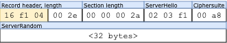
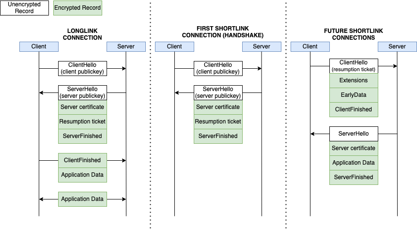
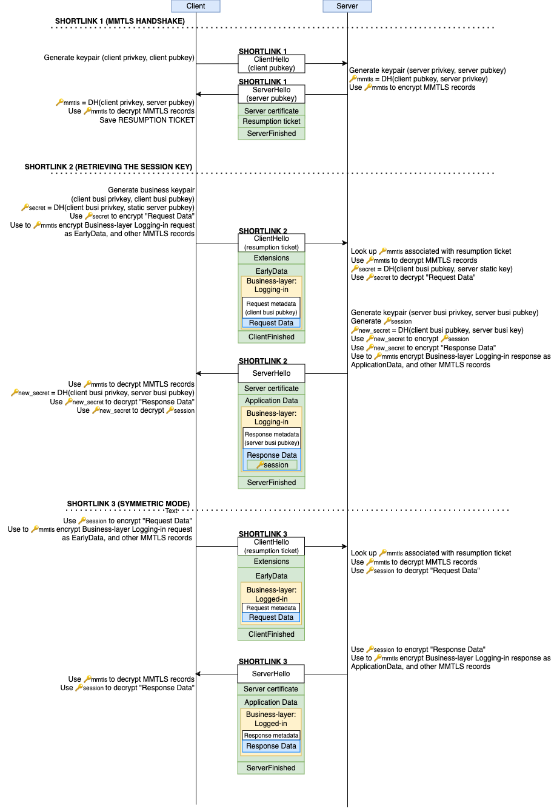

# Should We Chat, Too? Security Analysis of WeChat’s MMTLS Encryption Protocol

## Key contributions

- We performed the first public analysis of the security and privacy properties of MMTLS, the main network protocol used by WeChat, an app with over one billion monthly active users.
- We found that MMTLS is a modified version of TLS 1.3, with many of the modifications that WeChat developers made to the cryptography introducing weaknesses.
- Further analysis revealed that earlier versions of WeChat used a less secure, custom-designed protocol that contains multiple vulnerabilities, which we describe as “Business-layer encryption”. This layer of encryption is still being used in addition to MMTLS in modern WeChat versions.
- Although we were unable to develop an attack to completely defeat WeChat’s encryption, the implementation is inconsistent with the level of cryptography you would expect in an app used by a billion users, such as its use of deterministic IVs and lack of forward secrecy.
- These findings contribute to a larger body of work that suggests that apps in the Chinese ecosystem fail to adopt cryptographic best practices, opting instead to invent their own, often problematic systems.
- We are releasing technical tools and further documentation of our technical methodologies in an accompanying [Github repository](https://github.com/xpko/wechat-security-report/). These tools and documents, along with this main report, will assist future researchers to study WeChat’s inner workings.

## Introduction

WeChat, with over [1.2 billion monthly active users](https://www.messengerpeople.com/global-messenger-usage-statistics), stands as the most popular messaging and social media platform in China and third globally. As indicated by market research, WeChat’s network traffic [accounted for 34%](https://walkthechat.com/wechat-impact-report-2016/) of Chinese mobile traffic in 2018. WeChat’s dominance has monopolized messaging in China, making it increasingly unavoidable for those in China to use. With an ever-expanding array of features, WeChat has also grown beyond its original purpose as a messaging app.

Despite the universality and importance of WeChat, there has been little study of the proprietary network encryption protocol, MMTLS, used by the WeChat application. This knowledge gap serves as a barrier for researchers in that it hampers additional security and privacy study of such a critical application. In addition, [home](https://citizenlab.ca/2016/02/privacy-security-issues-baidu-browser/)–[rolled](https://citizenlab.ca/2016/03/privacy-security-issues-qq-browser/) [cryptography](https://arxiv.org/abs/1802.03367) [is](https://citizenlab.ca/2015/05/a-chatty-squirrel-privacy-and-security-issues-with-uc-browser/) [unfortunately](https://citizenlab.ca/2016/08/a-tough-nut-to-crack-look-privacy-and-security-issues-with-uc-browser/) [common](https://www.usenix.org/conference/foci16/workshop-program/presentation/knockel) [in](https://citizenlab.ca/2020/04/move-fast-roll-your-own-crypto-a-quick-look-at-the-confidentiality-of-zoom-meetings/) [many](https://citizenlab.ca/2022/01/cross-country-exposure-analysis-my2022-olympics-app/) incredibly popular Chinese applications, and there have historically [been](https://citizenlab.ca/2023/08/vulnerabilities-in-sogou-keyboard-encryption/) [issues](https://citizenlab.ca/2024/04/vulnerabilities-across-keyboard-apps-reveal-keystrokes-to-network-eavesdroppers/) with cryptosystems developed independently of well-tested standards such as TLS.

This work is a deep dive into the mechanisms behind MMTLS and the core workings of the WeChat program. We compare the security and performance of MMTLS to TLS 1.3 and discuss our overall findings. We also provide public documentation and tooling to decrypt WeChat network traffic. These tools and documents, along with our report, will assist future researchers to study WeChat’s privacy and security properties, as well as its other inner workings.

This report consists of a technical description of [how WeChat launches a network request](https://citizenlab.ca/2024/10/should-we-chat-too-security-analysis-of-wechats-mmtls-encryption-protocol/#launching-a-wechat-network-request) and its [encryption protocols](https://citizenlab.ca/2024/10/should-we-chat-too-security-analysis-of-wechats-mmtls-encryption-protocol/#wechat-network-request-encryption), followed by a [summary of weaknesses in WeChat’s protocol](https://citizenlab.ca/2024/10/should-we-chat-too-security-analysis-of-wechats-mmtls-encryption-protocol/#security-issues), and finally a [high-level discussion](https://citizenlab.ca/2024/10/should-we-chat-too-security-analysis-of-wechats-mmtls-encryption-protocol/#discussion) of WeChat’s design choices and their impact. The report is intended for privacy, security, or other technical researchers interested in furthering the privacy and security study of WeChat. For non-technical audiences, we have summarized our findings in this FAQ.

#### Prior work on MMTLS and WeChat transport security

Code internal to the WeChat mobile app refers to its proprietary TLS stack as MMTLS (MM is short for MicroMessenger, which is a direct translation of 微信, the Chinese name for WeChat) and uses it to encrypt the bulk of its traffic.

There is limited public documentation of the MMTLS protocol. This [technical document](https://github.com/WeMobileDev/article/blob/master/基于TLS1.3的微信安全通信协议mmtls介绍.md) from WeChat developers describes in which ways it is similar and different from TLS 1.3, and attempts to justify various decisions they made to either simplify or change how the protocol is used. In this document, there are various key differences they identify between MMTLS and TLS 1.3, which help us understand the various modes of usage of MMTLS.

[Wan et al.](https://wenku.baidu.com/view/67762def4b35eefdc9d33374.html) conducted the most comprehensive study of WeChat transport security in 2015 using standard security analysis techniques. However, this analysis was performed before the deployment of MMTLS, WeChat’s upgraded security protocol. In 2019, [Chen et al.](https://link.springer.com/chapter/10.1007/978-3-030-24268-8_27) studied the login process of WeChat and specifically studied packets that are encrypted with TLS and not MMTLS.

As for MMTLS itself, in 2016 WeChat developers published [a document](https://github.com/WeMobileDev/article/blob/master/基于TLS1.3的微信安全通信协议mmtls介绍.md) describing the design of the protocol at a high level that compares the protocol with TLS 1.3. Other MMTLS publications focus on [website fingerprinting-type](https://ieeexplore.ieee.org/abstract/document/8711267) [attacks](https://ieeexplore.ieee.org/abstract/document/8456067), but none specifically perform a security evaluation. A few [Github repositories](https://github.com/anonymous5l/mmtls) and [blog posts](https://bbs.pediy.com/thread-257942.htm) look briefly into the wire format of MMTLS, though none are comprehensive. Though there has been little work studying MMTLS specifically, previous Citizen Lab reports have discovered security flaws of [other](https://citizenlab.ca/2016/03/privacy-security-issues-qq-browser/) [cryptographic](https://arxiv.org/abs/1802.03367) protocols designed and implemented by Tencent.

## Methodology

We analyzed two versions of WeChat Android app:

- Version 8.0.23 (APK “versionCode” 2160) released on May 26, 2022, downloaded from the WeChat website.
- Version 8.0.21 (APK “versionCode” 2103) released on April 7, 2022, downloaded from Google Play Store.

All findings in this report apply to both of these versions.

We used an account registered to a U.S. phone number for the analysis, which changes the behavior of the application compared to a mainland Chinese number. Our setup may not be representative of all WeChat users, and the full limitations are discussed further below.

For dynamic analysis, we analyzed the application installed on a rooted Google Pixel 4 phone and an emulated Android OS. We used [Frida](https://frida.re/) to hook the app’s functions and manipulate and export application memory. We also performed network analysis of WeChat’s network traffic using [Wireshark](https://www.wireshark.org/). However, due to WeChat’s use of nonstandard cryptographic libraries like MMTLS, standard network traffic analysis tools that might work with HTTPS/TLS do not work for all of WeChat’s network activity. Our use of Frida was paramount for capturing the data and information flows we detail in this report. These Frida scripts are designed to intercept WeChat’s request data immediately before WeChat sends it to its MMTLS encryption module. The Frida scripts we used are published in [our Github repository](https://github.com/citizenlab/wechat-report-data).

For static analysis, we used [Jadx](https://github.com/skylot/jadx), a popular Android decompiler, to decompile WeChat’s Android Dex files into Java code. We also used [Ghidra](https://ghidra-sre.org/) and [IDA Pro](https://hex-rays.com/ida-pro/) to decompile the native libraries (written in C++) bundled with WeChat.

### Notation

In this report, we reference a lot of code from the WeChat app. When we reference any code (including file names and paths), we will style the text using `monospace fonts` to indicate it is code. If a function is referenced, we will add empty parentheses after the function name, like this: `somefunction()`. The names of variables and functions that we show may come from one of the three following:

1. The original decompiled name.
2. In cases where the name cannot be decompiled into a meaningful string (e.g., the symbol name was not compiled into the code), we rename it according to how the nearby internal log messages reference it.
3. In cases where there is not enough information for us to tell the original name, we name it according to our understanding of the code. In such cases, we will note that these names are given by us.

In the cases where the decompiled name and log message name of functions are available, they are generally consistent. Bolded or italicized terms can refer to higher-level concepts or parameters we have named.

### Utilization of open source components

We also identified open source components being used by the project, the two largest being [OpenSSL](https://openssl-library.org/) and [Tencent Mars](https://github.com/Tencent/mars). Based on our analysis of decompiled WeChat code, large parts of its code are identical to Mars. Mars is an “infrastructure component” for mobile applications, providing common features and abstractions that are needed by mobile applications, such as networking and logging.

By compiling these libraries separately with debug symbols, we were able to import function and class definitions into Ghidra for further analysis. This helped tremendously to our understanding of other non-open-source code in WeChat. For instance, when we were analyzing the network functions decompiled from WeChat, we found a lot of them to be highly similar to the open source Mars, so we could just read the source code and comments to understand what a function was doing. What was not included in open source Mars are encryption related functions, so we still needed to read decompiled code, but even in these cases we were aided by various functions and structures that we already know from the open source Mars.

#### Matching decompiled code to its source

In the internal logging messages of WeChat, which contain source file paths, we noticed three top level directories, which we have highlighted below:

- `/home/android/devopsAgent/workspace/p-e118ef4209d745e1b9ea0b1daa0137ab/src/mars/`
- `/home/android/devopsAgent/workspace/p-e118ef4209d745e1b9ea0b1daa0137ab/src/mars-wechat/`
- `/home/android/devopsAgent/workspace/p-e118ef4209d745e1b9ea0b1daa0137ab/src/mars-private/`

The source files under “mars” can all be found in the [open source Mars repository](https://github.com/Tencent/mars) as well, while source files in the other two top level directories cannot be found in the open source repository. To illustrate, below is a small section of decompiled code from `libwechatnetwork.so` :

```
    XLogger::XLogger((XLogger *)&local_2c8,5,"mars::stn",

"/home/android/devopsAgent/workspace/p-e118ef4209d745e1b9ea0b1daa0137ab/src/mars/mars/stn/src/longlink.cc"
                ,"Send",0xb2,false,(FuncDef0 *)0x0);
    XLogger::Assert((XLogger *)&local_2c8,"tracker_.get()");
    XLogger::~XLogger((XLogger *)&local_2c8);
```

From its similarity, is highly likely that this section of code was compiled from [this line](https://github.com/Tencent/mars/blob/1583548111ed055836bdc2a344e45084ec775e6d/mars/stn/src/longlink.cc#L178) in the Send() function, defined in longlink.cc file from the open source repository:

```
xassert2(tracker_.get());
```

Reusing this observation, whenever our decompiler is unable to determine the name of a function, we can use logging messages within the compiled code to determine its name. Moreover, if the source file is from open source Mars, we can read its source code as well.

#### Three parts of Mars

In a few articles on the [Mars wiki](https://github.com/Tencent/mars/wiki), Tencent developers provided the following motivations to develop Mars:

- The need for a [cross-platform](https://cloud.tencent.com/developer/article/1005495) networking library, to reduce the development and maintenance costs of two separate network libraries on Android and iOS.
- The need to [customize parameters of the TCP handshake process](http://mp.weixin.qq.com/s?__biz=MzAwNDY1ODY2OQ==&mid=2649286458&idx=1&sn=320f690faa4f97f7a49a291d4de174a9&chksm=8334c3b8b4434aae904b6d590027b100283ef175938610805dd33ca53f004bd3c56040b11fa6#rd), in order for faster connection establishment.

According to its developers, Mars and its STN module are comparable to networking libraries such as [AFNetworking](https://github.com/AFNetworking/AFNetworking) and [OkHttp](https://square.github.io/okhttp/), which are widely used in other mobile apps.

[One of the technical articles](https://github.com/WeMobileDev/article/blob/master/微信终端跨平台组件 Mars 系列 - 我们如约而至.md?plain=1) released by the WeChat development team wrote about the process of open-sourcing Mars. According to the article, they had to separate WeChat-specific code, which was kept private, from the general use code, which was open sourced. In the end, three parts were separated from each other:

- mars-open: to be open sourced, independent repository.
- mars-private: potentially open sourced, depends on mars-open.
- mars-wechat: WeChat business logic code, depends on mars-open and mars-private.

These three names match the top level directories we found earlier if we take “mars-open” to be in the “mars” top-level directory. Using this knowledge, when reading decompiled WeChat code, we could easily know whether it was WeChat-specific or not. From our reading of the code, mars-open contains basic and generic structures and functions, for instance, [buffer structures](https://github.com/Tencent/mars/blob/master/mars/comm/autobuffer.cc), [config stores](https://github.com/Tencent/mars/blob/6c71f72ff770f8a2b111ef27f1ccf72511801bbd/mars/comm/ini.h#L60), [thread management](https://github.com/Tencent/mars/tree/6c71f72ff770f8a2b111ef27f1ccf72511801bbd/mars/comm/unix/thread) and, most importantly, the module named “STN” responsible for network transmission. (We were unable to determine what STN stands for.) On the other hand, mars-wechat contains the MMTLS implementation, and mars-private is not closely related to the features within our research scope.

As a technical side note, the open source Mars [compiles](https://github.com/Tencent/mars/wiki/Mars-Android-接入指南#本地编译) to just one object file named “libmarsstn.so”. However, in WeChat, multiple shared object files reference code within the open source Mars, including the following:

- `libwechatxlog.so`
- `libwechatbase.so`
- `libwechataccessory.so`
- `libwechathttp.so`
- `libandromeda.so`
- `libwechatmm.so`
- `libwechatnetwork.so`

Our research focuses on the transport protocol and encryption of WeChat, which is implemented mainly in libwechatmm.so and libwechatnetwork.so. In addition, we inspected libMMProtocalJni.so, which is not part of Mars but contains functions for cryptographic calculations. We did not inspect the other shared object files.

#### Matching Mars versions

Despite being able to find open source code to parts of WeChat, in the beginning of our research, we were unable to pinpoint the specific version of the source code of mars-open that was used to build WeChat. Later, we found version strings contained in `libwechatnetwork.so`. For WeChat 8.0.21, searching for the string “MARS_” yielded the following:

MARS_BRANCH: HEAD
MARS_COMMITID: d92f1a94604402cf03939dc1e5d3af475692b551
MARS_PRIVATE_BRANCH: HEAD
MARS_PRIVATE_COMMITID: 193e2fb710d2bb42448358c98471cd773bbd0b16
MARS_URL:
MARS_PATH: HEAD
MARS_REVISION: d92f1a9
MARS_BUILD_TIME: 2022-03-28 21:52:49
MARS_BUILD_JOB: rb/2022-MAR-p-e118ef4209d745e1b9ea0b1daa0137ab-22.3_1040

The specific MARS_COMMITID (d92f1a…) exists in the open source Mars repository. This version of the source code also matches the decompiled code.

Pinpointing the specific source code version helped us tremendously with Ghidra’s decompilation. Since a lot of the core data structures used in WeChat are from Mars, by importing the known data structures, we can observe the non-open-sourced code accessing structure fields, and inferring its purpose.

### Limitations

This investigation only looks at client behavior and is therefore subject to other common limitations in privacy research that can only perform client analysis. Much of the data that the client transmits to WeChat servers may be required for functionality of the application. For instance, WeChat servers can certainly see chat messages since WeChat can censor them according to their content. We cannot always measure what Tencent is doing with the data that they collect, but we can make inferences about what is possible. [Previous work](https://citizenlab.ca/2020/05/we-chat-they-watch/) has made certain limited inferences about data sharing, such as that messages sent by non-mainland-Chinese users are used to train censorship algorithms for mainland Chinese users. In this report, we focus on the version of WeChat for non-mainland-Chinese users.

Our investigation was also limited due to legal and ethical constraints. It has become increasingly difficult to obtain Chinese phone numbers for investigation due to the strict phone number and associated government ID requirements. Therefore, we did not test on Chinese phone numbers, which causes WeChat to behave differently. In addition, without a mainland Chinese account, the types of interaction with certain features and Mini Programs were limited. For instance, we did not perform financial transactions on the application.

Our primary analysis was limited to analyzing only two versions of WeChat Android (8.0.21 and 8.0.23). However, we also re-confirmed our tooling works on WeChat 8.0.49 for Android (released April 2024) and that the MMTLS network format matches that used by WeChat 8.0.49 for iOS. Testing different versions of WeChat, the backwards-compatibility of the servers with older versions of the application, and testing on a variety of Android operating systems with variations in API version, are great avenues for future work.

Within the WeChat Android app, we focused on its networking components. Usually, within a mobile application (and in most other programs as well), all other components will defer the work of communicating over the network to the networking components. Our research is not a complete security and privacy audit of the WeChat app, as even if the network communication is properly protected, other parts of the app still need to be secure and private. For instance, an app would not be secure if the server accepts any password to an account login, even if the password is confidentially transmitted.

### Tooling for studying WeChat and MMTLS

In the [Github repository](https://github.com/xpko/wechat-security-report/), we have released tooling that can log keys using Frida and decrypt network traffic that is captured during the same period of time, as well as samples of decrypted payloads. In addition, we have provided additional documentation and our reverse-engineering notes from studying the protocol. We hope that these tools and documentation will further aid researchers in the study of WeChat.

## Launching a WeChat network request

As with any other apps, WeChat is composed of various components. Components within WeChat can invoke the networking components to send or receive network transmissions. In this section, we provide a highly simplified description of the process and components surrounding sending a network request in WeChat. The actual process is much more complex, which we explain in more detail in a [separate document](https://github.com/xpko/wechat-security-report/blob/main/docs/networking_components.md). The specifics of data encryption is discussed in the next section “WeChat network request encryption”.

In the WeChat source code, each API is referred to as a different “Scene”. For instance, during the registration process, there is one API that submits all new account information provided by the user, called `NetSceneReg`. `NetSceneReg` is referred to by us as a “Scene class”, Other components could start a network request towards an API by calling the particular Scene class. In the case of `NetSceneReg`, it is usually invoked by a click event of a button UI component.

Upon invocation, the Scene class would prepare the request data. The structure of the request data (as well as the response) is defined in “RR classes”. (We dub them RR classes because they tend to have “ReqResp” in their names.) Usually, one Scene class would correspond to one RR class. In the case of `NetSceneReg`, it corresponds to the RR class `MMReqRespReg2`, and contains fields like the desired username and phone number. For each API, its RR class also defines a unique internal URI (usually starting with “/cgi-bin”) and a “request type” number (an approximately 2–4 digit integer). The internal URI and request type number is often used throughout the code to identify different APIs. Once the data is prepared by the Scene class, it is sent to `MMNativeNetTaskAdapter`.

`MMNativeNetTaskAdapter` is a task queue manager, it manages and monitors the progress of each network connection and API requests. When a Scene Class calls `MMNativeNetTaskAdapter`, it places the new request (a task) onto the task queue, and calls the req2Buf() function. req2Buf() serializes the request [Protobuf](https://protobuf.dev/) object that was prepared by the Scene Class into bytes, then encrypts the bytes using *Business-layer Encryption*.

Finally, the resultant ciphertext from Business-layer encryption is sent to the “STN” module, which is part of Mars. STN then encrypts the data again using *MMTLS Encryption*. Then, STN establishes the network transport connection, and sends the MMTLS Encryption ciphertext over it. In STN, there are two types of transport connections: *Shortlink* and *Longlink*. Shortlink refers to an HTTP connection that carries MMTLS ciphertext. Shortlink connections are closed after one request-response cycle. Longlink refers to a long-lived TCP connection. A Longlink connection can carry multiple MMTLS encrypted requests and responses without being closed.

## WeChat network request encryption

WeChat network requests are encrypted twice, with different sets of keys. Serialized request data is first encrypted using what we call the *Business-layer Encryption*, as internal encryption is referred to in this [blog post](https://github.com/WeMobileDev/article/blob/master/基于TLS1.3的微信安全通信协议mmtls介绍.md) as occurring at the **“**Business-layer**”**. The Business-layer Encryption has two modes: *Symmetric Mode* and *Asymmetric Mode*. The resultant Business-layer-encrypted ciphertext is appended to metadata about the Business-layer request. Then, the Business-layer requests (i.e., request metadata and inner ciphertext) are additionally encrypted, using *MMTLS Encryption*. The final resulting ciphertext is then serialized as an *MMTLS Request* and sent over the wire.

WeChat’s network encryption system is disjointed and seems to still be a combination of at least three different cryptosystems. The encryption process described in the Tencent documentation mostly matches our findings about MMTLS Encryption, but the document does not seem to describe in detail the Business-layer Encryption**,** whose operation differs when **logged-in** and when **logged-out**. Logged-in clients use Symmetric Mode while logged-out clients use Asymmetric Mode. We also observed WeChat utilizing HTTP, HTTPS, and QUIC to transmit large, static resources such as translation strings or transmitted files. The endpoint hosts for these communications are different from MMTLS server hosts. Their domain names also suggest that they belong to [CDNs](https://en.wikipedia.org/wiki/Content_delivery_network). However, the endpoints that are interesting to us are those that download dynamically generated, often confidential resources (i.e., generated by the server on every request) or endpoints where users transmit, often confidential, data to WeChat’s servers. These types of transmissions are made using MMTLS.

As a final implementation note, WeChat, across all these cryptosystems, uses internal OpenSSL bindings that are compiled into the program. In particular, the libwechatmm.so library seems to have been compiled with [OpenSSL version 1.1.1l](https://mta.openssl.org/pipermail/openssl-announce/2021-August/000206.html), though the other libraries that use OpenSSL bindings, namely `libMMProtocalJni.so` and `libwechatnetwork.so` were not compiled with the OpenSSL version strings. We note that OpenSSL internal APIs can be confusing and are often [misused](https://www.cs.utexas.edu/~shmat/shmat_ccs12.pdf) by well-intentioned developers. Our full notes about each of the OpenSSL APIs that are used can be found in the [Github repository](https://github.com/xpko/wechat-security-report/blob/main/docs/reversing-notes.md).

In Table 1, we have summarized each of the relevant cryptosystems, how their keys are derived, how encryption and authentication are achieved, and which libraries contain the relevant encryption and authentication functions. We will discuss cryptosystem’s details in the coming sections.

|                                     | **Key derivation**               | **Encryption** | **Authentication** | **Library**           | **Functions that perform the symmetric encryption**  |
| :---------------------------------- | :------------------------------- | :------------- | :----------------- | :-------------------- | :--------------------------------------------------- |
| **MMTLS, Longlink**                 | Diffie-Hellman (DH)              | AES-GCM        | AES-GCM tag        | `libwechatnetwork.so` | `Crypt()`                                            |
| **MMTLS, Shortlink**                | DH with session resumption       | AES-GCM        | AES-GCM tag        | `libwechatnetwork.so` | `Crypt()`                                            |
| **Business-layer, Asymmetric Mode** | Static DH with fresh client keys | AES-GCM        | AES-GCM tag        | `libwechatmm.so`      | `HybridEcdhEncrypt(),` `AesGcmEncryptWithCompress()` |
| **Business-layer, Symmetric Mode**  | Fixed key from server            | AES-CBC        | Checksum + MD5     | `libMMProtocalJNI.so` | `pack(), EncryptPack(), genSignature()`              |

*Table 1: Overview of different cryptosystems for WeChat network request encryption, how keys are derived, how encryption and authentication are performed, and which libraries perform them.*

### 1. MMTLS Wire Format

Since MMTLS can go over various transports, we refer to an *MMTLS packet* as a unit of correspondence within MMTLS. Over Longlink, MMTLS packets can be split across multiple TCP packets. Over Shortlink, MMTLS packets are generally contained within an HTTP POST request or response body.


Each MMTLS packet contains one or more *MMTLS records* (which are similar in structure and purpose to [TLS records](https://datatracker.ietf.org/doc/html/rfc8446#section-5)). Records are units of messages that carry handshake data, application data, or alert/error message data within each MMTLS packet.

#### 1A. MMTLS Records

Records can be identified by different *record headers*, a fixed 3-byte sequence preceding the record contents. In particular, we observed 4 different record types, with the corresponding *record headers*:

| Handshake-Resumption Record | `19 f1 04` |
| --------------------------- | ---------- |
| Handshake Record            | `16 f1 04` |
| Data Record                 | `17 f1 04` |
| Alert Record                | `15 f1 04` |

*Handshake* records contain metadata and the key establishment material needed for the other party to derive the same shared session key using Diffie-Hellman. *Handshake-Resumption* record contains sufficient metadata for “resuming” a previously established session, by re-using previously established key material. *Data* records can contain encrypted ciphertext that carries meaningful WeChat request data. Some *Data* packets simply contain an encrypted no-op heartbeat. *Alert* records signify errors or signify that one party intends to end a connection. In MMTLS, all non-handshake records are encrypted, but the key material used differs based on which stage of the handshake has been completed.

Here is an annotated MMTLS packet from the server containing a *Handshake* record:
[](https://citizenlab.ca/wp-content/uploads/2024/10/handshake-record.png)
Here is an example of a **Data** record sent from the client to the server:
[](https://citizenlab.ca/wp-content/uploads/2024/10/data-record.png)

To give an example of how these records interact, generally the client and server will exchange *Handshake* records until the Diffie-Hellman handshake is complete and they have established shared key material. Afterwards, they will exchange *Data* records, encrypted using the shared key material. When either side wants to close the connection, they will send an *Alert* record. More illustrations of each record type’s usage will be made in the following section.

#### 1B. MMTLS Extensions

As MMTLS’ wire protocol is heavily modeled after TLS, we note that it has also borrowed the wire format of “[TLS Extensions](https://datatracker.ietf.org/doc/html/rfc6066)” to exchange relevant encryption data during the handshake. Specifically, MMTLS uses the same format as TLS Extensions for the Client to communicate their key share (i.e. the client’s public key) for Diffie-Hellman, similar to TLS 1.3’s [*key_share*](https://datatracker.ietf.org/doc/html/rfc8446#section-4.2.8) extension, and to communicate session data for session resumption (similar to TLS 1.3’s [*pre_shared_key*](https://datatracker.ietf.org/doc/html/rfc8446#section-4.2.11) extension). In addition, MMTLS has support for [*Encrypted Extensions*](https://datatracker.ietf.org/doc/html/rfc8446#section-4.3.1), similar to TLS, but they are currently not used in MMTLS (i.e., the *Encrypted Extensions* section is always empty).

### 2. MMTLS Encryption

This section describes the outer layer of encryption, that is, what keys and encryption functions are used to encrypt and decrypt the ciphertexts found in the **“**MMTLS Wire Format” section, and how the encryption keys are derived.

The encryption and decryption at this layer occurs in the STN module, in a separate spawned “com.tencent.mm:push”

 process on Android. The spawned process ultimately transmits and receives data over the network. The code for all of the MMTLS Encryption and MMTLS serialization were analyzed from the library `libwechatnetwork.so`. In particular, we studied the `Crypt()` function, a central function used for all encryption and decryption whose name we derived from debug logging code. We also hooked all calls to [HKDF_Extract](https://github.com/OneSignal/openssl/blob/main/crypto/kdf/hkdf.c#L26)() and [HKDF_Expand](https://github.com/OneSignal/openssl/blob/main/crypto/kdf/hkdf.c#L31)(), the OpenSSL functions for [HKDF](https://en.wikipedia.org/wiki/HKDF), in order to understand how keys are derived.


When the “:push” process is spawned, it starts an event loop in HandshakeLoop(), which processes all outgoing and incoming MMTLS Records. We hooked all functions called by this event loop to understand how each MMTLS Record is processed. The code for this study, as well as the internal function addresses identified for the particular version of WeChat we studied, can be found in the [Github repository](https://github.com/xpko/wechat-security-report/tree/main).

[](https://citizenlab.ca/wp-content/uploads/2024/10/image2.png)

> Figure 1: Network requests: MMTLS encryption connection over longlink and over shortlink. Each box is an MMTLS Record, and each arrow represents an “MMTLS packet” sent over either Longlink (i.e., a single TCP packet) or shortlink (i.e., in the body of HTTP POST). Once both sides have received the DH keyshare, all further records are encrypted.

#### 2A. Handshake and key establishment

In order for Business-layer Encryption to start sending messages and establish keys, it has to use the MMTLS Encryption tunnel. Since the key material for the MMTLS Encryption has to be established first, the handshakes in this section happen before any data can be sent or encrypted via Business-layer Encryption. The end goal of the MMTLS Encryption handshake discussed in this section is to establish a common secret value that is known only to the client and server.

On a fresh startup of WeChat, it tries to complete one MMTLS handshake over Shortlink, and one MMTLS handshake over Longlink, resulting in two MMTLS encryption tunnels, each using different sets of encryption keys. For Longlink, after the handshake completes, the same Longlink (TCP) connection is kept open to transport future encrypted data. For Shortlink, the MMTLS handshake is completed in the first HTTP request-response cycle, then the first HTTP connection closes. The established keys are stored by the client and server, and when data needs to be sent over Shortlink, those established keys are used for encryption, then sent over a newly established Shortlink connection. In the remainder of this section, we describe details of the handshakes.

##### ClientHello

First, the client generates keypairs on the [SECP256R1 elliptic curve](https://neuromancer.sk/std/secg/secp256r1). Note that these elliptic curve keys are entirely separate pairs from those generated in the Business-layer Encryption section. The client also reads some Resumption Ticket data from a file stored on local storage named **`psk.key`,** if it exists. The `**psk.key**` file is written to after the first ServerHello is received, so, on a fresh install of WeChat, the resumption ticket is omitted from the ClientHello.

The client first simultaneously sends a ClientHello message (contained in a Handshake record) over both the Shortlink and Longlink. The first of these two handshakes that completes successfully is the one that the initial Business-layer Encryption handshake occurs over (details of Business-layer Encryption are discussed in Section 4). Both Shortlink and Longlink connections are used afterwards for sending other data.

In both the initial Shortlink and Longlink handshake, each ClientHello packet contains the following data items:

- ClientRandom (32 bytes of randomness)
- Resumption Ticket data read from psk.key, if available
- Client public key

An abbreviated version of the MMTLS ClientHello is shown below.

```
16 f1 04 (Handshake Record header) . . .
01 04 f1 (ClientHello) . . .
08 cd 1a 18 f9 1c . . . (ClientRandom) . . .
00 0c c2 78 00 e3 . . . (Resumption Ticket from psk.key) . . .
04 0f 1a 52 7b 55 . . . (Client public key) . . .
```

Note that the client generates **a separate keypair** for the Shortlink ClientHello and the Longlink ClientHello. The Resumption Ticket sent by the client is the same on both ClientHello packets because it is always read from the same psk.key file. On a fresh install of WeChat, the Resumption Ticket is omitted since there is no psk.key file.

##### ServerHello

The client receives a ServerHello packet in response to each ClientHello packet. Each contains:

- A record containing ServerRandom and Server public key
- Records containing **encrypted** server certificate, new resumption ticket, and a ServerFinished message.

An abbreviated version of the MMTLS ServerHello is shown below; a full packet sample with labels can be found in the [annotated network capture](https://docs.google.com/document/d/1Ub195WcLUY8YGJoGKW5IlhIIGaUWFzcM7aovNWqnFL4/edit).

```
16 f1 04 (Handshake Record header) . . .
02 04 f1 (ServerHello) . . .
2b a6 88 7e 61 5e 27 eb . . . (ServerRandom) . . .
04 fa e3 dc 03 4a 21 d9 . . . (Server public key) . . .
16 f1 04 (Handshake Record header) . . .
b8 79 a1 60 be 6c . . . (ENCRYPTED server certificate) . . .
16 f1 04 (Handshake Record header) . . .
1a 6d c9 dd 6e f1 . . . (ENCRYPTED NEW resumption ticket) . . .
16 f1 04 (Handshake Record header) . . .
b8 79 a1 60 be 6c . . . (ENCRYPTED ServerFinished) . . .
```

On receiving the server public key, the client generates

```
secret = ecdh(client_private_key, server_public_key).
```

Note that since each MMTLS encrypted tunnel uses a different pair of client keys, the shared secret, and any derived keys and IVs will be different between MMTLS tunnels. This also means Longlink handshake and Shortlink handshake each compute a different shared secret.

Then, the shared secret is used to derive several sets of cryptographic parameters via HKDF, a mathematically secure way to transform a short secret value into a long secret value. In this section, we will focus on the *handshake parameters*. Alongside each set of keys, [initialization vectors (IVs)](https://www.techtarget.com/whatis/definition/initialization-vector-IV) are also generated. The IV is a value that is needed to initialize the [AES-GCM](https://en.wikipedia.org/wiki/Galois/Counter_Mode) encryption algorithm. IVs do not need to be kept secret. However, they need to be random and not reused.

The *handshake parameters* are generated using HKDF (“handshake key expansion” is a constant string in the program, as well as other monotype double quoted strings in this section):

```
key_enc, key_dec, iv_enc, iv_dec = HKDF(secret, 56, “handshake key expansion”)
```

Using `key_dec` and `iv_dec`, the client can decrypt the remainder of the ServerHello records. Once decrypted, the client validates the server certificate. Then, the client also saves the new Resumption Ticket to the file `psk.key`.

At this point, since the shared `secret` has been established, the MMTLS Encryption Handshake is considered completed. To start encrypting and sending data, the client derives other sets of parameters via HKDF from the shared secret. The details of which keys are derived and used for which connections are fully specified in [these notes](https://github.com/xpko/wechat-security-report/blob/main/docs/outer-crypto.md#full-key-derivation-details) where we annotate the keys and connections created on WeChat startup.

#### 2B. Data encryption

After the handshake, MMTLS uses AES-GCM with a particular key and IV, which are tied to the particular MMTLS tunnel, to encrypt data. The IV is incremented by the number of records previously encrypted with this key. This is important because re-using an IV with the same key destroys the confidentiality provided in AES-GCM, as it can lead to a key recovery attack using the known tag.

```
ciphertext, tag = AES-GCM(input, key, iv+n)`
`ciphertext = ciphertext | tag
```

The 16-byte tag is appended to the end of the ciphertext. This tag is authentication data computed by [AES-GCM](https://en.wikipedia.org/wiki/Galois/Counter_Mode); it functions as a [MAC](https://en.wikipedia.org/wiki/Message_authentication_code) in that when verified properly, this data provides authentication and integrity. In many cases, if this is a Data record being encrypted, `input` contains metadata and ciphertext that has already been encrypted as described in the Business-layer Encryption section.

We separately discuss data encryption in Longlink and Shortlink in the following subsections.

##### 2B1. Longlink

Client-side Encryption for Longlink packets is done using AES-GCM with **key_enc** and **iv_enc** derived earlier in the handshake. Client-side Decryption uses **key_dec** and **iv_dec**. Below is a sample Longlink (TCP) packet containing a single data record containing an encrypted heartbeat message from the server

:


```
17 f1 04     RECORD HEADER (of type “DATA”)
00 20                                           RECORD LENGTH
e6 55 7a d6 82 1d a7 f4 2b 83 d4 b7 78 56 18 f3         ENCRYPTED DATA
1b 94 27 e1 1e c3 01 a6 f6 23 6a bc 94 eb 47 39             TAG (MAC)
```

Within a long-lived Longlink connection, the IV is incremented for each record encrypted. If a new Longlink connection is created, the handshake is restarted and new key material is generated.

##### 2B2. Shortlink

Shortlink connections can only contain a single MMTLS packet request and a single MMTLS packet response (via HTTP POST request and response, respectively). After the initial Shortlink ClientHello sent on startup, WeChat will send ClientHello with Handshake Resumption packets. These records have the header 19 f1 04 instead of the 16 f1 04 on the regular ClientHello/ServerHello handshake packets.

An abbreviated sample of a Shortlink request packet containing Handshake Resumption is shown below.

```
19 f1 04 (Handshake Resumption Record header) . . .
01 04 f1 (ClientHello) . . .
9b c5 3c 42 7a 5b 1a 3b . . . (ClientRandom) . . .
71 ae ce ff d8 3f 29 48 . . . (NEW Resumption Ticket) . . .
19 f1 04 (Handshake Resumption Record header) . . .
47 4c 34 03 71 9e . . . (ENCRYPTED Extensions) . . .
17 f1 04 (Data Record header) . . .
98 cd 6e a0 7c 6b . . . (ENCRYPTED EarlyData) . . .
15 f1 04 (Alert Record header) . . .
8a d1 c3 42 9a 30 . . . (ENCRYPTED Alert (ClientFinished)) . . .
```

Note that, based on our understanding of the MMTLS protocol, the ClientRandom sent in this packet is not used at all by the server, because there is no need to re-run Diffie-Hellman in a resumed session. The Resumption Ticket is used by the server to identify which prior-established shared secret should be used to decrypt the following packet content.

Encryption for Shortlink packets is done using AES-GCM with the *handshake parameters* **key_enc** and **iv_enc**. (Note that, despite their identical name, **key_enc** and **iv_enc** here are different from those of the Longlink, since Shortlink and Longlink each complete their own handshake using different elliptic curve client keypair.) The **iv_enc** is incremented for each record encrypted. Usually, EarlyData records sent over **S**hortlink contain ciphertext that has been encrypted with Business-layer Encryption as well as associated metadata. This metadata and ciphertext will then be additionally encrypted at this layer.

The reason this is referred to as EarlyData internally in WeChat is likely due to it being borrowed from [TLS](https://datatracker.ietf.org/doc/html/rfc8446#section-4.2.10); typically, it refers to the data that is encrypted with a key derived from a pre-shared key, before the establishment of a regular session key via Diffie-Hellman. However, in this case, when using Shortlink, there is no data sent “after the establishment of a regular session key”, so almost all Shortlink data is encrypted and sent in this EarlyData section.

Finally, `ClientFinished` indicates that the client has finished its side of the handshake. It is an encrypted Alert record with a fixed message that always follows the EarlyData Record. From our reverse-engineering, we found that the handlers for this message referred to it as `ClientFinished`.

### 3. Business-layer Request

MMTLS Data Records either carry an “Business-layer request” or heartbeat messages. In other words, if one decrypts the payload from an MMTLS Data Record, the result will often be messages described below.

This Business-layer request contains several metadata parameters that describe the purpose of the request, including the internal URI and the request type number, which we briefly described in the “Launching a WeChat network request” section.

When logged-in, the format of a Business-layer request looks like the following:

```
00 00 00 7b                 (total data length)
00 24                       (URI length)
/cgi-bin/micromsg-bin/...   (URI)
00 12                       (hostname length)
sgshort.wechat.com          (hostname)
00 00 00 3D                 (length of rest of data)
BF B6 5F                    (request flags)
41 41 41 41                 (user ID)
42 42 42 42                 (device ID)
FC 03 48 02 00 00 00 00     (cookie)
1F 9C 4C 24 76 0E 00        (cookie)
D1 05 varint                (request_type)
0E 0E 00 02                 (4 more varints)
BD 95 80 BF 0D varint       (signature)
FE                          (flag)
80 D2 89 91
04 00 00                    (marks start of data)
08 A6 29 D1 A4 2A CA F1 ... (ciphertext)
```

Responses are formatted very similarly:

```
bf b6 5f                    (flags)
41 41 41 41                 (user ID)
42 42 42 42                 (device ID)
fc 03 48 02 00 00 00 00     (cookie)
1f 9c 4c 24 76 0e 00        (cookie)
fb 02 varint                (request_type)
35 35 00 02 varints
a9 ad 88 e3 08 varint       (signature)
fe
ba da e0 93
04 00 00                    (marks start of data)
b6 f8 e9 99 a1 f4 d1 20 . . . ciphertext
```

This request then contains another encrypted ciphertext, which is encrypted by what we refer to as Business-layer Encryption. Business-layer Encryption is separate from the system we described in the **MMTLS Encryption** section. The `signature` mentioned above is the output of `genSignature()`, which is discussed in the “Integrity check” section. Pseudocode for the serialization schemes and more samples of WeChat’s encrypted request header can be found in our [Github repository](https://github.com/xpko/wechat-security-report/blob/main/docs/wechat-encrypted-request-format.md).

### 4. Business-layer Encryption

[WeChat Crypto diagrams (inner layer)](https://docs.google.com/drawings/d/1WSZY_R8XBliTDrb3tSkmoZpaq3lsud0sBaWRuygGuJo/edit)

This section describes how the Business-layer requests described in **Section 3** are encrypted and decrypted, and how the keys are derived. We note that the set of keys and encryption processes introduced in this section are completely separate from those referred to in the MMTLS Encryption section. Generally, for Business-layer Encryption, much of the protocol logic is handled in the Java code, and the Java code calls out to the C++ libraries for encryption and decryption calculations. Whereas for MMTLS Encryption everything is handled in C++ libraries, and occurs on a different process entirely. There is very little interplay between these two layers of encryption.

The Business-layer Encryption has two modes using different cryptographic processes: *Asymmetric Mode* and *Symmetric Mode*. To transition into Symmetric Mode, WeChat needs to perform an *Autoauth* request. Upon startup, WeChat typically goes through the three following stages:

1. Before the user logs in to their account, Business-layer Encryption first uses asymmetric cryptography to derive a shared secret via [static Diffie-Hellman](https://en.wikipedia.org/wiki/Diffie–Hellman_key_exchange#Ephemeral_and/or_static_keys) (static DH), then uses the shared secret as a key to AES-GCM encrypt the data. We name this Asymmetric Mode. In Asymmetric Mode, the client derives a new shared secret for each request.
2. Using Asymmetric Mode, WeChat can send an Autoauth request, to which the server would return an Autoauth response, which contains a **session_key**.
3. After the client obtains `session_key`, Business-layer Encryption uses it to [AES-CBC](https://docs.anchormydata.com/docs/what-is-aes-256-cbc) encrypt the data. We name this Symmetric Mode since it only uses symmetric cryptography. Under Symmetric Mode, the same `session_key` can be used for multiple requests.

For *Asymmetric Mode*, we performed dynamic and static analysis of C++ functions in libwechatmm.so; in particular the `HybridEcdhEncrypt()` and `HybridEcdhDecrypt()` functions, which call `AesGcmEncryptWithCompress()` / `AesGcmDecryptWithUncompress()`, respectively.

For *Symmetric Mode*, the requests are handled in `pack()`, `unpack()`, and `genSignature()` functions in `libMMProtocalJNI.so`. Generally, `pack()` handles outgoing requests, and `unpack()` handles incoming responses to those requests. They also perform encryption/decryption. Finally, `genSignature()` computes a checksum over the full request. In the Github repository, we’ve uploaded pseudocode for [pack](https://github.com/xpko/wechat-security-report/blob/main/docs/reversing-notes.md#pack-notes), [AES-CBC](https://github.com/xpko/wechat-security-report/blob/main/docs/reversing-notes.md#aesencrypt-cbc) encryption, and the [genSignature](https://github.com/xpko/wechat-security-report/blob/main/docs/reversing-notes.md#gensignature) routine.

The Business-layer Encryption is also tightly integrated with WeChat’s user authentication system. The user needs to log in to their account before the client is able to send an Autoauth request. For clients that have not logged in, they exclusively use Asymmetric Mode. For clients that have already logged in, their first Business-layer packet would most often be an Autoauth request encrypted using Asymmetric Mode, however, the second and onward Business-layer packets are encrypted using Symmetric Mode.

[](https://citizenlab.ca/wp-content/uploads/2024/10/image3.png)

> **Figure 2: Business-layer encryption, logged-out, logging-in, and logged-in:** Swimlane diagrams showing at a high-level what Business-layer Encryption requests look like, including which secrets are used to generate the key material used for encryption.   secret is generated via DH(static server public key, client private key), and **new_secret** is DH(server public key, client private key). **session** is decrypted from the first response when logged-in. Though it isn’t shown above, **new_secret** is also used in **genSignature()** when logged-in; this signature is sent with request and response metadata.

#### 4A. Business-layer Encryption, Asymmetric Mode

Before the user logs in to their WeChat account, the Business-layer Encryption process uses a *static server public key*, and generates new client keypair to agree on a static Diffie-Hellman shared secret for every WeChat network request. The shared secret is run through the HKDF function and any data is encrypted with AES-GCM and sent alongside the generated client public key so the server can calculate the shared secret.

For each request, the client generates a public, private keypair for use with [ECDH](https://en.wikipedia.org/wiki/Elliptic-curve_Diffie–Hellman). We also note that the client has a static server public key pinned in the application. The client then calculates an initial secret.

```
secret = ECDH(static_server_pub, client_priv)`
`hash = sha256(client_pub)`
`client_random = <32 randomly generated bytes>`
`derived_key = HKDF(secret)
```

`derived_key` is then used to AES-GCM encrypt the data, which we describe in detail in the next section.

#### 4B. Business-layer Encryption, obtaining session_key

If the client is logged-in (i.e., the user has logged in to a WeChat account on a previous app run), the first request will be a very large data packet authenticating the client to the server (referred to as Autoauth in WeChat internals) which also contains key material. We refer to this request as the Autoauth request. In addition, the client pulls a locally-stored key `autoauth_key`, which we did not trace the provenance of, since it does not seem to be used other than in this instance. The key for encrypting this initial request (`authrequest_data`) is derived_key, calculated in the same way as in Section 4A. The encryption described in the following is the Asymmetric Mode encryption, albeit a special case where the data is the `authrequest_data`.

Below is an abbreviated version of a serialized and encrypted Autoauth request:

```
    08 01 12 . . . [Header metadata]
    04 46 40 96 4d 3e 3e 7e [client_publickey] . . .
    fa 5a 7d a7 78 e1 ce 10 . . . [ClientRandom encrypted w secret]
    a1 fb 0c da . . .               [IV]
    9e bc 92 8a 5b 81 . . .         [tag]
    db 10 d3 0f f8 e9 a6 40 . . . [ClientRandom encrypted w autoauth_key]
    75 b4 55 30 . . .               [IV]
    d7 be 7e 33 a3 45 . . .         [tag]
    c1 98 87 13 eb 6f f3 20 . . . [authrequest_data encrypted w derived_key]
    4c ca 86 03 . .                 [IV]
    3c bc 27 4f 0e 7b . . .         [tag]
```

A full sample of the Autoauth request and response at each layer of encryption can be found in the [Github repository](https://github.com/xpko/wechat-security-report/tree/main/data). Finally, we note that the `autoauth_key` above does not seem to be actively used outside of encrypting in this particular request. We suspect this is vestigial from a legacy encryption protocol used by WeChat.

The client encrypts here using AES-GCM with a randomly generated IV, and uses a SHA256 hash of the preceding message contents as [AAD](https://datatracker.ietf.org/doc/html/rfc5084#section-1.4). At this stage, the messages (including the ClientRandom messages) are always [ZLib](https://en.wikipedia.org/wiki/Zlib) compressed before encryption.

```
iv = <12 random bytes>compressed = zlib_compress(plaintext)ciphertext, tag = AESGCM_encrypt(compressed, aad = hash(previous), derived_key, iv)
```

In the above, previous is the header of the request (i.e. all header bytes preceding the 04 00 00 marker of data start). The client appends the 12-byte IV, then the 16-byte tag, onto the ciphertext. This tag can be used by the server to verify the integrity of the ciphertext, and essentially functions as a [MAC](https://en.wikipedia.org/wiki/Message_authentication_code).

##### 4B1. Obtaining session_key: Autoauth Response

The response to autoauth is serialized similarly to the request:

```
08 01 12 . . . [Header metadata]
04 46 40 96 4d 3e 3e 7e [new_server_pub] . . .
c1 98 87 13 eb 6f f3 20 . . . [authresponse_data encrypted w new_secret]
4c ca 86 03 . . [IV]
3c bc 27 4f 0e 7b . . . [tag]
```

With the newly received server public key (`new_server_pub`), which is different from the `static_server_pub` hardcoded in the app, the client then derives a new secret (`new_secret`). new_secret is then used as the key to AES-GCM decrypt `authresponse_data`. The client can also verify `authresponse_data` with the given tag.

```
new_secret = ECDH(new_server_pub, client_privatekey)authresponse_data= AESGCM_decrypt(aad = hash(authrequest_data),new_secret, iv)
```

`authresponse_data` is a serialized Protobuf containing a lot of important data for WeChat to start, starting with a helpful **“**`Everything is ok`**”** status message. A full sample of this Protobuf can be found in the [Github repository](https://github.com/xpko/wechat-security-report/blob/main/data/autoauth-response.json). Most importantly, `authresponse_data` contains `**session_key**`, which is the key used for future AES-CBC encryption under Symmetric Mode. From here on out, `new_secret` is only used in `genSignature()`, which is discussed below in Section 4C2 Integrity Check.

We measured the entropy of the session_key provided by the server, as it is used for future encryption. This key exclusively uses printable ASCII characters, and is thus limited to around ~100 bits of entropy.

The WeChat code refers to three different keys: *client_session*, *server_session*, and *single_session*. Generally, *client_session* refers to the `client_publickey`, `server_session` refers to the *shared secret key* generated using ECDH i.e. `new_secret`, and `single_session` refers to the `session_key` provided by the server.

#### 4C. Business-layer Encryption, Symmetric Mode

After the client receives session_key from the server, future data is encrypted using Symmetric Mode. Symmetric Mode encryption is mostly done using AES-CBC instead of AES-GCM, with the exception of some large files being encrypted with `AesGcmEncryptWithCompress()`. As `AesGcmEncryptWithCompress()` requests are the exception, we focus on the more common use of AES-CBC.

Specifically, the Symmetric Mode uses AES-CBC with PKCS-7 padding, with the session_key as a symmetric key:

```
ciphertext = AES-CBC(PKCS7_pad(plaintext), session_key, iv = session_key)
```

This `session_key` is doubly used as the IV for encryption.

##### 4C1. Integrity check

In Symmetric Mode, a function called `genSignature()` calculates a pseudo-integrity code on the plaintext. This function first calculates the **MD5 hash** of WeChat’s assigned user ID for the logged-in user (`uin`), `new_secret`, and the plaintext length. Then, genSignature() uses [**Adler32**](https://en.wikipedia.org/wiki/Adler-32), a checksumming function, on the MD5 hash concatenated with the plaintext.

```
signature = adler32(md5(uin | new_secret | plaintext_len) |
            plaintext)
```

The result from Adler32 is concatenated to the ciphertext as metadata (see Section 3A for how it is included in the request and response headers), and is referred to as a `signature` in WeChat’s codebase. We note that though it is referred to as a `signature`, it does not provide any cryptographic properties; details can be found in the Security Issues section. The full pseudocode for this function can also be found in [the Github repository](https://github.com/xpko/wechat-security-report/blob/main/docs/reversing-notes.md#gensignature).

### 5. Protobuf data payload

The input to Business-layer Encryption is generally a serialized Protobuf, optionally compressed with Zlib. When logged-in, many of the Protobufs sent to the server contain the following header data:

```
"1": {
    "1": "\u0000",
    "2": "1111111111", # User ID (assigned by WeChat)
    "3": "AAAAAAAAAAAAAAA\u0000", # Device ID (assigned by WeChat)
    "4": "671094583", # Client Version
    "5": "android-34", # Android Version
    "6": "0"
    },
```

The Protobuf structure is defined in each API’s corresponding RR class, as we previously mentioned in the “Launching a WeChat network request” section.

### 6. Putting it all together

In the below diagram, we demonstrate the network flow for the most common case of opening the WeChat application. We note that in order to prevent further complicating the diagram, HKDF derivations are not shown; for instance, when “`mmtls`” is used, HKDF is used to derive a key from “`mmtls`”, and the derived key is used for encryption. The specifics of how keys are derived, and which derived keys are used to encrypt which data, can be found in [these notes](https://github.com/xpko/wechat-security-report/blob/main/docs/outer-crypto.md#full-key-derivation-details).

[](https://citizenlab.ca/wp-content/uploads/2024/10/image1.png)

Figure 3: Swimlane diagram demonstrating the encryption setup and network flow of the most common case (user is logged in, opens WeChat application).

We note that other configurations are possible. For instance, we have observed that if the Longlink MMTLS handshake completes first, the Business-layer “Logging-in” request and response can occur over the Longlink connection instead of over several **shortlink** connections. In addition, if the user is logged-out, Business-layer requests are simply encrypted with secret (resembling **Shortlink 2** requests)

## Security issues

In this section, we outline potential security issues and privacy weaknesses we identified with the construction of the **MMTLS encryption** and **Business-layer** encryption layers. There could be other issues as well.

### Issues with MMTLS encryption

Below we detail the issues we found with WeChat’s MMTLS encryption.

#### Deterministic IV

The MMTLS encryption process generates a single IV once per connection. Then, they increment the IV for each subsequent record encrypted in that connection. Generally, NIST [recommends](https://nvlpubs.nist.gov/nistpubs/Legacy/SP/nistspecialpublication800-38d.pdf) not using a wholly deterministic derivation for IVs in AES-GCM since it is easy to accidentally re-use IVs. In the case of AES-GCM, reuse of the (key, IV) tuple is catastrophic as it [allows key recovery](https://csrc.nist.gov/csrc/media/projects/block-cipher-techniques/documents/bcm/comments/800-38-series-drafts/gcm/joux_comments.pdf) from the AES-GCM authentication tags. Since these tags are appended to AES-GCM ciphertexts for authentication, this enables plaintext recovery from as few as 2 ciphertexts encrypted with the same key and IV pair.

In addition, [Bellare and Tackmann](https://eprint.iacr.org/2016/564.pdf) have shown that the use of a deterministic IV can make it possible for a powerful adversary to brute-force a particular (key, IV) combination. This type of attack applies to powerful adversaries, if the crypto system is deployed to a very large (i.e., the size of the Internet) pool of (key, IV) combinations being chosen. Since WeChat has over a billion users, this order of magnitude puts this attack within the realm of feasibility.

#### Lack of forward secrecy

Forward secrecy is [generally expected](https://github.com/ssllabs/research/wiki/SSL-and-TLS-Deployment-Best-Practices) of modern communications protocols to reduce the importance of session keys. Generally, TLS itself is forward-secret by design, except in the case of the first packet of a “resumed” session. This first packet is encrypted with a “pre-shared key”, or PSK established during a previous handshake.

MMTLS makes heavy use of PSKs by design. Since the Shortlink transport format only supports a single round-trip of communication (via a single HTTP POST request and response), any encrypted data sent via the transport format is encrypted with a pre-shared key. Since leaking the shared `PSK_ACCESS` secret would enable a third-party to decrypt any EarlyData sent across multiple MMTLS connections, data encrypted with the pre-shared key is not forward secret. The vast majority of records encrypted via MMTLS are sent via the Shortlink transport, which means that the majority of network data sent by WeChat is not forward-secret between connections. In addition, when opening the application, WeChat creates a single long-lived Longlink connection. This long-lived Longlink connection is open for the duration of the WeChat application, and any encrypted data that needs to be sent is sent over the same connection. Since most WeChat requests are either encrypted using (A) a session-resuming PSK or (B) the application data key of the long-lived Longlink connection, WeChat’s network traffic often does not retain forward-secrecy between network requests.

### Issues with Business-layer encryption

On its own, the business-layer encryption construction, and, in particular the Symmetric Mode, AES-CBC construction, has many severe issues. Since the requests made by WeChat are double-encrypted, and these concerns only affect the inner, business layer of encryption, we did not find an immediate way to exploit them. However, in older versions of WeChat which exclusively used business-layer encryption, these issues would be exploitable.

#### Metadata leak

Business-layer encryption does not encrypt metadata such as the user ID and request URI, as shown in the “Business-layer request” section. This issue is also [acknowledged](https://cloud.tencent.com/developer/article/1005518) by the WeChat developers themselves to be one of the motivations to develop MMTLS encryption.

#### Forgeable genSignature integrity check

While the purpose of the `genSignature` code is not entirely clear, if it is being used for authentication (since the `ecdh_key` is included in the MD5) or integrity, it fails on both parts. A valid forgery can be calculated with any known `plaintext` without knowledge of the `ecdh_key`. If the client generates the following for some known plaintext message `plaintext`:

```
sig = adler32(md5(uin | ecdh_key | plaintext_len) | plaintext)
```

We can do the following to forge the signature `evil_sig` for some `evil_plaintext` with length `plaintext_len`:

```
evil_sig = sig - adler32(plaintext) + adler32(evil_plaintext)
```

Subtracting and adding from `adler32` checksums is achievable by solving for a system of equations [when the message is short](https://en.wikipedia.org/wiki/Adler-32#Weakness). Code for subtracting and adding to `adler32` checksum, thereby forging this integrity check, can be found in `adler.py` in [our Github repository](https://github.com/xpko/wechat-security-report/blob/main/code/adler.py).

#### Possible AES-CBC padding oracle

Since AES-CBC is used alongside [PKCS7](https://en.wikipedia.org/wiki/PKCS_7) padding, it is possible that the use of this encryption on its own would be susceptible to an [AES-CBC padding oracle](https://en.wikipedia.org/wiki/Padding_oracle_attack), which can lead to recovery of the encrypted plaintext. Earlier this year, we found that another custom cryptography scheme developed by a Tencent company was [susceptible to this exact attack](https://citizenlab.ca/2023/08/vulnerabilities-in-sogou-keyboard-encryption/).

#### Key, IV re-use in block cipher mode

Re-using the key as the IV for AES-CBC, as well as re-using the same key for all encryption in a given session (i.e., the length of time that the user has the application opened) introduces some privacy issues for encrypted plaintexts. For instance, since the key and the IV provide all the randomness, re-using both means that if two plaintexts are identical, they will encrypt to the same ciphertext. In addition, due to the use of [CBC mode](https://en.wikipedia.org/wiki/Block_cipher_mode_of_operation#Cipher_block_chaining_(CBC)) in particular, two plaintexts with identical N block-length prefixes will encrypt to the same first N ciphertext blocks.

#### Encryption key issues

It is highly unconventional for the server to choose the encryption key used by the client. In fact, we note that the encryption key generated by the server (the “session key”) exclusively uses printable ASCII characters. Thus, even though the key is 128 bits long, the entropy of this key is at most 106 bits.

#### No forward secrecy

As mentioned in the previous section, forward-secrecy is a standard property for modern network communication encryption. When the user is logged-in, all communication with WeChat, at this encryption layer, is done with the exact same key. The client does not receive a new key until the user closes and restarts WeChat.

## Other versions of WeChat

To confirm our findings, we also tested our decryption code on WeChat 8.0.49 for Android (released April 2024) and found that the MMTLS network format matches that used by WeChat 8.0.49 for iOS.

### Previous versions of WeChat network encryption

To understand how WeChat’s complex cryptosystems are tied together, we also briefly reverse-engineered an older version of WeChat that did not utilize MMTLS. The newest version of WeChat that did not utilize MMTLS was v6.3.16, released in 2016. Our full notes on this reverse-engineering can be found [here](https://github.com/xpko/wechat-security-report/blob/main/docs/wechat-v6.3.16.md).

While logged-out, requests were largely using the Business-layer Encryption cryptosystem, using RSA public-key encryption rather than static Diffie-Hellman plus symmetric encryption via AES-GCM. We observed requests to the internal URIs `cgi-bin/micromsg-bin/encryptcheckresupdate` and `cgi-bin/micromsg-bin/getkvidkeystrategyrsa`.

There was also another encryption mode used, DES with a static key. This mode was used for sending crash logs and memory stacks; POST requests to the URI `/cgi-bin/mmsupport-bin/stackreport` were encrypted using DES.

We were not able to login to this version for dynamic analysis, but from our static analysis, we determined that the encryption behaves the same as Business-layer Encryption when logged-in (i.e. using a `session_key` provided by the server for AES-CBC encryption).

## Discussion

#### Why does Business-layer encryption matter?

Since Business-layer encryption is wrapped in MMTLS, why should it matter whether or not it is secure? First, from our study of previous versions of WeChat, Business-layer encryption was the sole layer of encryption for WeChat network requests until 2016. Second, from the the fact that Business-layer encryption exposes internal request URI unencrypted, one of the possible architectures for WeChat would be to host different internal servers to handle different types of network requests (corresponding to different “requestType” values and different cgi-bin request URLs). It could be the case, for instance, that after MMTLS is terminated at the front WeChat servers (handles MMTLS decryption), the inner WeChat request that is forwarded to the corresponding internal WeChat server is not re-encrypted, and therefore solely encrypted using Business-layer encryption. A network eavesdropper, or network tap, placed within WeChat’s intranet could then attack the Business-layer encryption on these forwarded requests. However, this scenario is purely conjectural. Tencent’s response to our disclosure is concerned with issues in Business-layer encryption and implies they are slowly migrating from the more problematic AES-CBC to AES-GCM, so Tencent is also concerned with this.

#### Why not use TLS?

According to [public documentation](https://docs.google.com/document/d/14Gsqi3vWjXLhF3odeTjhq_njtTk4aFPr-LptPwuzMsw/edit) and confirmed by our own findings, MMTLS (the “Outer layer” of encryption) is based heavily on TLS 1.3. In fact, the document demonstrates that the architects of MMTLS have a decent understanding of asymmetric cryptography in general.

The document contains reasoning for not using TLS. It explains that the way WeChat uses network requests necessitates something like [0-RTT](https://www.haproxy.com/glossary/what-is-zero-round-trip-time-resumption-0-rtt) session resumption, because the majority of WeChat data transmission needs only one request-response cycle (i.e., Shortlink). MMTLS only required one round-trip handshake to establish the underlying TCP connection before any application data can be sent; according to this document, introducing another round-trip for the TLS 1.2 handshake was a non-starter.

> Fortunately, TLS1.3 proposes a 0-RTT (no additional network delay) method for the protocol handshake. In addition, the protocol itself provides extensibility through the version number, CipherSuite, and Extension mechanisms. However, TLS1.3 is still in draft phases, and its implementation may still be far away. TLS1.3 is also a general-purpose protocol for all apps, given the characteristics of WeChat, there is great room for optimization. Therefore, at the end, we chose to design and implement our own secure transport protocol, MMTLS, based on the TLS1.3 draft standard. [originally written in Chinese]

However, even at the time of writing in 2016, TLS 1.2 did provide an option for [session resumption](https://blog.cloudflare.com/tls-session-resumption-full-speed-and-secure/). In addition, since WeChat controls both the servers and the clients, it doesn’t seem unreasonable to deploy the fully-fledged TLS 1.3 implementations that were being tested at the time, even if the IETF draft was incomplete.

Despite the architects of MMTLS’ best effort, generally, the security protocols used by WeChat seem both less performant and less secure than TLS 1.3. Generally speaking, designing a secure and performant transport protocol is no easy feat.

The issue of performing an extra round-trip for a handshake has been a perennial issue for application developers. The TCP and TLS handshake each require a single round-trip, meaning each new data packet sent requires two round-trips. Today, TLS-over-QUIC combines the transport-layer and encryption-layer handshakes, requiring only a single handshake. QUIC provides the best of both worlds, both strong, forward-secret encryption, and halving the number of round-trips needed for secure communication. **Our recommendation would be for WeChat to migrate to a standard QUIC implementation.**

Finally, there is also the issue of client-side performance, in addition to network performance. Since WeChat’s encryption scheme performs two layers of encryption per request, the client is performing double the work to encrypt data, than if they used a single standardized cryptosystem.

#### The trend of home-rolled cryptography in Chinese applications

The findings here contribute to much of [our](https://citizenlab.ca/2024/04/vulnerabilities-across-keyboard-apps-reveal-keystrokes-to-network-eavesdroppers/) [prior](https://citizenlab.ca/2016/03/privacy-security-issues-qq-browser/) [research](https://citizenlab.ca/2015/05/a-chatty-squirrel-privacy-and-security-issues-with-uc-browser/) that suggests the popularity of home-grown cryptography in Chinese applications. In general, the avoidance of TLS and the preference for proprietary and non-standard cryptography is a departure from cryptographic best practices. While there may have been many legitimate reasons to distrust TLS in 2011 (like [EFF](https://www.usenix.org/legacy/events/sec11/tech/slides/eckersley.pdf) and [Access Now](https://www.accessnow.org/wp-content/uploads/archive/docs/Weakest_Link_in_the_Chain.pdf)’s concerns over the certificate authority ecosystem), the TLS ecosystem has largely [stabilized](https://letsencrypt.org/stats/) since then, and is more auditable and [transparent](https://certificate.transparency.dev/). Like MMTLS, all the proprietary protocols we have researched in the past contain weaknesses relative to TLS, and, in some cases, could even be [trivially decrypted](https://citizenlab.ca/2024/04/vulnerabilities-across-keyboard-apps-reveal-keystrokes-to-network-eavesdroppers/) by a network adversary. This is a growing, concerning trend unique to the Chinese security landscape as the global Internet progresses towards technologies like QUIC or TLS to protect data in transit.

#### Anti-DNS-hijacking mechanisms

Similar to how Tencent wrote their own cryptographic system, we found that in Mars they also wrote a proprietary domain lookup system. This system is part of STN and has the ability to support domain name to IP address lookups over HTTP. This feature is referred to as “NewDNS” in Mars. Based on our dynamic analysis, this feature is regularly used in WeChat. At first glance, NewDNS duplicates the same functions already provided by DNS (Domain Name System), which is already built into nearly all internet-connected devices.

WeChat is not the only app in China that utilizes such a system. Major cloud computing providers in China such as [Alibaba Cloud](https://cn.aliyun.com/product/httpdns?from_alibabacloud=) and [Tencent Cloud](https://cloud.tencent.com/developer/article/2180368) both offer their own DNS over HTTP service. A VirusTotal search for apps that tries to contact [Tencent Cloud’s DNS over HTTP service endpoint (119.29.29.98)](https://github.com/TencentCloud/httpdns-sdk-android) yielded [3,865 unique results](https://www.virustotal.com/gui/search/behavior_network%3A%22119.29.29.98%22/files).

One likely reason for adopting such a system is that ISPs in China often implement [DNS hijacking](https://en.wikipedia.org/wiki/DNS_hijacking) to insert ads and redirect web traffic to perform [ad fraud](https://www.oracle.com/uk/advertising/measurement/ad-fraud-invalid-traffic/). The problem was so serious that six Chinese internet giants [issued a joint statement in 2015](https://www.thepaper.cn/newsDetail_forward_1413110) urging ISPs to improve. According to the news article, about 1–2% of traffic to Meituan (an online shopping site) suffers from DNS hijacking. Ad fraud by Chinese ISPs seems to remain a [widespread](https://web.archive.org/web/20240131063911/https://www.v2ex.com/t/651746) [problem](https://web.archive.org/web/20240131063930/https://m.thepaper.cn/baijiahao_15406173) in recent years.

Similar to their MMTLS cryptographic system, Tencent’s NewDNS domain lookup system was motivated by trying to meet the needs of the Chinese networking environment. DNS proper over the years has proven to have multiple [security](https://en.wikipedia.org/w/index.php?title=Domain_Name_System&oldid=1232087380#Security_issues) and [privacy](https://en.wikipedia.org/w/index.php?title=Domain_Name_System&oldid=1232087380#Privacy_and_tracking_issues) issues. Compared to TLS, we found that WeChat’s MMTLS has additional deficiencies. However, it remains an open question as to, when compared to DNS proper, whether NewDNS is more or less problematic. We leave this question for future work.

#### Use of Mars STN outside WeChat

We speculate that there is a widespread adoption of Mars (mars-open) outside of WeChat, based on the following observations:

- There are numerous [issues](https://github.com/Tencent/mars/issues) opened on the Mars GitHub repository.
- There are [plenty](http://www.li5jun.com/article/662.html) [of](https://blog.csdn.net/BunnyCoffer/article/details/80051766) technical [articles](https://segmentfault.com/a/1190000016558538) outlining building instant messaging systems using Mars.
- There is already [a white-label instant messaging system product](https://docs.wildfirechat.cn/) that is based on Mars.

The adoption of Mars outside of WeChat is concerning because Mars by default does not provide any transport encryption. As we have mentioned in the “Three Parts of Mars” section, the MMTLS encryption used in WeChat is part of mars-wechat, which [is not open source](https://github.com/Tencent/mars/issues/1023). The Mars developers [also have no plans to add support of TLS, and expect other developers using Mars to implement their own encryption in the upper layers](https://github.com/Tencent/mars/issues/81). To make matters worse, implementing TLS within Mars [seems to require a fair bit of architectural changes](https://github.com/Tencent/mars/issues/184). Even though it would not be unfair for Tencent to keep MMTLS proprietary, MMTLS is still the main encryption system that Mars was designed for, leaving MMTLS proprietary would mean other developers using Mars would have to either devote significant resources to integrate a different encryption system with Mars, or leave everything unencrypted.

Mars is also lacking in documentation. The official [wiki](https://github.com/Tencent/mars/wiki/) only contains a few, old articles on how to integrate with Mars. Developers using Mars often resort to [asking questions on GitHub](https://github.com/Tencent/mars/issues/639). The lack of documentation means that developers are more prone to making mistakes, and ultimately reducing security.

Further research is needed in this area to analyze the security of apps that use Tencent’s Mars library.

#### “Tinker”, a dynamic code-loading module

In this section, we tentatively refer to the APK downloaded from the Google Play Store as “WeChat APK”, and the APK downloaded from WeChat’s official website as “Weixin APK”. The distinction between WeChat and Weixin seems blurry. The WeChat APK and Weixin APK contain partially different code, as we will later discuss in this section. However, when installing both of these APKs to an English-locale Android Emulator, they both show their app names as “WeChat”. Their application ID, which is used by the Android system and Google Play Store to identify apps, are also both “com.tencent.mm”. We were also able to login to our US-number accounts using both APKs.

Unlike the WeChat APK, we found that the Weixin APK contains Tinker, [“a hot-fix solution library”](https://github.com/Tencent/tinker). Tinker allows the developer to update the app itself without calling Android’s system APK installer by using a technique called “dynamic code loading”. In an earlier report we found a similar [distinction](https://citizenlab.ca/2021/03/tiktok-vs-douyin-security-privacy-analysis/) between TikTok and Douyin, where we found Douyin to have a similar dynamic code-loading feature that was not present in TikTok. This feature raises three concerns:

1. If the process for downloading and loading the dynamic code does not sufficiently authenticate the downloaded code (e.g., that it is cryptographically signed with the correct public key, that it is not out of date, and that it is the code intended to be downloaded and not other cryptographically signed and up-to-date code), an attacker might be able to exploit this process to run malicious code on the device (e.g., by injecting arbitrary code, by performing a downgrade attack, or by performing a sidegrade attack). Back in 2016, we found such instances in [other](https://citizenlab.ca/2016/02/privacy-security-issues-baidu-browser/) [Chinese](https://citizenlab.ca/2016/03/privacy-security-issues-qq-browser/) [apps](https://citizenlab.ca/2016/08/a-tough-nut-to-crack-look-privacy-and-security-issues-with-uc-browser/).
2. Even if the code downloading and loading mechanism contains no weaknesses, the dynamic code loading feature still allows the application to load code without notifying the user, bypassing users’ consent to decide what program could run on their device. For example, the developer may push out an unwanted update, and the users do not have a choice to keep using the old version. Furthermore, a developer may selectively target a user with an update that compromises their security or privacy. In 2016, a Chinese security analyst [accused](https://web.archive.org/web/20160330060941/news.boxun.com/news/gb/china/2016/02/201602231542.shtml) Alibaba of pushing dynamically loaded code to Alipay to surreptitiously take photos and record audio on his device.
3. Dynamically loading code deprives app store reviewers from reviewing all relevant behavior of an app’s execution. As such, the [Google Play Developer Program Policy](https://support.google.com/googleplay/android-developer/answer/14906471?hl=en) does not permit apps to use dynamic code loading.

When analyzing the WeChat APK, we found that, while it retains some components of Tinker. The component which seems to handle the downloading of app updates is present, however the core part of Tinker that handles loading and executing the downloaded app updates has been replaced with “no-op” functions, which perform no actions. We did not analyze the WeChat binaries available from other third party app stores.

Further research is needed to analyze the security of Tinker’s app update process, whether WeChat APKs from other sources contain the dynamic code loading feature, as well as any further differences between the WeChat APK and Weixin APK.

## Recommendations

In this section, we make recommendations based on our findings to relevant audiences.

#### To application developers

Implementing proprietary encryption is more expensive, less performant, and [less secure](https://www.schneier.com/blog/archives/2011/04/schneiers_law.html) than using well-scrutinized standard encryption suites. Given the sensitive nature of data that can be sent by applications, we encourage application developers to use tried-and-true encryption suites and protocols and to avoid rolling their own crypto. SSL/TLS has seen almost three decades of various improvements as a result of rigorous public and academic scrutiny. TLS configuration is now easier than ever before, and the advent of QUIC-based TLS has dramatically improved performance.

#### To Tencent and WeChat developers

Below is a copy of the recommendations we sent to WeChat and Tencent in our disclosure. The full disclosure correspondence can be found in the [Appendix](https://citizenlab.ca/2024/10/should-we-chat-too-security-analysis-of-wechats-mmtls-encryption-protocol/#appendix).

> In [this post from 2016](https://github.com/WeMobileDev/article/blob/master/基于TLS1.3的微信安全通信协议mmtls介绍.md), WeChat developers note that they wished to upgrade their encryption, but the addition of another round-trip for the TLS 1.2 handshake would significantly degrade WeChat network performance, as the application relies on many short bursts of communication. At that time, TLS 1.3 was not yet an RFC (though session resumption extensions were available for TLS 1.2), so they opted to “roll their own” and incorporate TLS 1.3’s session resumption model into MMTLS.
>
> This issue of performing an extra round-trip for a handshake has been a perennial issue for application developers around the world. The TCP and TLS handshake each require a single round-trip, meaning each new data packet sent requires two round-trips. Today, TLS-over-QUIC combines the transport-layer and encryption-layer handshakes, requiring only a single handshake. QUIC was developed for this express purpose, and can provide both strong, forward-secret encryption, while halving the number of round-trips needed for secure communication. We also note that WeChat seems to already use QUIC for some large file downloads. **Our recommendation would be for WeChat to migrate entirely to a standard TLS or QUIC+TLS implementation.**
>
> There is also the issue of client-side performance, in addition to network performance. Since WeChat’s encryption scheme performs two layers of encryption per request, the client is performing double the work to encrypt data than if WeChat used a single standardized cryptosystem.

#### To operating systems

On the web, client-side browser [security](https://security.googleblog.com/2016/09/moving-towards-more-secure-web.html) [warnings](https://blog.mozilla.org/security/2017/01/20/communicating-the-dangers-of-non-secure-http/) and the use of HTTPS as [a ranking factor](https://developers.google.com/search/blog/2014/08/https-as-ranking-signal) in search engines contributed to widespread TLS adoption. We can draw loose analogies to the mobile ecosystem’s operating systems and application stores.

Is there any platform or OS-level permission model that can indicate regular usage of standard encrypted network communications? As we mentioned in our prior work studying proprietary cryptography in [Chinese IME keyboards](https://citizenlab.ca/2024/04/vulnerabilities-across-keyboard-apps-reveal-keystrokes-to-network-eavesdroppers/), OS developers could consider device permission models that surface whether applications use lower-level system calls for network access.

#### To high-risk users with privacy concerns

Many WeChat users use it out of necessity rather than choice. For users with privacy concerns who are using WeChat out of necessity, our recommendations from [the previous report](https://citizenlab.ca/2023/06/privacy-in-the-wechat-ecosystem-full-report/) still hold:

- Avoid features delineated as “Weixin” services if possible. We note that many core “Weixin” services (such as Search, Channels, Mini Programs) as delineated by the Privacy Policy perform more tracking than core “WeChat” services.
- When possible, prefer web or applications over Mini Programs or other such embedded functionality.
- Use stricter device permissions and update your software and OS regularly for security features.

In addition, due to the risks introduced by dynamic code loading in WeChat downloaded from the official website, we recommend users to instead download WeChat from the Google Play Store whenever possible. For users who have already installed WeChat from the official website, removing and re-installing the Google Play Store version would also mitigate the risk.

#### To security and privacy researchers

As WeChat has over one billion users, we posit that the order of magnitude of global MMTLS users is on a similar order of magnitude as global TLS users. Despite this, there is little-to-no third-party analysis or scrutiny of MMTLS, as there is in TLS. At this scale of influence, MMTLS deserves similar scrutiny as TLS. We implore future security and privacy researchers to build on this work to continue the study of the MMTLS protocol, as from our correspondences, Tencent insists on continuing to use and develop MMTLS for WeChat connections.

## Acknowledgments

We would like to thank Jedidiah Crandall, Jakub Dalek, Prateek Mittal, and Jonathan Mayer for their guidance and feedback on this report. Research for this project was supervised by Ron Deibert.

## Appendix

In this appendix, we detail our disclosure to Tencent concerning our findings and their response.

### April 24, 2024 — Our disclosure

To Whom It May Concern:

The Citizen Lab is an academic research group based at the Munk School of Global Affairs & Public Policy at the University of Toronto in Toronto, Canada.

We analyzed WeChat v8.0.23 on Android and iOS as part of our ongoing work analyzing popular mobile and desktop apps for security and privacy issues. We found that WeChat’s proprietary network encryption protocol, MMTLS, contains weaknesses compared to modern network encryption protocols, such as TLS or QUIC+TLS. For instance, the protocol is not forward-secret and may be susceptible to replay attacks. We plan on publishing a documentation of the MMTLS network encryption protocol and strongly suggest that WeChat, which is responsible for the network security of over 1 billion users, switch to a strong and performant encryption protocol like TLS or QUIC+TLS.

For further details, please see the [**attached document**](https://citizenlab.ca/wp-content/uploads/2024/10/CL-Disclosure-042424.docx).

**Timeline to Public Disclosure**

The Citizen Lab is committed to research transparency and will publish details regarding the security vulnerabilities it discovers in the context of its research activities, absent exceptional circumstances, on its website: https://citizenlab.ca/.

The Citizen Lab will publish the details of our analysis no sooner than 45 calendar days from the date of this communication.

Should you have any questions about our findings please let us know. We can be reached at this email address: disclosure@citlab.utoronto.ca.

Sincerely,

The Citizen Lab

### May 17, 2024 — Tencent’s response

Thank you for your report.Since receiving your report on April 25th, 2024, we have conducted a careful evaluation.The core of WeChat’s security protocol is outer layer mmtls encryption, currently ensuring that outer layer mmtls encryption is secure. On the other hand, the encryption issues in the inner layer are handled as follows: the core data traffic has been switched to AES-GCM encryption, while other traffic is gradually switching from AES-CBC to AES-GCM.If you have any other questions, please let us know.thanks.