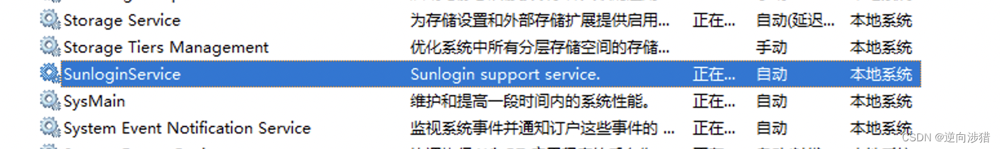
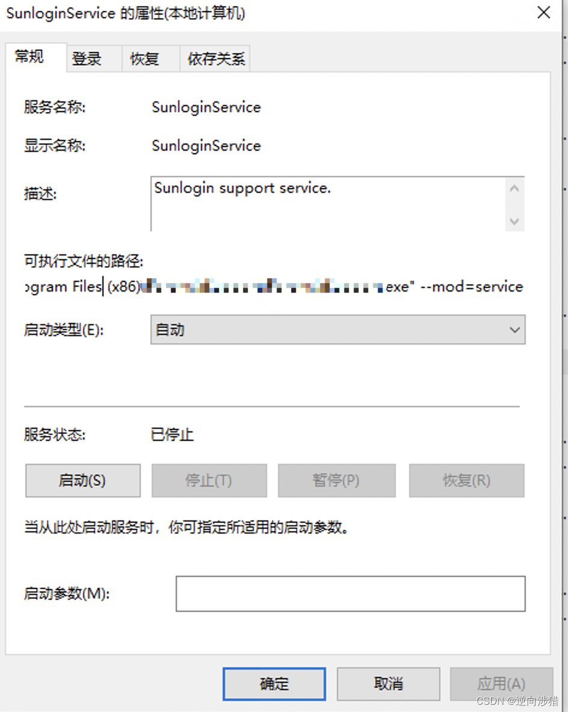
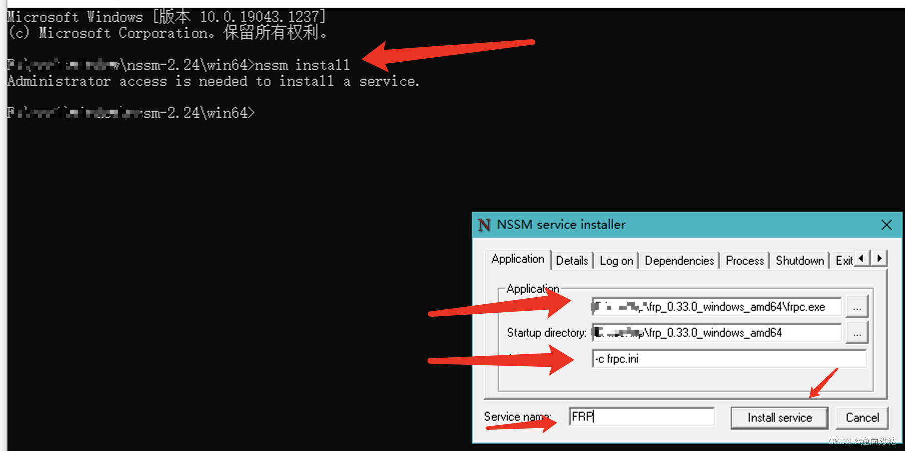
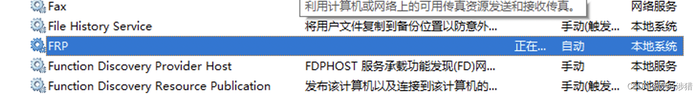
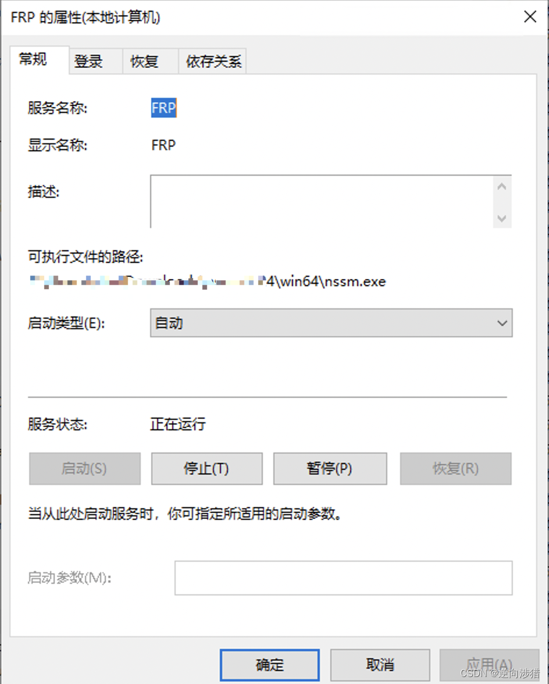

# Window下frp最稳定的开机自启方式【将程序转为服务(天生自带隐藏窗口功能)】【放弃不靠谱的定时任务和启动目录启动吧】（向日葵稳定开机自启实现原理分析）

使用过向日葵的都会发现，只要电脑已启动，不用登录用户，即可远程连接，而其他自启软件这时都没有启动

经过研究发现，其注册了一个本地系统服务

而将该服务关掉后，向日葵就连接不上了，由此可以判断，核心自启功能就在该服务上

打开该服务的详细信息，可以发现，其以命令行方式执行了一个程序

启动方式设置为自动，应该就可以在系统启动时就运行了

的确是个很好的策略，我之前一直用的定时任务，但虽然也是设置的在系统启动时启动，可就是启动不了，或者将启动脚本放在了启动文件夹里，但是也是同样的问题，可能由于本身是窗口程序，系统启动后，还没登录呢，怎么显示窗口呢

那接下来就是将程序转变为服务了，经过网上查找，这里推荐一个非常简单好用又免费的工具nssm

官网：[nssm.cc](https://nssm.cc/)  
github：[kirillkovalenko/nssm](https://github.com/kirillkovalenko/nssm)    
csdn备份地址：[nssm-2.24.zip](https://download.csdn.net/download/qq_26914291/87512469)  

直接nssm install 运行后，会弹出一个选项配置窗口，这里只输入frp的路径，若是有参数也可以下面参数那一栏输入即可，其他选项一般默认就行，点击窗口右下角的安装按钮安装该服务

之后就可以在服务列表里看到你配置的frp服务了，这里服务刚安装还未启动，需要先手动启动一下，或者nssm start service_name 启动下服务
> 注意：这里服务中的启动按钮，`只要启动一次，以后就永久启动，系统重启后也会自动启动（当然前提是该服务的启动类型为自动的情况下）`。当然这里的停止按钮也是，只要停止一次，以后就永久停止，系统重启后也不会启动（即使启动类型设置为自动），除非再次点击启动按钮

打开服务属性，可以看到启动的还是nssm程序，然后启动我们的程序，所以注意这时就`不要更改nssm和frp程序的路径`了

## 参考
https://blog.csdn.net/qubernet/article/details/104728178  

https://www.hesudu.com/350.htm  

https://blog.csdn.net/CJF_iceKing/article/details/71725935  

## 总结
- 解决问题时，不要太注意问题自身，有时候问题之外的东西才是根本所在